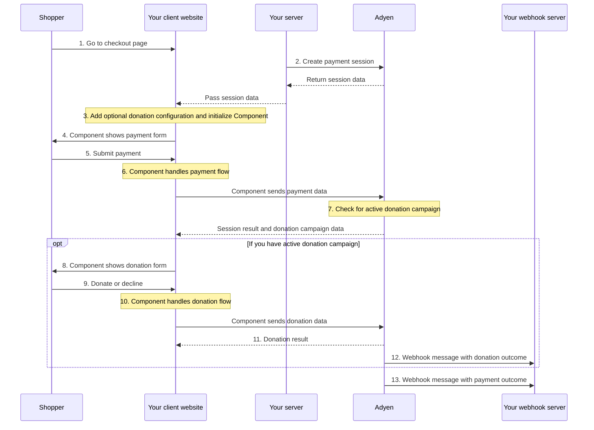

<!-- Source URL: https://docs.adyen.com/online-payments/donations/integration-options/advanced-flow.md -->
<!-- Fetched: 2026-09-15 -->
<!-- Discovery: llms.txt -->

---
title: "Donations with Advanced flow"
description: "Accept donations using the Advanced flow with Web Components or API only."
url: "https://docs.adyen.com/online-payments/donations/integration-options/advanced-flow"
source_url: "https://docs.adyen.com/online-payments/donations/integration-options/advanced-flow.md"
canonical: "https://docs.adyen.com/online-payments/donations/integration-options/advanced-flow"
last_modified: "2026-09-15T12:56:52+02:00"
language: "en"
---

# Donations with Advanced flow

Accept donations using the Advanced flow with Web Components or API only.

## Web Components

Use the Component to show the donation form on your website

### Intro

Our Giving Component shows the Giving donation form to the shopper after finishing their original payment.

If the shopper chooses to make a donation, the donation transaction uses the same payment method that the shopper used to make the original payment.

You can accept donations for fixed amounts, or allow the shopper to round up their transaction amount as a donation.

## Requirements

In addition to the [general Adyen Giving requirements](/online-payments/donations#requirements), take into account the following requirements.

| Requirement                                     | Description                                                                                                                                                                                                                                                                                                                                                                                                                                |
| ----------------------------------------------- | ------------------------------------------------------------------------------------------------------------------------------------------------------------------------------------------------------------------------------------------------------------------------------------------------------------------------------------------------------------------------------------------------------------------------------------------ |
| **Integration type**                            | Make sure that you have integrated with:- [Web Components v5.0.0 or later using the Advanced flow](/online-payments/build-your-integration/advanced-flow/?platform=Web\&integration=Components\&version=latest)
- Checkout API v67 or later                                                                                                                                                                                                |
| **[Customer Area roles](/account/user-roles)**  | Make sure that you have the **[Donation campaigns manager](/account/user-roles/#manage-donation-campaigns)** role.                                                                                                                                                                                                                                                                                                                         |
| **[Webhooks](/development-resources/webhooks)** | Subscribe to the following webhooks:- Standard webhooks
- [Adyen Giving merchant webhook](/development-resources/webhooks/webhook-types/#other-webhooks)                                                                                                                                                                                                                                                                                   |
| **Setup steps**                                 | Before you begin:- To check if your [Customer Area](https://ca-test.adyen.com/) user has the required roles, go to **Account** > **Users**. If you need additional roles, contact your admin user.
- Set up components integrations for the [payment methods](/online-payments/donations#supported-payment-methods) that you want to support.
- [Create and activate a donation campaign](/online-payments/donations/#donation-campaigns). |

## How it works

1. The shopper goes to the checkout page.
2. Your server [creates a payment session](/online-payments/build-your-integration/sessions-flow/?platform=Web\&integration=Components#create-a-payment-session).
3. When you create a [global configuration object for `AdyenCheckout`](/online-payments/build-your-integration/sessions-flow/?platform=Web\&integration=Components#configure), optionally [add a configuration object for donations](/online-payments/donations/integration-options/sessions-flow/#add-giving-configuration).
4. The Component shows the payment form.
5. The shopper submits the payment on your checkout page.
6. The Component handles the payment flow.
7. If the payment is successful, the Component checks if you have an active donation campaign in your Adyen Customer Area.
8. If you have an active donation campaign, the Component shows the donation form.
9. The shopper chooses to donate or declines.
10. The Component handles the donation flow.
11. [Get the donation result](#get-the-donation-outcome) from the `donation.onDonationSuccess` callback
12. Adyen sends a webhook message with the donation outcome.



### Get Campaigns

## Get details of your active donation campaigns

If the shopper's payment is authorized, and the [/payments](https://docs.adyen.com/api-explorer/Checkout/latest/post/payments) or [/payments/details](https://docs.adyen.com/api-explorer/Checkout/latest/post/payments/details) (for iDEAL payments) response includes the [donationToken](https://docs.adyen.com/api-explorer/Checkout/latest/post/payments#responses-200-donationToken) field, get the details of your active donation campaigns.

From your server, make a POST [/donationCampaigns](https://docs.adyen.com/api-explorer/Checkout/latest/post/donationCampaigns) request, specifying:

| Field name        | Required                                                                                                      | Description                                                                                                                                                                                                   |
| ----------------- | ------------------------------------------------------------------------------------------------------------- | ------------------------------------------------------------------------------------------------------------------------------------------------------------------------------------------------------------- |
| `merchantAccount` |  | Your merchant account name.                                                                                                                                                                                   |
| `currency`        |  | The three-character [ISO currency code](https://en.wikipedia.org/wiki/ISO_4217).                                                                                                                              |
| `locale`          |                                                                                                               | The language in which you want to receive the donation campaign details in the response. The default is configured by the nonprofit. Set it to the shopper's language and country code, for example, `en-US`. |

**Example POST /donationCampaigns request**

```bash
curl https://checkout-test.adyen.com/v71/donationCampaigns \
-H 'x-api-key: ADYEN_API_KEY' \
-H 'content-type: application/json' \
-d '{
   "merchantAccount": "ADYEN_MERCHANT_ACCOUNT",
   "currency":"EUR",
   "locale":"en-US"
}'
```

The response contains the details of your active donation campaigns. If there is at least one campaign in the response, [show Giving in your payment form](#show-giving-in-your-payment-form).

When you make a request to get your active donation campaigns, the response you receive depends on the [donation type](/online-payments/donations#donation-type):

### Tab: Fixed amount donations

**Example POST /donationCampaigns response for a fixed amount donation**

```bash
{
    "donationCampaigns": [
        {
            "id": "DONATION_CAMPAIGN_ID",
            "campaignName": "DONATION_CAMPAIGN_NAME",
            "donation": {
                "currency": "EUR",
                "type": "fixedAmounts",
                "values": [100, 200, 300]
            },
            "nonprofitName": "NONPROFIT_NAME",
            "causeName": "NONPROFIT_CAUSE",
            "nonprofitDescription": "NONPROFIT_DESCRIPTION.",
            "nonprofitUrl": "NONPROFIT_WEBSITE_URL",
            "logoUrl": "NONPROFIT_LOGO_URL",
            "bannerUrl": "NONPROFIT_BANNER_URL",
            "termsAndConditionsUrl": "NONPROFIT_TERMS_AND_CONDITIONS_URL"
        }
    ]
}
```

### Tab: Round-up donations

**Example POST /donationCampaigns response for a round-up donation**

```bash
{
    "donationCampaigns": [
        {
            "id": "DONATION_CAMPAIGN_ID",
            "campaignName": "DONATION_CAMPAIGN_NAME",
            "donation": {
                "currency": "EUR",
                "type": "roundup",
                "maxRoundupAmount": 100
            },
            "nonprofitName": "NONPROFIT_NAME",
            "causeName": "NONPROFIT_CAUSE",
            "nonprofitDescription": "NONPROFIT_DESCRIPTION.",
            "nonprofitUrl": "NONPROFIT_WEBSITE_URL",
            "logoUrl": "NONPROFIT_LOGO_URL",
            "bannerUrl": "NONPROFIT_BANNER_URL",
            "termsAndConditionsUrl": "NONPROFIT_TERMS_AND_CONDITIONS_URL"
        }
    ]
}
```

### Show Giving

## Show Giving in your payment form

To show the Giving Component in your payment form:

1. Create a DOM element for Giving, placing it where you want the form to be rendered:

   ```js
   <div id='donation-container'></div>
   ```

2) Use the values you received in the [`/donationCampaigns` response](#get-details-of-donation-campaigns) to configure the Giving Component:

   | Parameter name              | Required                                                                                                      | Description                                                                                                                                                      |
   | --------------------------- | ------------------------------------------------------------------------------------------------------------- | ---------------------------------------------------------------------------------------------------------------------------------------------------------------- |
   | `donation.type`             |  | The [donation type](/online-payments/donations#donation-type). Possible values: - **roundup** - **fixedAmounts**                                                 |
   | `donation.currency`         |  | The three-character [ISO currency code](/development-resources/currency-codes/).                                                                                 |
   | `donation.maxRoundupAmount` | Round-up donations                                                                                            | The maximum amount a transaction can be rounded up to make a donation.                                                                                           |
   | `donation.values`           | Fixed amount donations                                                                                        | The object containing suggested donation amounts.                                                                                                                |
   | `commercialTxAmount`        | Round-up donations                                                                                            | The original transaction amount for the shopper's order, excluding the donation amount. The component uses this value to calculate the round-up donation amount. |
   | `nonprofitName`             |  | The name of the nonprofit.                                                                                                                                       |
   | `nonprofitDescription`      |  | The description of the nonprofit.                                                                                                                                |
   | `nonprofitUrl`              |  | The website URL of the nonprofit.                                                                                                                                |
   | `logoUrl`                   |  | The URL for the nonprofit logo.                                                                                                                                  |
   | `bannerUrl`                 |  | The URL for the banner for the campaign.                                                                                                                         |
   | `termsAndConditionsUrl`     |  | The URL for the terms and conditions page of the nonprofit.                                                                                                      |
   | `onDonate`                  |  | Create an event handler for `onDonate`. This is called when the shopper selects the amount they want to donate. In the example below, we use `handleOnDonate`.   |
   | `causeName`                 |                                                                                                               | The cause of the nonprofit.                                                                                                                                      |
   | `onCancel`                  |                                                                                                               | Create an event handler for `onCancel`. This is called when the shopper declines to donate. In the example below, we use `handleOnCancel`.                       |
   | `showCancelButton`          |                                                                                                               | By default, the Component shows a **Not now** button. Your shopper can select this button to decline to donate. Set to **false** to remove this button.          |

   **Example Giving Component configuration for a fixed amount donation**

   ```js
   // Implement the event handlers.
   function handleOnDonate(state, component) {
        state.isValid // True or false. Specifies if the shopper has selected a donation amount.
        state.data // Provides the data that you need to pass in the /donations call.
        component // Provides the active Component instance that called this event.
   }

   function handleOnCancel(state, component) {
        // Show a message, unmount the Component, or redirect to another page.
   }

   // Create the configuration object.
   const donationCampaign = {
        campaignName: "CAMPAIGN_NAME",
        donation: {
             currency: "EUR",
             type: "fixedAmounts",
             values: [100, 200, 300]
        },
        nonprofitName: "NONPROFIT_NAME",
        causeName: "CAUSE_NAME",
        nonprofitDescription: "NONPROFIT_DESCRIPTION",
        nonprofitUrl: "NONPROFIT_WEBSITE_URL",
        logoUrl: "NONPROFIT_LOGO_URL",
        bannerUrl: "NONPROFIT_BANNER_URL",
        termsAndConditionsUrl: "NONPROFIT_TERMS_AND_CONDITIONS_URL"
   };

   const donationConfig = {
        ...donationCampaign,
        showCancelButton: true,
        onDonate: handleOnDonate,
        onCancel: handleOnCancel
   };
   ```

### Create Checkout

3. If you did not persist a previous instance of the `AdyenCheckout` object, create a new checkout object.

   **Create a new AdyenCheckout object**

   ```js
   const checkout= await AdyenCheckout(
     {
       clientKey,
       environment: "test",
     }
   );
   ```

### Mount Component

4. Use the `checkout.create` method to create and mount an instance of the Giving Component.

   **Create and mount the Giving Component**

   ```js
   const donation = new Donation(checkout, donationConfig).mount('#donation-container');
   ```

   When the shopper selects a donation amount, the Component calls the `onDonate` event. If `state.isValid` is **true**, collect the values passed in `state.data` which contains the donation amount that the shopper selected.

5. Pass the `state.data` to your server.

## Make a donation

Depending on the [donation moment](#how-it-works) for the campaign, when you make the request for the donation is different:

* **Pre-checkout donation**: Make the request for the donation immediately after the payment is authorized, because the shopper has already selected the donation amount.
* **Post-checkout donation**: Show the option to donate after the payment is authorized. After the shopper confirms the donation, make the request for the donation.

Make a POST [/donations](https://docs.adyen.com/api-explorer/Checkout/latest/post/donations) request, including the following:

For [donations with Apple Pay](#apple-pay-donations), the parameters included in the request are different.

| Field name                                                                                                                              | Required                                                                                                      | Description                                                                                                                                                                                                                                                                                                                                                                          |
| --------------------------------------------------------------------------------------------------------------------------------------- | ------------------------------------------------------------------------------------------------------------- | ------------------------------------------------------------------------------------------------------------------------------------------------------------------------------------------------------------------------------------------------------------------------------------------------------------------------------------------------------------------------------------ |
| [amount](https://docs.adyen.com/api-explorer/Checkout/latest/post/donations#request-amount)                                             |  | The `currency` and `value` of the donation.                                                                                                                                                                                                                                                                                                                                          |
| [donationCampaignId](https://docs.adyen.com/api-explorer/Checkout/latest/post/donations#request-donationCampaignId)                     |  | The unique campaign ID from the `/donationCampaigns` response `id` field.                                                                                                                                                                                                                                                                                                            |
| [paymentMethod](https://docs.adyen.com/api-explorer/Checkout/latest/post/payments#request-paymentMethod)                                |  | For cards or Google Pay: `type`: **scheme** For iDEAL: `type`: **sepadirectdebit**                                                                                                                                                                                                                                                                                                   |
| [donationOriginalPspReference](https://docs.adyen.com/api-explorer/Checkout/latest/post/donations#request-donationOriginalPspReference) |  | The PSP reference of the original payment.                                                                                                                                                                                                                                                                                                                                           |
| [donationToken](https://docs.adyen.com/api-explorer/Checkout/latest/post/donations#request-donationOriginalPspReference)                |  | For cards, the `donationToken` from the [/payments](https://docs.adyen.com/api-explorer/Checkout/latest/post/payments), or [/payments/details](https://docs.adyen.com/api-explorer/Checkout/latest/post/payments/details) response. For iDEAL, the `donationToken` from the [/payments/details](https://docs.adyen.com/api-explorer/Checkout/latest/post/payments/details) response. |
| [reference](https://docs.adyen.com/api-explorer/Checkout/latest/post/donations#request-reference)                                       |  | The reference to uniquely identify a payment. This reference is used in all communication with you about the payment status. We recommend using a unique value per payment; however, it is not a requirement. If you need to provide multiple references for a transaction, separate them with hyphens ("-"). Maximum length: 80 characters.                                         |
| [merchantAccount](https://docs.adyen.com/api-explorer/Checkout/latest/post/donations#request-merchantAccount)                           |  | The merchant account identifier, with which you want to process the transaction.                                                                                                                                                                                                                                                                                                     |

**Example POST /donations request**

```bash
curl https://checkout-test.adyen.com/v72/donations \
-H 'x-api-key: ADYEN_API_KEY' \
-H 'content-type: application/json' \
-d '{
    "amount": {
        "currency": "EUR",
        "value": 500
    },
    "donationCampaignId": "DONATION_CAMPAIGN_ID",
    "paymentMethod": {
        "type": "scheme"
    },
    "donationOriginalPspReference": "ORIGINAL_PAYMENT_PSP_REFERENCE",
    "donationToken": "DONATION_TOKEN",
    "reference": "YOUR_DONATION_REFERENCE"
    "merchantAccount":"YOUR_MERCHANT_ACCOUNT"
}'
```

The response contains:

* `id`: a unique resource identifier.
* `status`: the status of the donation. Possible values: **completed**, **pending**, or **refused**.
* `payment`: object that contains the [result code](/online-payments/build-your-integration/payment-result-codes/#final-payment-status), and the `pspReference` for the donation transaction.
* The request body.

### Donations with Apple Pay

When the shopper's original transaction uses Apple Pay, get the following information from the [/payments](https://docs.adyen.com/api-explorer/Checkout/latest/post/payments) response:

| Parameter                            | Description                                                                       |
| ------------------------------------ | --------------------------------------------------------------------------------- |
| `pspReference`                       | The PSP reference of the original Apple Pay payment.                              |
| `donationToken`                      | The token to use for the donation.                                                |
| `additionalData.paymentMethod.brand` | The Apple Pay brand variant. For example, **visa\_applepay** or **mc\_applepay**. |

In the [/donations](https://docs.adyen.com/api-explorer/Checkout/latest/post/donations) request, include the following parameters:

| Parameter                                                                                                                               | Required                                                                                                      | Description                                                                                                                                                                                     |
| --------------------------------------------------------------------------------------------------------------------------------------- | ------------------------------------------------------------------------------------------------------------- | ----------------------------------------------------------------------------------------------------------------------------------------------------------------------------------------------- |
| [amount](https://docs.adyen.com/api-explorer/Checkout/latest/post/donations#request-amount)                                             |  | The `currency` and `value` of the donation.                                                                                                                                                     |
| [donationCampaignId](https://docs.adyen.com/api-explorer/Checkout/latest/post/donations#request-donationCampaignId)                     |  | The unique campaign ID from the `/donationCampaigns` response `id` field.                                                                                                                       |
| [donationOriginalPspReference](https://docs.adyen.com/api-explorer/Checkout/latest/post/donations#request-donationOriginalPspReference) |  | The `pspReference` from the [/payments](https://docs.adyen.com/api-explorer/Checkout/latest/post/payments) response.                                                                            |
| [donationToken](https://docs.adyen.com/api-explorer/Checkout/latest/post/donations#request-donationOriginalPspReference)                |  | The `donationToken` from the [/payments](https://docs.adyen.com/api-explorer/Checkout/latest/post/payments) response.                                                                           |
| [merchantAccount](https://docs.adyen.com/api-explorer/Checkout/latest/post/donations#request-merchantAccount)                           |  | The merchant account identifier, with which you want to process the transaction.                                                                                                                |
| [paymentMethod.type](https://docs.adyen.com/api-explorer/Checkout/latest/post/donations#request-paymentMethod-CardDetails-type)         |  | The `additionalData.paymentMethod.brand` from the [/payments](https://docs.adyen.com/api-explorer/Checkout/latest/post/payments) response. For example, **visa\_applepay** or **mc\_applepay**. |
| [reference](https://docs.adyen.com/api-explorer/Checkout/latest/post/donations#request-reference)                                       |  | The reference to uniquely identify a payment.                                                                                                                                                   |

**Example POST /donations request for an Apple Pay donation**

```bash
curl -X POST https://checkout-test.adyen.com/v72/donations \
-H 'x-api-key: ADYEN_API_KEY' \
-H 'idempotency-key: YOUR_IDEMPOTENCY_KEY' \
-H 'content-type: application/json' \
-d '{
    "amount": {
        "currency": "EUR",
        "value": 500
    },
    "donationAccount": "MyCharity_Giving_TEST",
    "donationCampaignId": "DONATION_CAMPAIGN_ID",
    "donationOriginalPspReference": "PPKFQ89R6QRXGN82",
    "donationToken": "DONATION_TOKEN",
    "merchantAccount": "ADYEN_MERCHANT_ACCOUNT",
    "paymentMethod": {
        "type": "visa_applepay"
    },
    "reference": "Your-payment-reference-123-abc"
}'
```

### Get Donation Outcome

## Get the donation outcome

You get the outcome of each donation in a webhook message.

For cards, you can show the shopper if their donation is successful after you get the webhook message. For iDEAL, you get the webhook event a day or more later. You can send the outcome to the shopper using email or mobile messaging.

To receive these webhook messages, enable the [Adyen Giving merchant webhook](/development-resources/webhooks/webhook-types#other-webhooks), which includes `eventCode`: **DONATION**.

For a successful donation, the event contains:

* `success`: **true**.
* `originalReference`: use this value to associate the donation with the shopper's original transaction.

**Successful donation webhook event**

```json
{
  "live": "false",
  "notificationItems": [
    {
      "NotificationRequestItem": {
        "additionalData": {
          "originalMerchantAccountCode": "YOUR_MERCHANT_ACCOUNT"
        },
        "amount": {
          "currency": "EUR",
          "value": 500
        },
        "originalReference": "V4HZ4RBFJGXXGN82",
        "eventCode": "DONATION",
        "eventDate": "2022-07-07T13:18:13+02:00",
        "merchantAccountCode": "CHARITY_DONATION_ACCOUNT",
        "merchantReference": "YOUR_DONATION_REFERENCE",
        "paymentMethod": "visa",
        "pspReference": "Z58FGTKBRCQ2WN27",
        "reason": "033899:1111:03/2030",
        "success": "true"
      }
    }
  ]
}
```

## Test and go live

Before going live with your integration, [use our test cards to test your integration](/online-payments/donations/testing).

## See also

* [Web Components integration guide](/online-payments/components-web)
* [Donations with Sessions flow](/online-payments/donations/integration-options/sessions-flow)
* [Webhooks](https://docs.adyen.com/api-explorer/Webhooks/v1/overview)
* [Giving on adyen.com](https://www.adyen.com/giving)
* [Monitor donations](/reporting/monitor-donations/)

## Web API only

Build your own donation form with the Adyen APIs

### Intro

Accept donations for a nonprofit with the Giving API-only integration that gives you the flexibility to customize the donation flow. You build your own donation form to accept donations, and have full control of the style, visual elements, and user interface.

If the shopper chooses to make a donation, the donation transaction uses the same payment method that the shopper used to make the original payment.

With an API-only integration, you can accept donations for fixed amounts, or allow the shopper to round up their transaction amount as a donation. You can present the option to donate before or after the shopper completes the payment for the original transaction.

## Requirements

In addition to the [general Adyen Giving requirements](/online-payments/donations#requirements), take into account the following information.

| Requirement                                     | Description                                                                                                                                                                                                                                                                                                                                                                                                                       |
| ----------------------------------------------- | --------------------------------------------------------------------------------------------------------------------------------------------------------------------------------------------------------------------------------------------------------------------------------------------------------------------------------------------------------------------------------------------------------------------------------- |
| **Integration type**                            | Make sure that you have built an [API only integration](/online-payments/build-your-integration/advanced-flow/?platform=Web\&integration=API%20only\&version=latest) using Checkout API v67 or later.                                                                                                                                                                                                                             |
| **[Customer Area roles](/account/user-roles)**  | Make sure that you have the **[Donation campaigns manager](/account/user-roles/#manage-donation-campaigns)** role.                                                                                                                                                                                                                                                                                                                |
| **[Webhooks](/development-resources/webhooks)** | Subscribe to the following webhooks:- Standard webhooks
- [Adyen Giving merchant webhook](/development-resources/webhooks/webhook-types/#other-webhooks)                                                                                                                                                                                                                                                                          |
| **Setup steps**                                 | Before you begin:- To check if your [Customer Area](https://ca-test.adyen.com/) user has the required roles, go to **Account** > **Users**. If you need additional roles, contact your admin user.
- Enable and integrate with the [payment methods](/online-payments/donations#supported-payment-methods) that you want to support.
- [Create and activate a donation campaign](/online-payments/donations/#donation-campaigns). |

## How it works

The donation flow depends on when you want the shopper to interact with the option to donate: before or after checkout.

### Tab: Pre-checkout donations

When your shopper goes to the checkout page and proceeds to pay with a [payment method that supports donations](/online-payments/donations#supported-payment-methods):

1. From your server, make a [/donationCampaigns](https://docs.adyen.com/api-explorer/Checkout/latest/post/donationCampaigns) request to [get the details of your active donation campaigns](#get-details-of-donation-campaigns).

2. [Present the option to donate](#present-option-to-donate) in one of the following ways, depending on the [donation type](/online-payments/donations#donation-type):

   * Show the shopper a donation form with fixed amounts.
   * Show the shopper a round-up option that suggests making a donation by rounding up their payment to the nearest full amount.

3. From your server, make a [/payments](https://docs.adyen.com/api-explorer/Checkout/latest/post/payments) request to make the payment for the original transaction.

4. After you get the [/payments](https://docs.adyen.com/api-explorer/Checkout/latest/post/payments) response, make a [/donations](https://docs.adyen.com/api-explorer/Checkout/latest/post/donations) request to [make a donation](#make-a-donation).

5. [Get the outcome](#get-the-donation-outcome) from a webhook and show it to the shopper.

The following diagram shows the donation flow for a round-up amount before the shopper pays for their original transaction:


### Tab: Post-checkout donations

When your shopper completes their payment with a [payment method that supports donations](/online-payments/donations#supported-payment-methods):

1. From your server, make a [/donationCampaigns](https://docs.adyen.com/api-explorer/Checkout/latest/post/donationCampaigns) request to [get the details of your active donation campaigns](#get-details-of-donation-campaigns).

2. [Present the option to donate](#present-option-to-donate) in one of the following ways, depending on the [donation type](/online-payments/donations#donation-type):

   * Show the shopper a donation form with fixed amounts.
   * Show the shopper a round-up option that suggests making a donation by rounding up their payment to the nearest full amount.

3. From your server, make a [/donations](https://docs.adyen.com/api-explorer/Checkout/latest/post/donations) request to [make a donation](#make-a-donation).

4. [Get the outcome](#get-the-donation-outcome) from a webhook and show it to the shopper.

The following diagram shows the donation flow for a fixed amount donation before the shopper pays for their original transaction.


### Get Campaigns

## Get details of your active donation campaigns

Depending on the [donation moment](#how-it-works) that you choose, get the details of your active donation campaigns at either moment:

* When a shopper proceeds to pay for their original transaction with a payment method that supports donations.
* When a shopper completes their original transaction with a payment method that supports donations, and the [/payments](https://docs.adyen.com/api-explorer/Checkout/latest/post/payments) or [/payments/details](https://docs.adyen.com/api-explorer/Checkout/latest/post/payments/details) (for iDeal payments) response includes the [donationToken](https://docs.adyen.com/api-explorer/Checkout/latest/post/payments#responses-200-donationToken) field.

When you make a request to get your active donation campaigns, the response you receive depends on the [donation type](/online-payments/donations#donation-type):

### Tab: Fixed amount donations

From your server, make a POST [/donationCampaigns](https://docs.adyen.com/api-explorer/Checkout/latest/post/donationCampaigns) request, specifying:

| Field name        | Required                                                                                                      | Description                                                                                                                                                                                                   |
| ----------------- | ------------------------------------------------------------------------------------------------------------- | ------------------------------------------------------------------------------------------------------------------------------------------------------------------------------------------------------------- |
| `merchantAccount` |  | Your merchant account name.                                                                                                                                                                                   |
| `currency`        |  | The three-character [ISO currency code](https://en.wikipedia.org/wiki/ISO_4217).                                                                                                                              |
| `locale`          |                                                                                                               | The language in which you want to receive the donation campaign details in the response. The default is configured by the nonprofit. Set it to the shopper's language and country code, for example, `en-US`. |

**Example POST /donationCampaigns request**

```bash
curl https://checkout-test.adyen.com/v71/donationCampaigns \
-H 'x-api-key: ADYEN_API_KEY' \
-H 'content-type: application/json' \
-d '{
   "merchantAccount": "ADYEN_MERCHANT_ACCOUNT",
   "currency":"EUR",
   "locale":"en-US"
}'
```

The response contains the details of your active donation campaign(s). Use the fields from the response [to create the donation form that you show to the shopper](#present-option-to-donate).

| Field name              | Description                                                                                                                                                                                                                                                     |
| ----------------------- | --------------------------------------------------------------------------------------------------------------------------------------------------------------------------------------------------------------------------------------------------------------- |
| `id`                    | The unique campaign ID of the donation campaign.                                                                                                                                                                                                                |
| `campaignName`          | The name of the donation campaign.                                                                                                                                                                                                                              |
| `donation`              | Specifies the details of the donation. This object has:- `type`: **fixedAmounts**.
- `currency`: The three-character [ISO currency code](/development-resources/currency-codes/).
- `values`: Specifies the fixed donation amounts the shopper can choose from. |
| `causeName`             | The cause of the nonprofit.                                                                                                                                                                                                                                     |
| `logoUrl`               | The URL for the logo of the nonprofit.                                                                                                                                                                                                                          |
| `bannerUrl`             | The URL for the banner of the nonprofit or campaign.                                                                                                                                                                                                            |
| `nonprofitName`         | The name of the nonprofit.                                                                                                                                                                                                                                      |
| `nonprofitDescription`  | The description of the nonprofit.                                                                                                                                                                                                                               |
| `nonprofitUrl`          | The website URL of the nonprofit.                                                                                                                                                                                                                               |
| `termsAndConditionsUrl` | The URL of the terms and conditions page of the nonprofit.                                                                                                                                                                                                      |

**Example POST /donationCampaigns response for a fixed amount donation**

```bash
{
    "donationCampaigns": [
        {
            "id": "DONATION_CAMPAIGN_ID",
            "campaignName": "DONATION_CAMPAIGN_NAME",
            "donation": {
                "currency": "EUR",
                "type": "fixedAmounts",
                "values": [100, 200, 300]
            },
            "nonprofitName": "NONPROFIT_NAME",
            "causeName": "NONPROFIT_CAUSE",
            "nonprofitDescription": "NONPROFIT_DESCRIPTION.",
            "nonprofitUrl": "NONPROFIT_WEBSITE_URL",
            "logoUrl": "NONPROFIT_LOGO_URL",
            "bannerUrl": "NONPROFIT_BANNER_URL",
            "termsAndConditionsUrl": "NONPROFIT_TERMS_AND_CONDITIONS_URL"
        }
    ]
}
```

### Tab: Round-up donations

From your server, make a POST [/donationCampaigns](https://docs.adyen.com/api-explorer/Checkout/latest/post/donationCampaigns) request, specifying:

| Field name        | Required                                                                                                      | Description                                                                                                                                                                                                   |
| ----------------- | ------------------------------------------------------------------------------------------------------------- | ------------------------------------------------------------------------------------------------------------------------------------------------------------------------------------------------------------- |
| `merchantAccount` |  | Your merchant account name.                                                                                                                                                                                   |
| `currency`        |  | The three-character [ISO currency code](https://en.wikipedia.org/wiki/ISO_4217).                                                                                                                              |
| `locale`          |                                                                                                               | The language in which you want to receive the donation campaign details in the response. The default is configured by the nonprofit. Set it to the shopper's language and country code, for example, `en-US`. |

**Example POST /donationCampaigns request**

```bash
curl https://checkout-test.adyen.com/v71/donationCampaigns \
-H 'x-api-key: ADYEN_API_KEY' \
-H 'content-type: application/json' \
-d '{
   "merchantAccount": "ADYEN_MERCHANT_ACCOUNT",
   "currency":"EUR",
   "locale":"en-US"
}'
```

The response contains the details of your active donation campaigns. Use the fields from the response [to display a checkbox suggesting to round up the order amount as a donation](#present-option-to-donate).

**Example POST /donationCampaigns response for a round-up donation**

```bash
{
    "donationCampaigns": [
        {
            "id": "DONATION_CAMPAIGN_ID",
            "campaignName": "DONATION_CAMPAIGN_NAME",
            "donation": {
                "currency": "EUR",
                "type": "roundup",
                "maxRoundupAmount": 100
            },
            "nonprofitName": "NONPROFIT_NAME",
            "causeName": "NONPROFIT_CAUSE",
            "nonprofitDescription": "NONPROFIT_DESCRIPTION.",
            "nonprofitUrl": "NONPROFIT_WEBSITE_URL",
            "logoUrl": "NONPROFIT_LOGO_URL",
            "bannerUrl": "NONPROFIT_BANNER_URL",
            "termsAndConditionsUrl": "NONPROFIT_TERMS_AND_CONDITIONS_URL"
        }
    ]
}
```

| Field name              | Description                                                                                                                                                                                                                                                                         |
| ----------------------- | ----------------------------------------------------------------------------------------------------------------------------------------------------------------------------------------------------------------------------------------------------------------------------------- |
| `id`                    | The unique campaign ID of the donation campaign.                                                                                                                                                                                                                                    |
| `campaignName`          | The name of the donation campaign.                                                                                                                                                                                                                                                  |
| `donation`              | Specifies the details of the donation. This object has:- `type`: **roundup**.
- `currency`: The three-character [ISO currency code](/development-resources/currency-codes/).
- `maxRoundupAmount`: Specifies the maximum amount a transaction can be rounded up to make a donation. |
| `causeName`             | The cause of the nonprofit.                                                                                                                                                                                                                                                         |
| `logoUrl`               | The URL for the logo of the nonprofit.                                                                                                                                                                                                                                              |
| `bannerUrl`             | The URL for the banner of the nonprofit or campaign.                                                                                                                                                                                                                                |
| `nonprofitName`         | The name of the nonprofit.                                                                                                                                                                                                                                                          |
| `nonprofitDescription`  | The description of the nonprofit.                                                                                                                                                                                                                                                   |
| `nonprofitUrl`          | The website URL of the nonprofit.                                                                                                                                                                                                                                                   |
| `termsAndConditionsUrl` | The URL of the terms and conditions page of the nonprofit.                                                                                                                                                                                                                          |

### Present Option

## Present the option to donate

### Tab: Fixed amount donations

Use the values you received in the [/donationCampaigns](https://docs.adyen.com/api-explorer/Checkout/latest/post/donationCampaigns) response to show a donation form with one or more buttons for the shopper to select a donation amount. For example, **Donate €3**, **Donate €5**, and **Donate €10**.

The donation form must:

* Show the name and description of the nonprofit.
* Link to the nonprofit's [Terms & Conditions](/online-payments/donations/terms-and-conditions).
* Show the campaign banner and logo.
* Have the option for the shopper to decline to donate. For example, a **Not now** button.

The donation form can optionally include the cause of the nonprofit.

If the shopper paid with iDeal, tell the shopper that the donation transaction will show up in their bank statement a day or more later.

### Tab: Round-up donations

Use the values you received in the [/donationCampaigns](https://docs.adyen.com/api-explorer/Checkout/latest/post/donationCampaigns) response to show a checkbox that suggests to round up the shopper's payment amount as a donation.

Use the following formula to calculate the round-up amount:

```text
roundupAmount = maxRoundupAmount - (commercialTxAmount % maxRoundupAmount)
```

* `maxRoundupAmount`: The maximum amount the transaction can be rounded up, received in the `/donationCampaigns` response.
* `commercialTxAmount`: The original transaction amount for the shopper's order. This excludes the donation amount.

The checkout page must:

* Show the name of the nonprofit.
* Link to the nonprofit's website.
* Link to the nonprofit's [Terms & Conditions](/online-payments/donations/terms-and-conditions).

If the shopper is paying with iDeal, tell the shopper that the donation transaction will show up in their bank statement a day or more later.

## Make a donation

Depending on the [donation moment](#how-it-works) for the campaign, when you make the request for the donation is different:

* **Pre-checkout donation**: Make the request for the donation immediately after the payment is authorized, because the shopper has already selected the donation amount.
* **Post-checkout donation**: Show the option to donate after the payment is authorized. After the shopper confirms the donation, make the request for the donation.

Make a POST [/donations](https://docs.adyen.com/api-explorer/Checkout/latest/post/donations) request, including the following:

For [donations with Apple Pay](#apple-pay-donations), the parameters included in the request are different.

| Field name                                                                                                                              | Required                                                                                                      | Description                                                                                                                                                                                                                                                                                                                                                                          |
| --------------------------------------------------------------------------------------------------------------------------------------- | ------------------------------------------------------------------------------------------------------------- | ------------------------------------------------------------------------------------------------------------------------------------------------------------------------------------------------------------------------------------------------------------------------------------------------------------------------------------------------------------------------------------ |
| [amount](https://docs.adyen.com/api-explorer/Checkout/latest/post/donations#request-amount)                                             |  | The `currency` and `value` of the donation.                                                                                                                                                                                                                                                                                                                                          |
| [donationCampaignId](https://docs.adyen.com/api-explorer/Checkout/latest/post/donations#request-donationCampaignId)                     |  | The unique campaign ID from the `/donationCampaigns` response `id` field.                                                                                                                                                                                                                                                                                                            |
| [paymentMethod](https://docs.adyen.com/api-explorer/Checkout/latest/post/payments#request-paymentMethod)                                |  | For cards or Google Pay: `type`: **scheme** For iDEAL: `type`: **sepadirectdebit**                                                                                                                                                                                                                                                                                                   |
| [donationOriginalPspReference](https://docs.adyen.com/api-explorer/Checkout/latest/post/donations#request-donationOriginalPspReference) |  | The PSP reference of the original payment.                                                                                                                                                                                                                                                                                                                                           |
| [donationToken](https://docs.adyen.com/api-explorer/Checkout/latest/post/donations#request-donationOriginalPspReference)                |  | For cards, the `donationToken` from the [/payments](https://docs.adyen.com/api-explorer/Checkout/latest/post/payments), or [/payments/details](https://docs.adyen.com/api-explorer/Checkout/latest/post/payments/details) response. For iDEAL, the `donationToken` from the [/payments/details](https://docs.adyen.com/api-explorer/Checkout/latest/post/payments/details) response. |
| [reference](https://docs.adyen.com/api-explorer/Checkout/latest/post/donations#request-reference)                                       |  | The reference to uniquely identify a payment. This reference is used in all communication with you about the payment status. We recommend using a unique value per payment; however, it is not a requirement. If you need to provide multiple references for a transaction, separate them with hyphens ("-"). Maximum length: 80 characters.                                         |
| [merchantAccount](https://docs.adyen.com/api-explorer/Checkout/latest/post/donations#request-merchantAccount)                           |  | The merchant account identifier, with which you want to process the transaction.                                                                                                                                                                                                                                                                                                     |

**Example POST /donations request**

```bash
curl https://checkout-test.adyen.com/v72/donations \
-H 'x-api-key: ADYEN_API_KEY' \
-H 'content-type: application/json' \
-d '{
    "amount": {
        "currency": "EUR",
        "value": 500
    },
    "donationCampaignId": "DONATION_CAMPAIGN_ID",
    "paymentMethod": {
        "type": "scheme"
    },
    "donationOriginalPspReference": "ORIGINAL_PAYMENT_PSP_REFERENCE",
    "donationToken": "DONATION_TOKEN",
    "reference": "YOUR_DONATION_REFERENCE"
    "merchantAccount":"YOUR_MERCHANT_ACCOUNT"
}'
```

The response contains:

* `id`: a unique resource identifier.
* `status`: the status of the donation. Possible values: **completed**, **pending**, or **refused**.
* `payment`: object that contains the [result code](/online-payments/build-your-integration/payment-result-codes/#final-payment-status), and the `pspReference` for the donation transaction.
* The request body.

### Donations with Apple Pay

When the shopper's original transaction uses Apple Pay, get the following information from the [/payments](https://docs.adyen.com/api-explorer/Checkout/latest/post/payments) response:

| Parameter                            | Description                                                                       |
| ------------------------------------ | --------------------------------------------------------------------------------- |
| `pspReference`                       | The PSP reference of the original Apple Pay payment.                              |
| `donationToken`                      | The token to use for the donation.                                                |
| `additionalData.paymentMethod.brand` | The Apple Pay brand variant. For example, **visa\_applepay** or **mc\_applepay**. |

In the [/donations](https://docs.adyen.com/api-explorer/Checkout/latest/post/donations) request, include the following parameters:

| Parameter                                                                                                                               | Required                                                                                                      | Description                                                                                                                                                                                     |
| --------------------------------------------------------------------------------------------------------------------------------------- | ------------------------------------------------------------------------------------------------------------- | ----------------------------------------------------------------------------------------------------------------------------------------------------------------------------------------------- |
| [amount](https://docs.adyen.com/api-explorer/Checkout/latest/post/donations#request-amount)                                             |  | The `currency` and `value` of the donation.                                                                                                                                                     |
| [donationCampaignId](https://docs.adyen.com/api-explorer/Checkout/latest/post/donations#request-donationCampaignId)                     |  | The unique campaign ID from the `/donationCampaigns` response `id` field.                                                                                                                       |
| [donationOriginalPspReference](https://docs.adyen.com/api-explorer/Checkout/latest/post/donations#request-donationOriginalPspReference) |  | The `pspReference` from the [/payments](https://docs.adyen.com/api-explorer/Checkout/latest/post/payments) response.                                                                            |
| [donationToken](https://docs.adyen.com/api-explorer/Checkout/latest/post/donations#request-donationOriginalPspReference)                |  | The `donationToken` from the [/payments](https://docs.adyen.com/api-explorer/Checkout/latest/post/payments) response.                                                                           |
| [merchantAccount](https://docs.adyen.com/api-explorer/Checkout/latest/post/donations#request-merchantAccount)                           |  | The merchant account identifier, with which you want to process the transaction.                                                                                                                |
| [paymentMethod.type](https://docs.adyen.com/api-explorer/Checkout/latest/post/donations#request-paymentMethod-CardDetails-type)         |  | The `additionalData.paymentMethod.brand` from the [/payments](https://docs.adyen.com/api-explorer/Checkout/latest/post/payments) response. For example, **visa\_applepay** or **mc\_applepay**. |
| [reference](https://docs.adyen.com/api-explorer/Checkout/latest/post/donations#request-reference)                                       |  | The reference to uniquely identify a payment.                                                                                                                                                   |

**Example POST /donations request for an Apple Pay donation**

```bash
curl -X POST https://checkout-test.adyen.com/v72/donations \
-H 'x-api-key: ADYEN_API_KEY' \
-H 'idempotency-key: YOUR_IDEMPOTENCY_KEY' \
-H 'content-type: application/json' \
-d '{
    "amount": {
        "currency": "EUR",
        "value": 500
    },
    "donationAccount": "MyCharity_Giving_TEST",
    "donationCampaignId": "DONATION_CAMPAIGN_ID",
    "donationOriginalPspReference": "PPKFQ89R6QRXGN82",
    "donationToken": "DONATION_TOKEN",
    "merchantAccount": "ADYEN_MERCHANT_ACCOUNT",
    "paymentMethod": {
        "type": "visa_applepay"
    },
    "reference": "Your-payment-reference-123-abc"
}'
```

### Get Donation Outcome

## Get the donation outcome

You get the outcome of each donation in a webhook message.

For cards, you can show the shopper if their donation is successful after you get the webhook message. For iDEAL, you get the webhook event a day or more later. You can send the outcome to the shopper using email or mobile messaging.

To receive these webhook messages, enable the [Adyen Giving merchant webhook](/development-resources/webhooks/webhook-types#other-webhooks), which includes `eventCode`: **DONATION**.

For a successful donation, the event contains:

* `success`: **true**.
* `originalReference`: use this value to associate the donation with the shopper's original transaction.

**Successful donation webhook event**

```json
{
  "live": "false",
  "notificationItems": [
    {
      "NotificationRequestItem": {
        "additionalData": {
          "originalMerchantAccountCode": "YOUR_MERCHANT_ACCOUNT"
        },
        "amount": {
          "currency": "EUR",
          "value": 500
        },
        "originalReference": "V4HZ4RBFJGXXGN82",
        "eventCode": "DONATION",
        "eventDate": "2022-07-07T13:18:13+02:00",
        "merchantAccountCode": "CHARITY_DONATION_ACCOUNT",
        "merchantReference": "YOUR_DONATION_REFERENCE",
        "paymentMethod": "visa",
        "pspReference": "Z58FGTKBRCQ2WN27",
        "reason": "033899:1111:03/2030",
        "success": "true"
      }
    }
  ]
}
```

## Test and go live

Before going live with your integration, [use our test cards to test your integration](/online-payments/donations/testing).

## See also

* [API only integration](/online-payments/api-only)
* [Donations with Sessions flow](/online-payments/donations/integration-options/sessions-flow)
* [Webhooks](/development-resources/webhooks)
* [API Explorer](https://docs.adyen.com/api-explorer/Checkout/latest/overview)
* [Monitor donations](/reporting/monitor-donations/)
