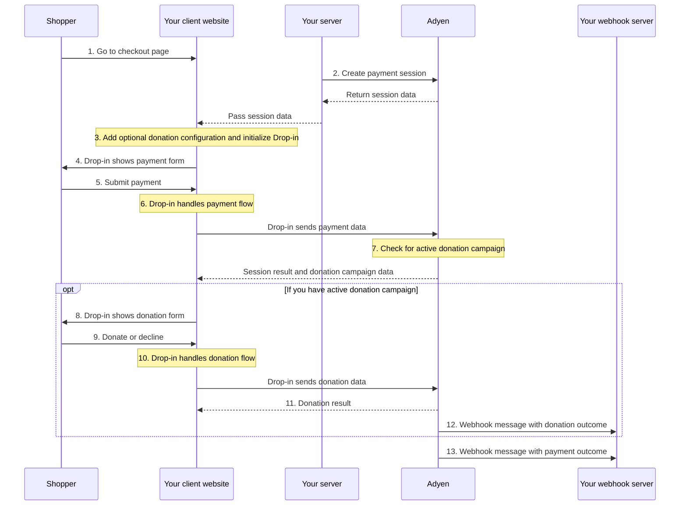
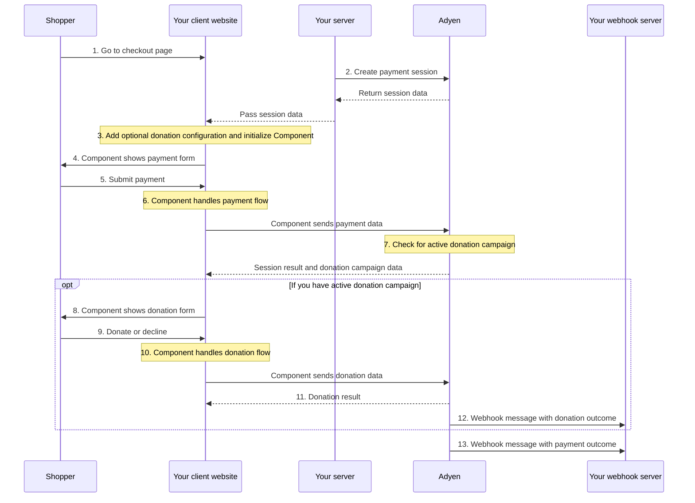

<!-- Source URL: https://docs.adyen.com/online-payments/donations/integration-options/sessions-flow.md -->
<!-- Fetched: 2026-09-15 -->
<!-- Discovery: llms.txt -->

---
title: "Donations with Sessions flow"
description: "Accept donations using the Sessions flow with Web Drop-in or Components."
url: "https://docs.adyen.com/online-payments/donations/integration-options/sessions-flow"
source_url: "https://docs.adyen.com/online-payments/donations/integration-options/sessions-flow.md"
canonical: "https://docs.adyen.com/online-payments/donations/integration-options/sessions-flow"
last_modified: "2026-09-15T12:56:52+02:00"
language: "en"
---

# Donations with Sessions flow

Accept donations using the Sessions flow with Web Drop-in or Components.

## Web Drop-in

Use Drop-in to show the donation form on your website

### Intro

With the Sessions flow, Drop-in handles the donation flow automatically. After a successful payment, if the shopper is eligible to donate, Drop-in shows the donation form to the shopper.

If the shopper chooses to donate, the donation transaction uses the same payment method that the shopper used for the original payment.

You can accept donations for fixed amounts, or allow the shopper to round up their transaction amount as a donation.

You do not need to pass any donation-specific parameters in your `/sessions` request. Drop-in manages the full donation flow, including presenting the campaign and processing the donation.

## Requirements

In addition to the [general Adyen Giving requirements](/online-payments/donations#requirements), take into account the following requirements.

| Requirement                                     | Description                                                                                                                                                                                                                                                                                                                                                                                                                              |
| ----------------------------------------------- | ---------------------------------------------------------------------------------------------------------------------------------------------------------------------------------------------------------------------------------------------------------------------------------------------------------------------------------------------------------------------------------------------------------------------------------------- |
| **Integration type**                            | Make sure that you have integrated with:- [Web Drop-in v6.36.0 or later using the Sessions flow](/online-payments/build-your-integration/sessions-flow/?platform=Web\&integration=Drop-in\&version=6.36.0)
- Checkout API v72 or later                                                                                                                                                                                                   |
| **[Customer Area roles](/account/user-roles)**  | Make sure that you have the **[Donation campaigns manager](/account/user-roles/#manage-donation-campaigns)** role.                                                                                                                                                                                                                                                                                                                       |
| **[Webhooks](/development-resources/webhooks)** | Subscribe to the following webhooks:- Standard webhooks
- [Adyen Giving merchant webhook](/development-resources/webhooks/webhook-types/#other-webhooks)                                                                                                                                                                                                                                                                                 |
| **Setup steps**                                 | Before you begin:- To check if your [Customer Area](https://ca-test.adyen.com/) user has the required roles, go to **Account** > **Users**. If you need additional roles, contact your admin user.
- Set up a Drop-in integration for the [payment methods](/online-payments/donations#supported-payment-methods) that you want to support.
- [Create and activate a donation campaign](/online-payments/donations/#donation-campaigns). |

## How it works

1. The shopper goes to the checkout page.
2. Your server [creates a payment session](/online-payments/build-your-integration/sessions-flow/?platform=Web\&integration=Drop-in#create-a-payment-session).
3. When you create a [global configuration object for `AdyenCheckout`](/online-payments/build-your-integration/sessions-flow/?platform=Web\&integration=Drop-in#configure), optionally [add a configuration object for donations](/online-payments/donations/integration-options/sessions-flow/#add-giving-configuration).
4. Drop-in shows the payment form.
5. The shopper uses submits the payment on your checkout page.
6. Drop-in handles the payment flow.
7. If the payment is successful, Drop-in checks if you have an active donation campaign in your Adyen Customer Area.
8. If you have an active donation campaign, Drop-in shows the donation form.
9. The shopper chooses to donate or declines.
10. Drop-in handles the donation flow.
11. [Get the donation result](#get-the-donation-outcome) from the `donation.onDonationSuccess` callback
12. Adyen sends a webhook message with the donation outcome.



### Show Giving

## Add Giving configuration

When you create a [global configuration object for Drop-in](/online-payments/build-your-integration/sessions-flow/?platform=Web\&integration=Drop-in#configure), you can optionally add configuration for donations.

To receive donation results and customize behavior, add a `donation` object to your checkout configuration. The `donation` configuration is optional, but if you include it, you must include the event handlers to get donation outcomes on your client website.

Event handlers:

| Property            | Required                                                                                                      | Description                                                                                                                          |
| ------------------- | ------------------------------------------------------------------------------------------------------------- | ------------------------------------------------------------------------------------------------------------------------------------ |
| `onDonationSuccess` |  | Called when the donation is completed or the shopper declines to donate. Receives an object with `didDonate`: **true** or **false**. |
| `onDonationFailure` |  | Called when an error occurs in the donation creation or when a donation fails.                                                       |

Configuration parameters:

| Property    | Required | Description                                                                                                                                                                              |
| ----------- | -------- | ---------------------------------------------------------------------------------------------------------------------------------------------------------------------------------------- |
| `autoMount` |          | Specifies if Drop-in automatically shows the donation form after a successful payment. Set to **false** to not show the donation form after the payment is completed. Default: **true**. |
| `delay`     |          | The delay in milliseconds after a successful payment before Drop-in shows the donation form.                                                                                             |

**Example Drop-in configuration with donation callbacks**

```js
const globalConfiguration = {
    session: {
        id: sessionId,
        sessionData: sessionData
    // ...Other configuration.
    donation: {
        // Handles the
        onDonationSuccess: (result) => {
            if (result.didDonate) {
                console.log("Shopper donated");
            } else {
                console.log("Shopper declined to donate");
            }
        },
        onDonationFailure: (error) => {
            console.error("Donation error:", error);
        }
    },
    onPaymentCompleted: (result, component) => {
        console.log("Payment completed:", result);
    }
};
```

After a successful payment, if the shopper is eligible to donate, Drop-in shows the donation form. By default, the donation form is mounted in the same container as Drop-in.

You do not need to create or configure the Donation component separately. Drop-in handles the full donation flow, including:

* Showing the donation campaign details (nonprofit name, description, logo, banner).
* Presenting the donation amounts or round-up option, depending on the [donation type](/online-payments/donations#donation-type).
* Processing the donation.

### Get Donation Outcome

## Get the donation outcome

You can get the outcome of each donation in a webhook message. This enables you to inform shoppers by email or mobile messaging about their donation, provided you have the shopper's contact details.

To receive these webhook messages, enable the [Adyen Giving merchant webhook](/development-resources/webhooks/webhook-types#other-webhooks), which includes `eventCode`: **DONATION**.

For a successful donation, the event contains:

* `success`: **true**.
* `originalReference`: use this value to associate the donation with the shopper's original transaction.

**Successful donation webhook event**

```json
{
  "live": "false",
  "notificationItems": [
    {
      "NotificationRequestItem": {
        "additionalData": {
          "originalMerchantAccountCode": "YOUR_MERCHANT_ACCOUNT"
        },
        "amount": {
          "currency": "EUR",
          "value": 500
        },
        "originalReference": "V4HZ4RBFJGXXGN82",
        "eventCode": "DONATION",
        "eventDate": "2022-07-07T13:18:13+02:00",
        "merchantAccountCode": "CHARITY_DONATION_ACCOUNT",
        "merchantReference": "YOUR_DONATION_REFERENCE",
        "paymentMethod": "visa",
        "pspReference": "Z58FGTKBRCQ2WN27",
        "reason": "033899:1111:03/2030",
        "success": "true"
      }
    }
  ]
}
```

## Test and go live

Before going live with your integration, [use our test cards to test your integration](/online-payments/donations/testing).

## See also

* [Sessions flow integration guide](/online-payments/build-your-integration/sessions-flow)
* [Donations with Advanced flow](/online-payments/donations/integration-options/advanced-flow)
* [Webhooks](https://docs.adyen.com/api-explorer/Webhooks/v1/overview)
* [Giving on adyen.com](https://www.adyen.com/giving)
* [Monitor donations](/reporting/monitor-donations/)

## Web Components

Use the Component to show the donation form on your website

### Intro

With the Sessions flow, the Component handles the donation flow automatically. After a successful payment, if the shopper is eligible to donate, the Component shows the donation form to the shopper.

If the shopper chooses to donate, the donation transaction uses the same payment method that the shopper used for the original payment.

You can accept donations for fixed amounts, or allow the shopper to round up their transaction amount as a donation.

You do not need to pass any donation-specific parameters in your `/sessions` request. the Component manages the full donation flow, including presenting the campaign and processing the donation.

## Requirements

In addition to the [general Adyen Giving requirements](/online-payments/donations#requirements), take into account the following requirements.

| Requirement                                     | Description                                                                                                                                                                                                                                                                                                                                                                                                                                    |
| ----------------------------------------------- | ---------------------------------------------------------------------------------------------------------------------------------------------------------------------------------------------------------------------------------------------------------------------------------------------------------------------------------------------------------------------------------------------------------------------------------------------- |
| **Integration type**                            | Make sure that you have integrated with:- [Web the Component v6.36.0 or later using the Sessions flow](/online-payments/build-your-integration/sessions-flow/?platform=Web\&integration=Components\&version=6.36.0)
- Checkout API v72 or later                                                                                                                                                                                                |
| **[Customer Area roles](/account/user-roles)**  | Make sure that you have the **[Donation campaigns manager](/account/user-roles/#manage-donation-campaigns)** role.                                                                                                                                                                                                                                                                                                                             |
| **[Webhooks](/development-resources/webhooks)** | Subscribe to the following webhooks:- Standard webhooks
- [Adyen Giving merchant webhook](/development-resources/webhooks/webhook-types/#other-webhooks)                                                                                                                                                                                                                                                                                       |
| **Setup steps**                                 | Before you begin:- To check if your [Customer Area](https://ca-test.adyen.com/) user has the required roles, go to **Account** > **Users**. If you need additional roles, contact your admin user.
- Set up a the Component integration for the [payment methods](/online-payments/donations#supported-payment-methods) that you want to support.
- [Create and activate a donation campaign](/online-payments/donations/#donation-campaigns). |

## How it works

1. The shopper goes to the checkout page.
2. Your server [creates a payment session](/online-payments/build-your-integration/sessions-flow/?platform=Web\&integration=Components#create-a-payment-session).
3. When you create a [global configuration object for `AdyenCheckout`](/online-payments/build-your-integration/sessions-flow/?platform=Web\&integration=Components#configure), optionally [add a configuration object for donations](/online-payments/donations/integration-options/sessions-flow/#add-giving-configuration).
4. The Component shows the payment form.
5. The shopper submits the payment on your checkout page.
6. The Component handles the payment flow.
7. If the payment is successful, the Component checks if you have an active donation campaign in your Adyen Customer Area.
8. If you have an active donation campaign, the Component shows the donation form.
9. The shopper chooses to donate or declines.
10. The Component handles the donation flow.
11. [Get the donation result](#get-the-donation-outcome) from the `donation.onDonationSuccess` callback
12. Adyen sends a webhook message with the donation outcome.



### Show Giving

## Add Giving configuration

When you create a [global configuration object for the Component](/online-payments/build-your-integration/sessions-flow/?platform=Web\&integration=Components#configure), you can optionally add configuration for donations.

To receive donation results and customize behavior, add a `donation` object to your checkout configuration. The `donation` configuration is optional, but if you include it, you must include the event handlers to get donation outcomes on your client website.

Event handlers:

| Property            | Required                                                                                                      | Description                                                                                                                          |
| ------------------- | ------------------------------------------------------------------------------------------------------------- | ------------------------------------------------------------------------------------------------------------------------------------ |
| `onDonationSuccess` |  | Called when the donation is completed or the shopper declines to donate. Receives an object with `didDonate`: **true** or **false**. |
| `onDonationFailure` |  | Called when an error occurs in the donation creation or when a donation fails.                                                       |

Configuration parameters:

| Property    | Required | Description                                                                                                                                                                                                                                                                                                                                                          |
| ----------- | -------- | -------------------------------------------------------------------------------------------------------------------------------------------------------------------------------------------------------------------------------------------------------------------------------------------------------------------------------------------------------------------- |
| `autoMount` |          | Specifies if the Component automatically shows the donation form after a successful payment. Set to **false** to not automatically show the donation form after the payment is completed. You can [show the donation form in a separate container](#show-the-donation-form-in-a-separate-container) by creating a new Donation Component instead. Default: **true**. |
| `delay`     |          | The delay in milliseconds after a successful payment before the Component shows the donation form.                                                                                                                                                                                                                                                                   |

**Example Component configuration with donation callbacks**

```js
const globalConfiguration = {
    session: {
        id: sessionId,
        sessionData: sessionData
    },
    // ...Other configuration.
    donation: {
        onDonationSuccess: (result) => {
            if (result.didDonate) {
                console.log("Shopper donated");
            } else {
                console.log("Shopper declined to donate");
            }
        },
        onDonationFailure: (error) => {
            console.error("Donation error:", error);
        }
    },
    onPaymentCompleted: (result, component) => {
        console.log("Payment completed:", result);
    }
};
```

### Show the donation form in a separate container

By default, the Component mounts the donation form in the same container as the original Component. To mount it in a different container:

1. Set `donation.autoMount` to **false**.
2. Create a new Donation Component in the `onPaymentCompleted` callback, passing the reference to the DOM element that you want to mount the Component into.

**Example configuration for showing the donation form in a separate container**

```js
const globalConfiguration = {
    session: {
        id: sessionId,
        sessionData: sessionData
    },
    //... Other configuration.
    donation: {
        // 1. Set autoMount to false.
        autoMount: false,
        onDonationSuccess: (result) => {
            console.log("Donation result:", result);
        },
        onDonationFailure: (error) => {
            console.error("Donation error:", error);
        }
    },
    onPaymentCompleted: (result, element) => {
        if (result.askDonation === true) {
            // 2. Create a new Donation Component, passing the reference to the DOM element.
            new Donation(element.core, {
                rootNode: '#donation-container',
                commercialTxAmount: element.props.amount.value
            });
        }
    }
};
```

### Get Donation Outcome

## Get the donation outcome

You can get the outcome of each donation in a webhook message. This enables you to inform shoppers by email or mobile messaging about their donation, provided you have the shopper's contact details.

To receive these webhook messages, enable the [Adyen Giving merchant webhook](/development-resources/webhooks/webhook-types#other-webhooks), which includes `eventCode`: **DONATION**.

For a successful donation, the event contains:

* `success`: **true**.
* `originalReference`: use this value to associate the donation with the shopper's original transaction.

**Successful donation webhook event**

```json
{
  "live": "false",
  "notificationItems": [
    {
      "NotificationRequestItem": {
        "additionalData": {
          "originalMerchantAccountCode": "YOUR_MERCHANT_ACCOUNT"
        },
        "amount": {
          "currency": "EUR",
          "value": 500
        },
        "originalReference": "V4HZ4RBFJGXXGN82",
        "eventCode": "DONATION",
        "eventDate": "2022-07-07T13:18:13+02:00",
        "merchantAccountCode": "CHARITY_DONATION_ACCOUNT",
        "merchantReference": "YOUR_DONATION_REFERENCE",
        "paymentMethod": "visa",
        "pspReference": "Z58FGTKBRCQ2WN27",
        "reason": "033899:1111:03/2030",
        "success": "true"
      }
    }
  ]
}
```

## Test and go live

Before going live with your integration, [use our test cards to test your integration](/online-payments/donations/testing).

## See also

* [Sessions flow integration guide](/online-payments/build-your-integration/sessions-flow)
* [Donations with Advanced flow](/online-payments/donations/integration-options/advanced-flow)
* [Webhooks](https://docs.adyen.com/api-explorer/Webhooks/v1/overview)
* [Giving on adyen.com](https://www.adyen.com/giving)
* [Monitor donations](/reporting/monitor-donations/)
