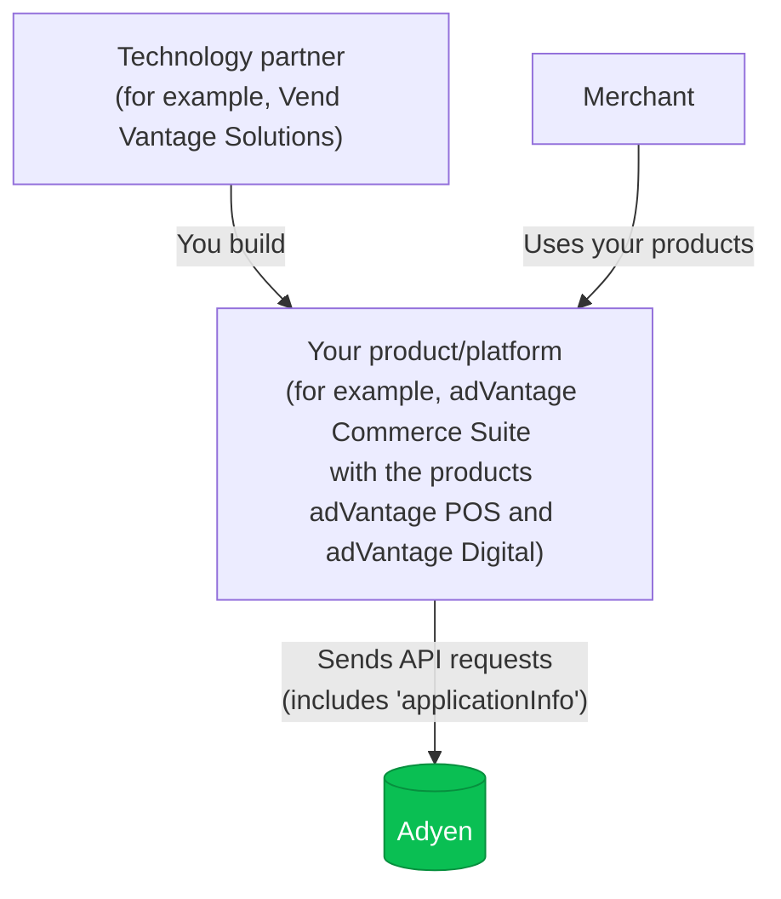
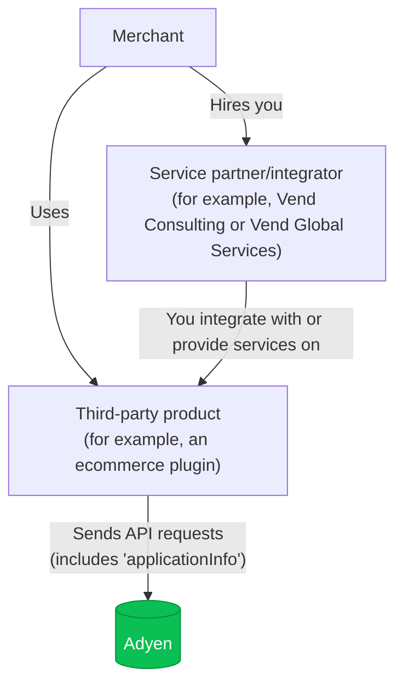

<!-- Source URL: https://docs.adyen.com/partners/application-information.md -->
<!-- Fetched: 2026-09-15 -->
<!-- Discovery: llms.txt -->

---
title: "Application information"
description: "Technology partners working with Adyen are required to add application info fields to API requests."
url: "https://docs.adyen.com/partners/application-information"
source_url: "https://docs.adyen.com/partners/application-information.md"
canonical: "https://docs.adyen.com/partners/application-information"
last_modified: "2023-08-17T20:34:00+02:00"
language: "en"
---

# Application information

Technology partners working with Adyen are required to add application info fields to API requests.

Adyen requires technology partners to include application information in API requests. When you send application information, we can help you do the following:

* Track payouts efficiently.
* Provide valuable performance insights.
* Offer improved operational support.
* Understand your partnership type.

## Partnership type

The application fields that you send depends on your partnership type.

* Technology partner (also known as solution or product provider): you own the global product brand for solutions like point-of-sale (POS), enterprise resource planning (ERP), kiosk, mobile, or ecommerce. Your products are used by other partners and merchants.
* Service partner or system integrator (SI): you are a service partner or system integrator if you integrate or implement third-party product solutions for merchants. This includes strategic consulting, custom integration, implementation, or field services.

## Send application information

To send application information, include the `applicationInfo` object in your API requests to Adyen. For example, the [/payments](https://docs.adyen.com/api-explorer/Checkout/latest/post/payments) request, the [/sessions](https://docs.adyen.com/api-explorer/Checkout/latest/post/sessions) request, or [requests from your in-person payments IPP integration](/point-of-sale/basic-tapi-integration/pass-application-information/).

You can use the following example to help you identify which application info fields to send in. This example includes the descriptions of the partner types and cases that show what application information to send.

You are required to send application information. If you do not, we are limited on how we can help you troubleshoot issues with your integration.

### Technology partner

In this example, the technology partner is a company called **Vend Vantage Solutions** that provides a suite of products called **adVantage Commerce Suite** that includes products called **adVantage POS** (point-of-sale software) and **adVantage Digital** (ecommerce software).



If you are a technology partner, include the following fields.

| Field                                      | Required                                                                                    | Description                                                                                             | Example                                      |
| ------------------------------------------ | ------------------------------------------------------------------------------------------- | ------------------------------------------------------------------------------------------------------- | -------------------------------------------- |
| `applicationInfo.externalPlatform.name`    |  | The name of your product platform. If the product does not have a platform name, use your company name. | **adVantage\_Commerce\_Suite**               |
| `applicationInfo.merchantApplication.name` |                                                                                             | The name of the specific product that uses Adyen services.                                              | **adVantage\_POS** or **adVantage\_Digital** |

The following example shows a payment request with the `applicationInfo` fields.

**Example of a payments request with application info for a technology partner**

```bash
curl https://checkout-test.adyen.com/checkout/v72/payments \
-H 'x-api-key: ADYEN_API_KEY' \
-H 'content-type: application/json' \
-X POST
-d '{
   "applicationInfo": {
      "externalPlatform": {
         "name": "adVantage_Commerce_Suite"
      },
      "merchantApplication": {
         "name": "adVantage_Digital"
      }
   },
   "amount":{
      "currency":"USD",
      "value":1000
   },
   "reference":"YOUR_ORDER_NUMBER",
   "paymentMethod":{
      "type": "scheme",
      "encryptedCardNumber": "test_4111111111111111",
      "encryptedExpiryMonth": "test_03",
      "encryptedExpiryYear": "test_2030",
      "encryptedSecurityCode": "test_737",
      "holderName": "S. Hopper"
   },
   "returnUrl": "https://your-company.example.com/...",
   "merchantAccount":"ADYEN_MERCHANT_ACCOUNT"
}'
```

### Service partner or system integrator (SI)

In this example, there are two service partners or system integrators:

* **Vend Consulting**
* **Vend Global Services**



If you are a service provider or system integrator, include the following fields.

| Field                                         | Required                                                                                    | Description                                                                              | Example                                            |
| --------------------------------------------- | ------------------------------------------------------------------------------------------- | ---------------------------------------------------------------------------------------- | -------------------------------------------------- |
| `applicationInfo.externalPlatform.integrator` |  | The name of your company or department providing the integration or consulting services. | **Vend\_Consulting** or **Vend\_Global\_Services** |

The following example shows a payment request with the `applicationInfo` fields.

**Example of a payments request with application info for a service partner or SI**

```bash
curl https://checkout-test.adyen.com/checkout/v72/payments \
-H 'x-api-key: ADYEN_API_KEY' \
-H 'content-type: application/json' \
-X POST
-d '{
   "applicationInfo": {
      "externalPlatform": {
         "integrator": "Vend_Consulting"
      }
   },
   "amount": {
      "currency": "USD",
      "value": 1000
   },
   "reference": "YOUR_ORDER_NUMBER",
   "paymentMethod": {
      "type": "scheme",
      "encryptedCardNumber": "test_4111111111111111",
      "encryptedExpiryMonth": "test_03",
      "encryptedExpiryYear": "test_2030",
      "encryptedSecurityCode": "test_737",
      "holderName": "S. Hopper"
   },
   "returnUrl": "https://your-company.example.com/checkout?shopperOrder=12xy...",
   "merchantAccount": "ADYEN_MERCHANT_ACCOUNT"
}'
```

### Field value requirements

The values you send in the application info fields can:

* Be between up to 40 characters in length.
* Start with a number or letter.
* Contain letters, digits, dashes, underscores, and spaces.

The formatting of the values must be the same in every request.\
For example, if the `externalPlatform.name` value is **adVantage\_Commerce\_Suite**, you cannot sometimes use a different value like **adVantage\_CommerceSuite** or **ADVANTAGECOMMERCESUITE**. You must choose one format and use it for every request.

## Optional application information fields

In addition to the required fields for your partnership type, we recommend that you also include additional fields.

| Field                       | Required | Description                                            | Example                |
| --------------------------- | -------- | ------------------------------------------------------ | ---------------------- |
| externalPlatform.version    |          | The version of the platform.                           | 1.0.0                  |
| merchantApplication.name    |          | The name of the application that the merchant uses.    | **adVantage\_Digital** |
| merchantApplication.version |          | The version of the application that the merchant uses. | 2.1.0                  |

## See also

* [Libraries](/development-resources/libraries)
