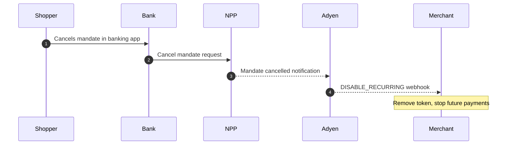

<!-- Source URL: https://docs.adyen.com/payment-methods/payto.md -->
<!-- Fetched: 2026-09-15 -->
<!-- Discovery: llms.txt -->

---
title: "PayTo"
description: "Accept PayTo payments with your online payments integration."
url: "https://docs.adyen.com/payment-methods/payto"
source_url: "https://docs.adyen.com/payment-methods/payto.md"
canonical: "https://docs.adyen.com/payment-methods/payto"
last_modified: "2026-09-15T14:06:04+02:00"
language: "en"
---

# PayTo

Accept PayTo payments with your online payments integration.

  **Read more**

Learn more about PayTo on [payto.com.au](https://payto.com.au).

PayTo is a real-time, account-to-account payment method built on Australia's [New Payments Platform (NPP)](https://www.auspayplus.com.au/brands/nppa). It enables merchants to accept both one-off and recurring payments directly from shoppers' bank accounts with real-time authorization through banking apps, lower processing costs, and flexible mandate management.

| Payment type       | Payment flow | Countries | Currencies | [Recurring](/online-payments/tokenization)                   | [Refunds](/online-payments/refund)                           | [Partial refunds](/online-payments/refund/#refund-a-payment) | [Multiple partial refunds](/online-payments/refund)          | [Separate captures](/online-payments/capture) | [Partial captures](/online-payments/capture/#partial-capture) | [Multiple partial captures](/online-payments/capture/#multiple-partial-captures) | [Chargebacks](/risk-management/chargeback-guidelines)        |
| ------------------ | ------------ | --------- | ---------- | ------------------------------------------------------------ | ------------------------------------------------------------ | ------------------------------------------------------------ | ------------------------------------------------------------ | --------------------------------------------- | ------------------------------------------------------------- | -------------------------------------------------------------------------------- | ------------------------------------------------------------ |
| Real-time payments | Direct       | AU        | AUD        |   |   |   |   |           |                           |                                              |   |

## Add PayTo as a payment method

Enable PayTo for your merchant account using either [Management API](#management-api) or the [Customer Area](#customer-area).

### Management API

Make a POST [/paymentMethodSettings](https://docs.adyen.com/api-explorer/Management/latest/post/merchants/\(merchantId\)/paymentMethodSettings) request and include:

| Parameter                                                                                                                                          | Required                                                                                                                                                | Description                                                                                                                   | Example                        |
| -------------------------------------------------------------------------------------------------------------------------------------------------- | ------------------------------------------------------------------------------------------------------------------------------------------------------- | ----------------------------------------------------------------------------------------------------------------------------- | ------------------------------ |
| [type](https://docs.adyen.com/api-explorer/Management/latest/post/merchants/\(merchantId\)/paymentMethodSettings#request-type)                     |                                                              | Must be **payto**.                                                                                                            | **payto**                      |
| [payto.merchantName](https://docs.adyen.com/api-explorer/Management/latest/post/merchants/\(merchantId\)/paymentMethodSettings#request-payto)      |                                                              | Business name displayed in shopper's banking app.                                                                             | **ACME Subscriptions Pty Ltd** |
| [payto.payToPurpose](https://docs.adyen.com/api-explorer/Management/latest/post/merchants/\(merchantId\)/paymentMethodSettings#request-payto)      |                                                              | Default purpose code, including mortgage, utility, loan, gambling, retail, salary, personal, government, pension, tax, other. | **retail**                     |
| [businessLineId](https://docs.adyen.com/api-explorer/Management/latest/post/merchants/\(merchantId\)/paymentMethodSettings#request-businessLineId) |  | Conditional: Your business line identifier. Optional, unless you are using the platform model.                                | **SE12345678912345ABCDEFG**    |
| [storeIds](https://docs.adyen.com/api-explorer/Management/latest/post/merchants/\(merchantId\)/paymentMethodSettings#request-storeIds)             |  | Conditional: Only required when configuring the payment method for a specific store.                                          | **\["ST123..."]**              |

**Management API request**

```json
{
  "type": "payto",
  "payto": {
      "merchantName": "",
      "payToPurpose": "retail"
  },
  "businessLineId": "YOUR_BUSINESS_LINE_ID",
  "storeIds": [
      "YOUR_STORE_ID"
      ]
}
```

PayTo setup is asynchronous. To confirm PayTo was added:

1. Configure a payment method webhook via Customer Area or Management API.
2. Listen for the `paymentMethod.created` event.

Example webhook confirmation:

**Webhook confirmation**

```json
{
  "type": "paymentMethod.created",
  "environment": "live",
  "createdAt": "2026-04-30T10:15:30+01:00",
  "data": {
      "id": "PM323232323232323232",
      "type": "payto",
      "status": "success",
      "merchantId": "YOUR_MERCHANT_ACCOUNT",
      "enabled": false
  }
}
```

If the `status` is **success**, PayTo is ready for use.

For webhook configuration, see [Configure and manage webhooks](https://docs.adyen.com/development-resources/webhooks/configure-and-manage).

### Customer Area

Follow these steps to [request PayTo to be added to your merchant account](/payment-methods/add-payment-methods#add-payment-methods):

1. Log in to [live Customer Area](https://ca-live.adyen.com/).
2. Go to **Payments** > **Payment methods**.
3. Search for PayTo and configure the merchant name and purpose code.

## Payments flow

A typical payment flow includes:

**First payment**

1. Call [/paymentMethods](https://docs.adyen.com/api-explorer/Checkout/latest/post/paymentMethods) to confirm which payment methods are available for the payment, showing PayTo if included in the response.

2. Collect customer details and submit a [/payments](https://docs.adyen.com/api-explorer/Checkout/latest/post/payments) request with the appropriate details. Adyen creates an agreement with the customer's bank.

3. The customer will be shown a pending screen while they confirm the payment in their banking app. Successful payment is confirmed via webhook notification from Adyen.

   **First payment and mandate creation**

   ```mermaid
   sequenceDiagram
   autonumber
   participant Shopper
   participant Merchant
   participant Adyen
   participant NPP
   participant Bank

       %% Step 1: Check Payment Methods
       Merchant->>Adyen: POST /paymentMethods (countryCode: AU, shopperReference)
       Adyen-->>Merchant: PayTo included in response
       Merchant->>Shopper: Display PayTo option

       %% Step 2: Initiate Payment & Mandate
       Shopper->>Merchant: Provides PayID or BSB, initiates payment
       Merchant->>Adyen: POST /payments (shopperAccountIdentifier, mandate, storePaymentMethod: true)
       Adyen-->>Merchant: resultCode: Pending + action (await)
       Merchant->>Shopper: Show pending screen

       %% Step 3: Mandate Approval via NPP & Bank
       Adyen->>NPP: Create mandate request
       NPP->>Bank: Push notification
       Bank->>Shopper: Mandate approval request (banking app)
       Shopper->>Bank: Confirms mandate
       Bank->>NPP: Mandate confirmed
       NPP-->>Adyen: Confirmation

       %% Step 4: First Payment Execution & Webhooks
       Adyen->>NPP: Execute first payment
       NPP->>Bank: Debit account
       Bank-->>NPP: Success
       NPP-->>Adyen: Payment successful
       Adyen-->>Merchant: AUTHORISATION webhook (payment outcome + recurringDetailReference)
       Adyen-->>Merchant: RECURRING_CONTRACT webhook (token / pspReference for future payments)
   ```

   **One-time payment**

   ```mermaid
   sequenceDiagram
   autonumber
   participant Shopper
   participant Merchant
   participant Adyen
   participant NPP
   participant Bank

       %% Step 1: Initial Check
       Merchant->>Adyen: POST /paymentMethods (countryCode: AU)
       Adyen-->>Merchant: PayTo included in response
       Merchant->>Shopper: Display PayTo option

       %% Step 2: Payment Initiation & Note
       Shopper->>Merchant: Provides PayID or BSB
       Merchant->>Adyen: POST /payments (shopperAccountIdentifier, shopperStatement, no mandate)
       Note over Adyen: Auto-generates mandate (adhoc, endDate: Day+1, amountRule: exact, count: 1)
       Adyen-->>Merchant: resultCode: Pending + action with auto-generated mandate
       Merchant->>Shopper: Show pending screen

       %% Step 3: Authorization & Single-Use Mandate Creation
       Adyen->>NPP: Create single-use mandate
       NPP->>Bank: Push notification
       Bank->>Shopper: Approval request (banking app)
       Shopper->>Bank: Confirms
       Bank->>NPP: Confirmed
       NPP-->>Adyen: Confirmation

       %% Step 4: Execution & Final Webhook
       Adyen->>NPP: Execute payment
       NPP->>Bank: Debit account
       Bank-->>NPP: Success
       NPP-->>Adyen: Payment successful
       Adyen-->>Merchant: AUTHORISATION webhook
   ```

**Subsequent payments**

1. Call [/paymentMethods](https://docs.adyen.com/api-explorer/Checkout/latest/post/paymentMethods) providing the `shopperReference` to retrieve your customer's stored payment methods.
2. Present the payment methods for which the available `supportedRecurringProcessingModels` contains **CardOnFile** to your customer.
3. Submit a [/payments](https://docs.adyen.com/api-explorer/Checkout/latest/post/payments) request with the appropriate details including the stored payment token. Adyen will automatically process the payment.
4. The customer will be able to see the transaction in real-time in their banking app. Successful payment is confirmed via webhook notification from Adyen.

When retrieving payment methods with a `shopperReference`, filter which PayTo tokens to show:

* Show at checkout (customer-initiated): Tokens with `supportedRecurringProcessingModels` containing **CardOnFile**

* Do not show at checkout (merchant-initiated): Tokens with only **Subscription** or **UnscheduledCardOnFile**

  **Subsequent recurring payment (CardOnFile)**

  ```mermaid
  sequenceDiagram
  autonumber
  participant Shopper
  participant Merchant
  participant Adyen
  participant NPP
  participant Bank

      %% Step 1: Fetch Saved Payment Methods
      Merchant->>Adyen: POST /paymentMethods (shopperReference)
      Adyen-->>Merchant: storedPaymentMethods with supportedRecurringProcessingModels
      Merchant->>Shopper: Display CardOnFile tokens only

      %% Step 2: Payment Initiation
      Shopper->>Merchant: Selects saved PayTo, clicks Pay
      Merchant->>Adyen: POST /payments (recurringDetailReference, shopperInteraction: ContAuth)
      Adyen-->>Merchant: resultCode: Pending + action (await)

      %% Step 3: Payment Execution
      Adyen->>NPP: Execute payment using existing mandate
      NPP->>Bank: Debit account
      Bank->>Shopper: Payment notification (real-time)
      Bank-->>NPP: Success
      NPP-->>Adyen: Payment successful
      Adyen-->>Merchant: AUTHORISATION webhook
  ```

## Recurring processing models

PayTo supports three recurring processing models. Select a model based on your payment frequency:

| Model                     | Use When                             | Mandate Frequency                                               | Example Use Case                                  |
| ------------------------- | ------------------------------------ | --------------------------------------------------------------- | ------------------------------------------------- |
| **Subscription**          | Regular scheduled payments           | daily, weekly, biWeekly, monthly, quarterly, halfYearly, yearly | Subscription services, monthly memberships        |
| **CardOnFile**            | Customer-initiated variable payments | adhoc                                                           | Shopper clicks "Pay with saved PayTo" at checkout |
| **UnscheduledCardOnFile** | Merchant-initiated variable payments | adhoc                                                           | Usage-based billing, account top-ups              |

Important:

* Subscription mandates require a count parameter (payments per frequency period)

* Adhoc mandates can omit count for unlimited payments

* The `recurringProcessingModel` must match your `mandate.frequency`:

  * Scheduled frequency: use **Subscription**
  * Adhoc frequency: use **CardOnFile** or **UnscheduledCardOnFile**

For detailed guidance, see [How to choose recurring processing model](https://help.adyen.com/knowledge/ecommerce-integrations/tokenization/how-to-choose-recurring-processing-model).

## Transaction limits

PayTo payments in Australia are subject to varying transaction limits that differ among banks and depend on the payment type:

* **Subscription (Recurring) Payments**: Many banks set a limit of $1,000 per transaction for recurring PayTo payments. However, some banks allow higher limits, up to $25,000 for recurring transactions.
* **One-Off (Ad hoc) Payments**: One-off payments typically have higher limits. Many banks allow one-off PayTo payments of up to $25,000. However, some banks may set lower limits for one-off payments, with daily limits as low as $5,000.
* **Card On File (Ad hoc) Payments**: Often have higher limits where many banks allow ad hoc PayTo payments of up to $25,000. However, some banks may set lower limits for ad hoc payments, with daily limits up to $1,000.

It is important to note that these limits can vary based on factors such as account type, customer verification status, and individual bank policies. Additionally, some banks may allow customers to request higher limits upon verification.

## Post-transaction management

### Mandate management

Cancellations: Customers can cancel mandates anytime through their banking app. You'll receive a DISABLE\_RECURRING webhook and future payments will fail. You cannot prevent customer-initiated cancellations.

**Mandate Cancellation**



Modifications: Mandates cannot be modified after creation. To change terms (amount, frequency, end date), cancel the existing mandate and create a new one with customer authorization.

### Refunds

Both full and partial [refunds](https://docs.adyen.com/online-payments/refund/) are supported. Refunds cannot be reversed once processed. Verify amounts and recipient details before initiating.

### Disputes

Unlike card payments, no chargeback process exists to clawback PayTo payments. If your customers wish to challenge the withdrawal of funds from their bank account, they do so via a manual mandate claim process with their bank. Note that mandate claims are largely limited to the exceptional scenarios:

1. Where there is no record of the customer’s mandate authorization
2. If the relevant mandate is suspended or canceled at the time of payment

Best practice: Resolve claims directly with your customer and offer refunds where appropriate.

## Bank notifications

The shopper can expect to receive in-app and/or email notifications from their bank for both one-off and recurring payments that are made with PayTo. These notifications could be for the creation or cancellation of mandates and agreements.

For **One-Off (Ad hoc) Payments**, a shopper might receive a notification for agreement creation, and then another notification for the cancellation of the agreement. This happens because cancellation will automatically occur once the agreement has elapsed, which happens immediately for one-time payments.\
How this is communicated to the shopper depends on the financial institution they’re with.

## Common errors and refusals

PayTo provides detailed raw responses that can be used as feedback to optimize your shopper checkout experience.\
Best practice: [Enable raw acquirer response](https://docs.adyen.com/development-resources/raw-acquirer-responses#receive-raw-responses) and see [PayTo raw responses](https://docs.adyen.com/development-resources/raw-acquirer-responses#payto-raw-responses) for error and refusal handling.

## How do you want to integrate?

[](/payment-methods/payto/web)

###### [Web](/payment-methods/payto/web)

[Use our pre-built UI solutions to add PayTo to your website.](/payment-methods/payto/web)

[](/payment-methods/payto/ios)

###### [iOS](/payment-methods/payto/ios)

[Use our pre-built UI solutions to add PayTo to your iOS app.](/payment-methods/payto/ios)

[](/payment-methods/payto/android)

###### [Android](/payment-methods/payto/android)

[Use our pre-built UI solutions to add PayTo your Android app.](/payment-methods/payto/android)

[](/payment-methods/payto/api-only)

###### [API only](/payment-methods/payto/api-only)

[Build your own UI for PayTo in your website, iOS or Android app.](/payment-methods/payto/api-only)
