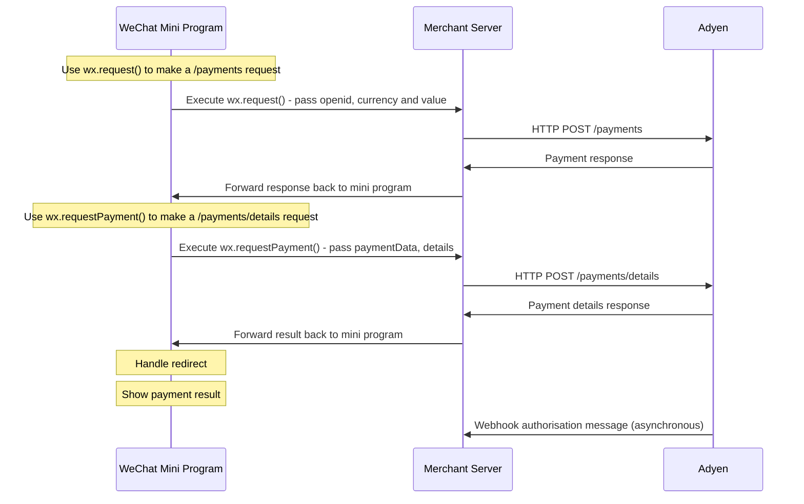

<!-- Source URL: https://docs.adyen.com/payment-methods/wechat-pay/wechat-pay-mini-program/api-only.md -->
<!-- Fetched: 2026-09-15 -->
<!-- Discovery: llms.txt -->

---
title: "Mini Program for API-only"
description: "How to offer WeChat Pay through WeChat Mini Program with an API-only integration."
url: "https://docs.adyen.com/payment-methods/wechat-pay/wechat-pay-mini-program/api-only"
source_url: "https://docs.adyen.com/payment-methods/wechat-pay/wechat-pay-mini-program/api-only.md"
canonical: "https://docs.adyen.com/payment-methods/wechat-pay/wechat-pay-mini-program/api-only"
last_modified: "2019-09-06T17:19:00+02:00"
language: "en"
---

# Mini Program for API-only

How to offer WeChat Pay through WeChat Mini Program with an API-only integration.

Make WeChat Pay available to your shopper on WeChat Mini Program with an API only integration.

## Requirements

| Requirement          | Description                                                                                                                                          |
| -------------------- | ---------------------------------------------------------------------------------------------------------------------------------------------------- |
| **Integration type** | Make sure that you have built an [API-only integration](/online-payments/build-your-integration/advanced-flow?platform=Web\&integration=API%20only). |
| **Setup steps**      | Before you begin, [add WeChat Pay Mini Program in your test Customer Area](/payment-methods/add-payment-methods).                                    |

## Preparation

Before you can accept WeChat Pay payments in your Mini Program:

1. Create a [Mini Program account](https://developers.weixin.qq.com/miniprogram/en/dev/#Apply-for-an-account) with WeChat.

2. Contact our [Support Team](https://ca-test.adyen.com/ca/ca/contactUs/support.shtml?form=other) or your implementation manager and provide your:

   * Mini Program AppID
   * Entity name
   * Currency

   These details are required to ensure that payments made with your Mini Program are settled to your Adyen account.

## Overview of payment flow

The diagram shows the flow of a Mini Program payment.



Follow the steps below to enable Mini Program payments.

Make all calls to Adyen from your server, not from your Mini Program.

## Step 1: Allow Adyen domains

Allow-list the following domains in your Mini Program settings:

* `https://[YOUR_MERCHANT_PREFIX]-checkout-live.adyenpayments.com`

Find your `merchant prefix` in the **Customer Area**, by selecting **Developers > API URLs**. Select the data center closest to your server.

## Step 2: Get the user's openid

1. Use **wx.login()** to get `jsCode` in the success callback.

2. Use **wx.request()** to make the following call that returns the user's `openid` in the response:

   `https://api.weixin.qq.com/sns/jscode2session?appid=${appId}&secret=${secret}&js_code=${jsCode}&grant_type=authorization_code`

   | Parameter       | Description                             |
   | --------------- | --------------------------------------- |
   | **appID**       | Available in your Mini Program Account. |
   | **secret**      | Available in your Mini Program Account. |
   | **jsCode**      | Obtained during the wx.login() call.    |
   | **grant\_type** | Set to **authorization\_code**.         |

Refer to the WeChat [Mini Program Login](https://developers.weixin.qq.com/miniprogram/en/dev/framework/open-ability/login.html) documentation for a detailed flow.

## Step 3: Make a payment request

1. Use the WeChat function **wx.request()** to make a request to your server.

   **Example of a payments request to your server**

   ```JavaScript
   // Make a payment request to your server

   wx.request({
      url: '{YOUR_SERVER_URL_TO_MAKE_PAYMENTS}',
      method: 'POST',
      header: {
         "content-type": "application/json",
      },
      data: {

         // Mandatory fields
         paymentMethod: {
            type: "wechatpayMiniProgram",
            openid: "{OPEN_ID_OBTAINED_IN_STEP_2}"
         },

         // Optional fields that may be assigned at server
         reference: "{YOUR_ORDER_NUMBER}",
         amount: {
            currency: "CNY",
            value: 1000
         }

      },
      // Get payment response in "res.data"
      success(res) {

         // Store paymentData to be used in 'Step 4 - chech payment result'
         const encryptedPaymentData = res.data.paymentData;

         // Handle redirect to make payment with WeChat Pay
         const payload = res.data.redirect.data;
         wx.requestPayment({
            ...payload,

            // Refer to 'Step 4 - check payment result', for complete code
            complete(res) {
               ...
            }
         })
      }
   });
   ```

2. Make a [/payments](https://docs.adyen.com/api-explorer/Checkout/latest/post/payments) request.

   **Example /payments request**

   ```bash
   curl https://[ACCOUNT-PREFIX]-checkout-live.adyenpayments.com/checkout/v72/payments \
   -H 'x-api-key: ADYEN_API_KEY' \
   -H 'content-type: application/json' \
   -d '{
       "merchantAccount": "ADYEN_MERCHANT_ACCOUNT",
       "reference": "JEP22U_698826xxxxx",
       "countryCode": "CN",
       "amount": {
           "currency": "CNY",
           "value": 1000
       },
       "paymentMethod":{
           "type": "wechatpayMiniProgram",
           "openid": "{OPEN_ID_OBTAINED_IN_STEP_2}"
       }
   }'
   ```

   When the [/payments](https://docs.adyen.com/api-explorer/Checkout/latest/post/payments) request is received by Adyen, a POST request is automatically sent from Adyen to the WeChat Server to place the order and to get the `prepay_id`, which is required to execute **wx.requestPayment()** and to trigger the payment on WeChat.

   The value for `prepay_id` is returned as part of the [/payments](https://docs.adyen.com/api-explorer/Checkout/latest/post/payments) response, and is contained in `redirect.data.package`.

   **Example /payments response**

   ```JavaScript
   {
      "resultCode": "Pending",
      "action": {
         "paymentData": "Ab02b4c0!...",
         "paymentMethodType": "wechatpayMiniProgram",
         "type": "qrCode"
      },
      "details": [{
         "key": "resultCode",
         "type": "text"
      }],
      "paymentData": "Ab02b4c0!...",
      "redirect": {
         "data": {
            "timeStamp": "{TIMESTAMP}",
            "package": "prepay_id={PREPAY_ID_FROM_WECHAT}",
            "paySign": "{SIGNATURE_GENERATED_USING_THESE_FIELDS}",
            "appId": "{APP_ID}",
            "signType": "MD5",
            "nonceStr": "{NONCE_STRING}"
         }
      }
   }
   ```

3) Use the WeChat function **wx.requestPayment()** to handle the redirect received in the [/payments](https://docs.adyen.com/api-explorer/Checkout/latest/post/payments) response.

## Step 4: Check the payment result

When the shopper completes the payment:

1. Use **wx.request()** (also used in step 3) to check the payment result.

   **Example of a payments request to your server**

   ```JavaScript
   complete(res) {
      // Make a payment result check to your server
      wx.request({
         url: '{YOUR_SERVER_URL_TO_PERFORM_PAYMENTS_DETAILS}',
         method: 'POST',
         header: {
            "content-type": "application/json",
         },
         data: {
            // Mandatory fields
            paymentData: encryptedPaymentData,
            details: {
               paymentStatus: res.errMsg
            }
         }
      });
   }
   ```

2. Make a [/payments/details](https://docs.adyen.com/api-explorer/Checkout/latest/post/payments/details) request.

   The value for `paymentStatus` is returned in `res.errMsg` and is one of these:

   * requestPayment:ok
   * requestPayment:fail cancel
   * requestPayment:fail (detail message)

   **Example /payments/details request**

   ```Unset
   curl https://[ACCOUNT-PREFIX]-checkout-live.adyenpayments.com/checkout/v72/payments \
   -H 'x-api-key: ADYEN_API_KEY' \
   -H 'content-type: application/json' \
   -d '{
   	"paymentData": "Ab02b4c0!..."
       "details" : {
           "paymentStatus" : "requestPayment:ok"
       }
   }'
   ```

   Receive the [/payments/details](https://docs.adyen.com/api-explorer/Checkout/latest/post/payments/details) response.

   **Example /payments/details response**

   ```Unset
   {
       "additionalData" : {
           "acquirerResponseCode" : "*************",
           "wechatpay.openid" : "*************"
       },
       "pspReference" : "PPKFQ89R6QRXGN82",
       "resultCode" : "Authorised",
       "amount" : {
           "currency" : "CNY",
           "value" : 1000
       },
       "merchantReference" : "LEDVRK_62471"
   }
   ```

## Step 5: Show the payment result

Use the `resultCode` that you received in the [/payments/details](https://docs.adyen.com/api-explorer/Checkout/latest/post/payments/details) response to present the payment result to your shopper.

The `resultCode` values you can receive for WeChat Pay are:

| resultCode                  | Description                                              | Action to take                                                                                                                                                                                                                                                                       |
| --------------------------- | -------------------------------------------------------- | ------------------------------------------------------------------------------------------------------------------------------------------------------------------------------------------------------------------------------------------------------------------------------------ |
| **Authorised**              | The payment was successful.                              | Inform the shopper that the payment has been successful. You will receive the funds in 2-3 days.                                                                                                                                                                                     |
| **Error**                   | There was an error when the payment was being processed. | Inform the shopper that there was an error processing their payment. The response contains a `refusalReason`, indicating the cause of the error.                                                                                                                                     |
| **Pending** or **Received** | The payment order was successfully received.             | Inform the shopper that you have received their order, and are waiting for the payment to clear. You will receive the final result of the payment in an [AUTHORISATION webhook](/development-resources/webhooks/webhook-types). If successful, you will receive the funds in 2 days. |
| **Refused**                 | The payment was refused by the shopper's bank.           | Ask the shopper to try the payment again using a different payment method.                                                                                                                                                                                                           |

## Test and go live

WeChat Pay does not have a test platform. If you have a personal WeChat account, test the following scenarios:

* Cancel the transaction when you are asked to verify the payment (recommended).
* Make a live WeChat Pay payment with a low value.

Check the status of a WeChat Pay payment in your [Customer Area](https://ca-test.adyen.com/) > **Payments** > **Payment list**.

## See also

* [About Mini Programs](https://developers.weixin.qq.com/miniprogram/en/dev/framework/quickstart/)
* [API only integration guide](/online-payments/build-your-integration/advanced-flow?platform=Web\&integration=API%20only)
* [Webhooks](/development-resources/webhooks)
* [API Explorer](https://docs.adyen.com/api-explorer/Checkout/latest/overview)
