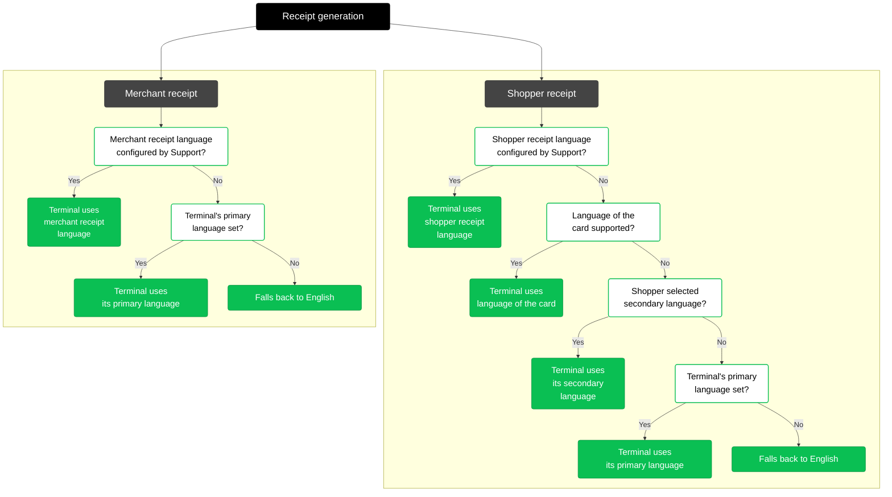

<!-- Source URL: https://docs.adyen.com/point-of-sale/basic-tapi-integration/generate-receipts.md -->
<!-- Fetched: 2026-09-15 -->
<!-- Discovery: llms.txt -->

---
title: "Generate receipts"
description: "Learn about compliant transaction receipts and printing receipts on terminals with a build-in printer."
url: "https://docs.adyen.com/point-of-sale/basic-tapi-integration/generate-receipts"
source_url: "https://docs.adyen.com/point-of-sale/basic-tapi-integration/generate-receipts.md"
canonical: "https://docs.adyen.com/point-of-sale/basic-tapi-integration/generate-receipts"
last_modified: "2026-09-15T13:50:00+02:00"
language: "en"
---

# Generate receipts

Learn about compliant transaction receipts and printing receipts on terminals with a build-in printer.

When you make a Terminal API transaction from your POS app, the API response includes receipt data. This contains values you can add to the receipt that you print, show, or email to your shopper.

Standalone terminals are not integrated in a POS system. They have a built-in printer that automatically prints a compliant receipt.

## Requirements

Before you begin, take into account the following requirements, and preparations.

| **Requirement**      | **Description**                                                                                                                                          |
| -------------------- | -------------------------------------------------------------------------------------------------------------------------------------------------------- |
| **Integration type** | A [Terminal API integration](/point-of-sale/design-your-integration/terminal-api) with payment terminals.                                                |
| **Setup steps**      | If you want to set a different language for receipts than the terminal display, check the [Changing the receipt languages](#changing-receipt-languages). |

## Generating compliant receipts

Card schemes have very specific requirements on what should be included on a receipt. These requirements differ per scheme and country/region, and can change. Receipts generated by Adyen have been certified as compliant by the card schemes that we support.

We strongly recommend generating receipts using the [Adyen-generated receipt data](/#receipt-data) without alterations.

Card schemes will occasionally visit stores to verify that the receipts are fully compliant. Non-compliant receipts can result in payments being [charged back](/get-started-with-adyen/adyen-glossary/#chargeback).

If you override the [Adyen-generated receipt data](#receipt-data), or validate values against a hard-coded list, it is your responsibility to ensure that scheme requirements are met at all times.

## URL encoding

If the Terminal API request includes characters from a non-Latin script, those characters are URL-encoded. To ensure those characters appear correctly on the printed receipt, you first need to URL-decode the `PaymentReceipt` object from the payment response.

## Displaying virtual receipts

If you are using a wide-screen [multimedia payment terminal](/point-of-sale/what-we-support/select-your-terminals), such as the M400, you can [show line items or receipts](/point-of-sale/shopper-engagement/display-data/display-receipt) on the display of the terminal.

## Receipt printing on terminals with a built-in printer

Some payment terminals, like the [V400m](/point-of-sale/user-manuals/v400m-user-manual) or [V400c](/point-of-sale/user-manuals/v400c-user-manual), have a built-in printer. Such terminals automatically print the receipt using the Terminal API receipt data.

You can optionally [add your company logo](/point-of-sale/design-your-integration/determine-account-structure/configure-features#device) to this receipt.

If you do not want to print the receipt on the terminal, specify the [tender option](/point-of-sale/add-data/tender-options) **ReceiptHandler** in your payment requests.

* Without that tender option, a terminal with a built-in printer will print the receipt.
* With that tender option, a terminal with a built-in printer will not print the receipt. You can then let your POS app send the receipt data to your receipt printer, or email the receipt to the shopper.

To let the shopper decide whether to print their receipt:

* In your [Customer Area](https://ca-test.adyen.com/), go to **Devices** > **Device settings** > **Payment features** > **Receipts** and enable **Ask before printing**. The terminal will then show a screen like the following after a transaction.

  

## Changing the receipt languages

You can customize the languages used for the terminal display, and receipts. This includes setting the terminal's primary and secondary languages, and excluding languages from use on the shopper receipt, for example if your integration has character set limitations.

To configure a specific merchant or shopper receipt language that differs from the primary and secondary terminal languages, contact our [Support Team](https://ca-test.adyen.com/ca/ca/contactUs/support.shtml?form=other).

### Change your receipt language settings

To change your terminal and receipt language settings:

1. Log in to your [Customer Area](https://ca-test.adyen.com/).

2. Switch to your merchant account.

3. Go to **Devices** > **Device settings**.

4. Under **Device** > **Location & language**, configure the following:

   * **Language:** Sets the default language for the terminal and acts as a language option for receipts.
   * **Secondary language:** Sets the terminal's secondary language and acts as a language option for receipts if the shopper selects it.

5. To exclude languages from being used on the shopper receipt, go to **Device settings** > **Payment features** > **Receipts**, and select the languages to exclude under **Excluded languages**.

If you want to [change the language](/point-of-sale/mobile-android/manage#change-the-receipt-language) for either or both receipts for your mobile solution, contact our [Support team](https://support.adyen.com/).

### Receipt language flows

When a receipt is generated, the terminal follows a specific flow to select the language. If at any step the selected language is excluded from use, the terminal ignores it and moves to the next step.

* **Merchant receipt:** The terminal first checks if a specific merchant receipt language is configured by our Support Team. If the language is not configured, the terminal uses the primary language. The receipt language falls back to English if the primary language is not configured.

* **Shopper receipt:** The terminal first checks if a specific shopper receipt language is configured by our Support Team. If the language is not configured, it tries to use the language of the country or region where the card was issued. If the language of the card is unknown or excluded from use, the terminal falls back to its secondary language (if selected by the shopper). If no secondary language is configured, the terminal uses its primary language. The receipt language falls back to English if the primary language is not configured.

The following diagram shows the receipt generation flows for merchant receipt and shopper receipt:

## Receipt data

When you make a payment using our Terminal API, the [payment result](/point-of-sale/basic-tapi-integration/make-a-payment#payment-response) contains a `PaymentReceipt` object. This object includes:

* `CustomerReceipt`: you can use this data to generate a receipt for the shopper.
* `CashierReceipt`: you can use this data to generate a merchant receipt. You can also use this data to collect the shopper's signature, or for reconciliation purposes.

Each receipt consists of multiple key-value pairs, which are generated dynamically depending on the:

* Transaction type.
* Result. For example, approved or declined.
* Cardholder verification method (CVM).
* Card issuer country/region.
* Country/region of your store.
* Payment method.

The following table shows all the keys that can appear in Adyen-generated receipt data.

| Key                          | Description                                                                                                                                                                                                                                                  |
| ---------------------------- | ------------------------------------------------------------------------------------------------------------------------------------------------------------------------------------------------------------------------------------------------------------ |
| `header1`                    | First header line of your receipt. You can [customize](/point-of-sale/design-your-integration/determine-account-structure/configure-features#payment-features) the structure and text of the receipt header.                                                 |
| `header2`                    | Second header line of your receipt. You can [customize](/point-of-sale/design-your-integration/determine-account-structure/configure-features#payment-features) the structure and text of the receipt header.                                                |
| `aac`                        | Decline cryptogram generated by the card.                                                                                                                                                                                                                    |
| `accountType`                | Bank account used for the authorization. For example, chequing or savings account.                                                                                                                                                                           |
| `additionalEmvData`          | Set of EMV details.                                                                                                                                                                                                                                          |
| `aid`                        | Application Identifier (the scheme product).                                                                                                                                                                                                                 |
| `approved`                   | Final state for approved transactions.                                                                                                                                                                                                                       |
| `refused`                    | Final state for declined transactions.                                                                                                                                                                                                                       |
| `void`                       | Final state for transactions that were cancelled by the merchant, shopper, or terminal.                                                                                                                                                                      |
| `atc`                        | Application Transaction Counter.                                                                                                                                                                                                                             |
| `authCode`                   | Authorization code from the issuer.                                                                                                                                                                                                                          |
| `authorizationType`          | Indicates the payment authorization was a pre-authorization. Not included for a regular final authorization. To enable this key, contact our [Support Team](https://ca-test.adyen.com/ca/ca/contactUs/support.shtml?form=other).                             |
| `authResponseCode`           | Authorization response code from the issuer.                                                                                                                                                                                                                 |
| `buyerId`                    | Identification of the wallet used for authorization.                                                                                                                                                                                                         |
| `cardholderHeader`           | Receipt type indicator. For example, **CARDHOLDER COPY** (or the localized text).                                                                                                                                                                            |
| `cardholderName`             | Name of the cardholder. This key is not present by default. When enabled, it is included only on the merchant receipt. To enable this key, contact our [Support Team](https://ca-test.adyen.com/ca/ca/contactUs/support.shtml?form=other).                   |
| `cardType`                   | Terminal-determined value for the type of card.                                                                                                                                                                                                              |
| `cashbackAmount`             | Amount to be provided to the shopper in cash.                                                                                                                                                                                                                |
| `charityAmount`              | Amount donated to a non-profit by the shopper.                                                                                                                                                                                                               |
| `cid`                        | Cryptogram Information Data.                                                                                                                                                                                                                                 |
| `cnpj`                       | Identification number issued for the National Registry of Legal Entities.                                                                                                                                                                                    |
| `currentBalanceAmount`       | Balance on the cardholder's bank account.                                                                                                                                                                                                                    |
| `cvmRes`                     | When applicable, indicates the PIN has been verified.                                                                                                                                                                                                        |
| `dccexpl`                    | Explanation of the DCC process, for shopper consent.                                                                                                                                                                                                         |
| `dccmarkup`                  | Markup on the sourced exchange rate for DCC.                                                                                                                                                                                                                 |
| `dccrate`                    | Exchange rate used to calculate the DCC conversion (including markup).                                                                                                                                                                                       |
| `dccshopperamount`           | Amount after DCC conversion was applied.                                                                                                                                                                                                                     |
| `dccsource`                  | Source of the base exchange rate (proxied by Adyen, excluding markup).                                                                                                                                                                                       |
| `discountAmount`             | Discount applied by the merchant.                                                                                                                                                                                                                            |
| `ebtCashBalanceAmount`       | The remaining balance in the shopper's Cash (TANF) account.                                                                                                                                                                                                  |
| `ebtSnapBalanceAmount`       | The remaining balance in the shopper's SNAP account.                                                                                                                                                                                                         |
| `expiryDate`                 | Expiry date of the card.                                                                                                                                                                                                                                     |
| `filler`                     | Generic filler to create blocks of elements that go together.                                                                                                                                                                                                |
| `fundingSource`              | Funding source used for paying, such as a credit, debit, prepaid, or charge card. In other words: where the customer's money comes from. To enable this key, contact our [Support Team](https://ca-test.adyen.com/ca/ca/contactUs/support.shtml?form=other). |
| `gratuityAmount`             | Amount of the tip.                                                                                                                                                                                                                                           |
| `lastAttemptResponseMessage` | A message indicating why an EBT transaction was refused or the number of remaining PIN attempts.                                                                                                                                                             |
| `mid`                        | Merchant Identification.                                                                                                                                                                                                                                     |
| `mref`                       | Merchant-determined reference for the transaction.                                                                                                                                                                                                           |
| `originalAmount`             | Starting amount of the transaction before gratuity, adjustments, and such.                                                                                                                                                                                   |
| `pan`                        | The last four digits of the masked PAN.                                                                                                                                                                                                                      |
| `panSeq`                     | PAN sequence number or sequence number of the issued card.                                                                                                                                                                                                   |
| `paymentMethod`              | Payment method on the brand or scheme level, as provided by Adyen. For example, `visa`, `maestro`.                                                                                                                                                           |
| `paymentMethodVariant`       | Payment method on the product level, as provided by Adyen. For example, `visastandarddebit`, `vpay`.                                                                                                                                                         |
| `posEntryMode`               | Method of obtaining the PAN, such as ICC, NFC, MSR, or MKE.                                                                                                                                                                                                  |
| `preferredName`              | Issuer-determined label for the application on the card.                                                                                                                                                                                                     |
| `productType`                | Category of account within the funding source that is used for the transaction. For example, Checking, Savings, Credit, or Default (when the terminal does not require a product type).                                                                      |
| `ptid`                       | Hardware (terminal) identifier sent to the schemes.                                                                                                                                                                                                          |
| `retain`                     | Retention message.                                                                                                                                                                                                                                           |
| `rrn`                        | Retrieval Reference Number.                                                                                                                                                                                                                                  |
| `stan`                       | System Trace Audit Number.                                                                                                                                                                                                                                   |
| `surcharge`                  | Surcharge amount.                                                                                                                                                                                                                                            |
| `tid`                        | Terminal identifier.                                                                                                                                                                                                                                         |
| `tokenTxVariant`             | Description of the token variant, such as ApplePay or SamsungPay.                                                                                                                                                                                            |
| `totalAmount`                | Total amount to be debited or credited.                                                                                                                                                                                                                      |
| `txdate`                     | Terminal date of the transaction, in the local time zone.                                                                                                                                                                                                    |
| `txRef`                      | Reference for the transaction, provided by the merchant.                                                                                                                                                                                                     |
| `txtime`                     | Terminal time of the transaction, in the local time zone.                                                                                                                                                                                                    |
| `txtype`                     | Transaction type: GOODS\_SERVICES, REFUND, and so on.                                                                                                                                                                                                        |
| `walletDccAmount`            | Amount after DCC was applied by the scheme.                                                                                                                                                                                                                  |
| `walletDccRate`              | Rate applied by the scheme to calculate DCC.                                                                                                                                                                                                                 |
| `walletOperationType`        | Similar to `paymentMethod`. For example, `alipay` or `wechatpay`.                                                                                                                                                                                            |
| `walletTransactionReference` | Reference that the scheme assigned to the transaction.                                                                                                                                                                                                       |
| `sigline`                    | Line to indicate a signature needs to be placed above it.                                                                                                                                                                                                    |
| `signature`                  | Room for shopper signature on the merchant receipt.                                                                                                                                                                                                          |
| `merchantSigline`            | Line for merchant signature on the shopper receipt.                                                                                                                                                                                                          |
| `thanks`                     | 'Thank you' message (or the localized text).                                                                                                                                                                                                                 |
| `QRCode`                     | QR code value. You can [customize this](/point-of-sale/design-your-integration/determine-account-structure/configure-features#payment-features).                                                                                                             |

## See also

* [Payment response](/point-of-sale/basic-tapi-integration/make-a-payment#payment-response)
* [Configure features](/point-of-sale/design-your-integration/determine-account-structure/configure-features#payment-features)
