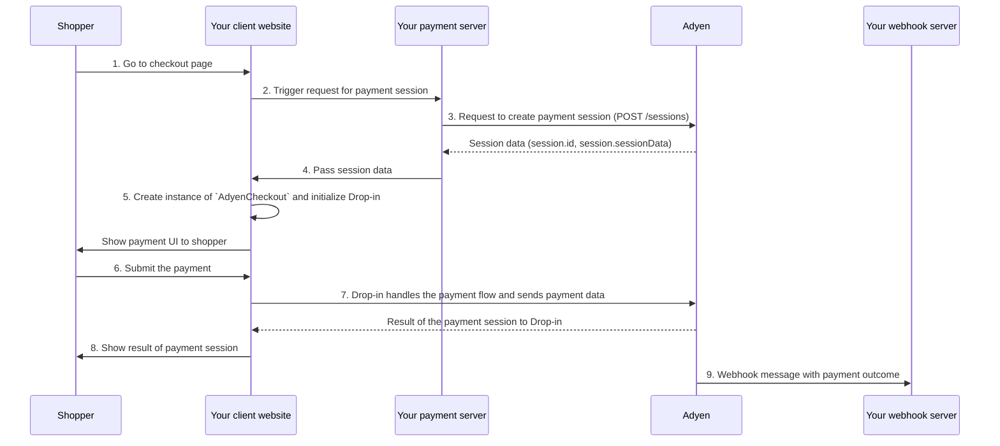

<!-- Source URL: https://docs.adyen.com/standard/integration/drop-in.md -->
<!-- Fetched: 2026-09-15 -->
<!-- Discovery: llms.txt -->

---
title: "Drop-in"
description: "Build your standard integration with Drop-in."
url: "https://docs.adyen.com/standard/integration/drop-in"
source_url: "https://docs.adyen.com/standard/integration/drop-in.md"
canonical: "https://docs.adyen.com/standard/integration/drop-in"
last_modified: "2026-09-15T14:06:04+02:00"
language: "en"
---

# Drop-in

Build your standard integration with Drop-in.

Our pre-built Drop-in includes the UI and client-side logic to show available payment methods to your shopper, collect their payment information, and handle the complete payment flow.

## Requirements

Before you begin, take into account the following requirements, limitations, and preparations.

| Requirement                    | Description                                                                                                                                                                                                                                                                                                                                                                                                                                                                                                                                                                                                                                                                                                                                                                                                                                                                                                                                                                                                                                                                                                                                                                                                                                       |
| ------------------------------ | ------------------------------------------------------------------------------------------------------------------------------------------------------------------------------------------------------------------------------------------------------------------------------------------------------------------------------------------------------------------------------------------------------------------------------------------------------------------------------------------------------------------------------------------------------------------------------------------------------------------------------------------------------------------------------------------------------------------------------------------------------------------------------------------------------------------------------------------------------------------------------------------------------------------------------------------------------------------------------------------------------------------------------------------------------------------------------------------------------------------------------------------------------------------------------------------------------------------------------------------------- |
| **Integration type**           | Use this information to build an online payments integration.                                                                                                                                                                                                                                                                                                                                                                                                                                                                                                                                                                                                                                                                                                                                                                                                                                                                                                                                                                                                                                                                                                                                                                                     |
| **Customer Area roles**        | Make sure that you have the following roles:- **Merchant admin role**
- **Manage API credentials**                                                                                                                                                                                                                                                                                                                                                                                                                                                                                                                                                                                                                                                                                                                                                                                                                                                                                                                                                                                                                                                                                                                                                |
| **Adyen API credentials**      | Make sure that you have created the following:- API credential
- API key
- Client key                                                                                                                                                                                                                                                                                                                                                                                                                                                                                                                                                                                                                                                                                                                                                                                                                                                                                                                                                                                                                                                                                                                                                             |
| **Adyen API credential roles** | Make sure that you have the roles for payments that are assigned by default.                                                                                                                                                                                                                                                                                                                                                                                                                                                                                                                                                                                                                                                                                                                                                                                                                                                                                                                                                                                                                                                                                                                                                                      |
| **Webhooks**                   | Subscribe to the following webhooks:- standard webhook with default event codes                                                                                                                                                                                                                                                                                                                                                                                                                                                                                                                                                                                                                                                                                                                                                                                                                                                                                                                                                                                                                                                                                                                                                                   |
| **Limitations**                | Make sure that your integration follows our recommended best practices:- **[\<iframe>](/standard/integration/drop-in/best-practices/#avoid-iframe-elements)**: an \<iframe> must be hosted on the same domain as the parent window to support payment flows that use redirects.
- **[WebViews](/standard/integration/drop-in/best-practices/#avoid-webviews)**: we do not recommend using WebViews in native apps due to security and functionality limitations. Use native equivalents instead.
- **[Server-side Rendering (SSR)](/standard/integration/drop-in/best-practices/#manage-server-side-rendering-ssr-)**: if you use SSR, ensure the `AdyenCheckout` instance and Drop-in are initialized on the client side.
- **[Browser support](/standard/integration/drop-in/best-practices/#supported-browsers)**: we support recent versions of all major browsers.For 3D Secure 2:- A strict Content Security Policy (CSP) can prevent native 3D Secure 2 challenges from being loaded on your website, because loading the 3D Secure 2 interface requires adding more URLs to your CSP. Adyen does not maintain a list of all URLs. You can specify to use the redirect flow when creating a session if you do not want to adjust your CSP. |
| **Setup steps**                | Make sure that you have done the following:- Set up your test account.
- Got an overview of what is required before you accept live payments.                                                                                                                                                                                                                                                                                                                                                                                                                                                                                                                                                                                                                                                                                                                                                                                                                                                                                                                                                                                                                                                                                                     |

## How it works

For a Drop-in integration, you must implement the following parts:

* **Your payment server**: Sends the API request to create a payment session.

  * Use the [/sessions](https://docs.adyen.com/api-explorer/Checkout/latest/post/sessions) endpoint on Checkout API v72 or later.
  * Use a [server-side library](https://github.com/Adyen#server-side) released on March 30, 2026 or later.

* **Your client website**: Shows the Drop-in UI where the shopper makes the payment. Drop-in uses the data from the API responses to handle the payment flow and additional actions on your client website.
  * Use [Web Drop-in](https://github.com/Adyen/adyen-web) v6.30.0 or later.

* **Your webhook server**: Listens for webhook messages that include the outcome of each payment.

### Payment flow

The parts of your integration work together to complete the payment flow. The payment flow is the same for all payments:

1. The shopper goes to the checkout page.
2. Your client website triggers a request to your payment server to create a payment session.
3. Your server uses the shopper's country and currency information from your client to make a POST [/sessions](https://docs.adyen.com/api-explorer/Checkout/latest/post/sessions) request to create a payment session. Adyen returns session data (`session.id`, `session.sessionData`).
4. Your server passes the session data to your client website.
5. Your client website creates an instance of `AdyenCheckout` using the session data, initializes Drop-in, and shows the payment UI to the shopper.
6. The shopper selects the payment method, enters payment details, and submits the payment.
7. Drop-in handles the payment flow and sends payment data. Adyen returns the result of the payment session to Drop-in.
8. Your client website shows the result of the payment session to the shopper.
9. Your webhook server receives a webhook message with the payment outcome.



### Implementation overview

This guide is organized by each part of the integration that you must implement:

* [**Payment server** ](#payment-server): Server-side setup and API calls.
* [**Client website** ](#client-website): Client-side setup, Drop-in configuration, and payment handling.
* [**Webhook server** ](#webhook-server): Receiving payment outcome notifications.

## Payment server

This section covers all the server-side implementation required for your Sessions flow integration. Complete these steps to set up your payment server.

* [Install an API library](#install-api-library)
* [Create a payment session](#create-payment-session)
* [Handle the payment result](#handle-payment-result)

### Install an API library

We provide server-side API libraries for several programming languages, available through common package managers, like Gradle and npm, for easier installation and version management. Our API libraries will save you development time, because they:

* Use an API version that is up to date.
* Have generated models to help you construct requests.
* Send the request to Adyen using their built-in HTTP client, so you do not have to create your own.

### Tab: Java

##### Try our example integration

  [Run it in Gitpod](https://github.com/adyen-examples/adyen-java-spring-online-payments#checkout-example).\
  [Clone the repository](https://github.com/adyen-examples/adyen-java-spring-online-payments).

#### Requirements

* Java 11 or later.

#### Installation

You can use [Maven](https://maven.apache.org), adding this dependency to your project's POM.

**Add the API library**

```xml
<dependency>
  <groupId>com.adyen</groupId>
  <artifactId>adyen-java-api-library</artifactId>
  <version>LATEST_VERSION</version>
</dependency>
```

You can find the latest version on GitHub. Alternatively, you can download the [release on GitHub](https://github.com/Adyen/adyen-java-api-library/releases).

#### Setting up the client

Create a singleton resource that you use for the API requests to Adyen:

**Set up your client**

```java
// Import the required classes.
package com.adyen.service;

import com.adyen.Client;
import com.adyen.service.checkout.PaymentsApi;
import com.adyen.model.checkout.Amount;
import com.adyen.model.checkout.CreateCheckoutSessionRequest;
import com.adyen.model.checkout.CreateCheckoutSessionResponse;
import com.adyen.enums.Environment;
import com.adyen.service.exception.ApiException;

import java.io.IOException;

public class Snippet {

    public Snippet() throws IOException, ApiException {
        // Set up the client and service.
        Client client = new Client("ADYEN_API_KEY", Environment.TEST);
    }
}
```

### Tab: PHP

##### Try our example integration

  [Run it in Gitpod](https://github.com/adyen-examples/adyen-php-online-payments#run-this-integration-in-seconds-using-gitpod).\
  [Clone the repository](https://github.com/adyen-examples/adyen-php-online-payments).

#### Requirements

* PHP 7.3 or later.
* cURL with SSL support.
* The JSON PHP extension.
* The list of dependencies from the composer require list.

#### Installation

You can use [Composer](https://getcomposer.org/). Follow the [installation instructions](https://getcomposer.org/doc/00-intro.md) if you do not already have composer installed.

**Install the API library**

```bash
composer require adyen/php-api-library
```

In your PHP script, make sure you include the autoloader:

**Include the autoloader**

```php
require __DIR__ . '/vendor/autoload.php';
```

Alternatively, you can download the [release on GitHub](https://github.com/Adyen/adyen-php-api-library/releases).

#### Set up the client

Create a singleton resource that you use for the API requests to Adyen:

**Set up your client**

```php
use Adyen\Model\Checkout\Amount;
use Adyen\Model\Checkout\CreateCheckoutSessionRequest;
use Adyen\Service\Checkout\PaymentsApi;

// Include your idempotency key when you make an API request.
$requestOptions['idempotencyKey'] = "YOUR_IDEMPOTENCY_KEY";

// Set up the client and service.
$client = new \Adyen\Client();
$client->setXApiKey('ADYEN_API_KEY');
$client->setEnvironment(\Adyen\Environment::TEST);

$service = new PaymentsApi($client);
```

### Tab: C\#

#### Requirements

* .NET standard 2.0 or later.

* For Terminal API certificate validation, set the application to either of the following:

  * .NET core 2.1 or later
  * .NET framework 4.6.1 or later

#### Installation

You can use [NuGet](https://www.nuget.org/packages/Adyen/):

**Install the API library**

```bash
PM> Install-Package Adyen -Version LATEST_VERSION
```

Alternatively, you can download the [release on GitHub](https://github.com/Adyen/adyen-dotnet-api-library).

#### Set up the client

Create a singleton resource that you use for the API requests to Adyen:

**Set up your client**

```cs
using Adyen;
using Adyen.Model.Checkout;
using Adyen.Service.Checkout;
using Environment = Adyen.Model.Environment;

class Program
{
    static void Main()
    {
        // Set up the client and service.
        var config = new Config
        {
            XApiKey = "ADYEN_API_KEY",
            Environment = Environment.Test
        };
        var client = new Client(config);
        var checkout = new PaymentsService(client);

        // Include your idempotency key when you make an API request.
        var requestOptions = new Adyen.Model.RequestOptions { IdempotencyKey = "YOUR_IDEMPOTENCY_KEY" };
    }
}
```

### Tab: NodeJS

##### Try our example integration

  [Run it in Gitpod](https://github.com/adyen-examples/adyen-node-online-payments#checkout-example).\
  [Clone the repository](https://github.com/adyen-examples/adyen-node-online-payments).

#### Requirements

* Node.js version 18 or later.

#### Installation

You can use [npm](https://www.npmjs.com/):

**Install the API library**

```bash
npm install --save @adyen/api-library
npm update @adyen/api-library
```

Alternatively, you can download the [release on GitHub](https://github.com/Adyen/adyen-node-api-library/releases).

#### Setting up the client

Create a singleton resource that you use for the API requests to Adyen:

**Set up your client**

```js
// Require the parts of the module you want to use.
const { Client, CheckoutAPI, Types} = require("@adyen/api-library");

// Set up the client and service.
const client = new Client({ apiKey: "ADYEN_API_KEY", environment: "TEST" });
const checkoutApi = new CheckoutAPI(client);

// Include your idempotency key when you make an API request.
const requestOptions = { idempotencyKey: "YOUR_IDEMPOTENCY_KEY" };
```

### Tab: Go

##### Try our example integration

  [Run it in Gitpod](https://github.com/adyen-examples/adyen-golang-online-payments#run-this-integration-in-seconds-using-gitpod).\
  [Clone the repository](https://github.com/adyen-examples/adyen-golang-online-payments).

#### Requirements

* Go 1.13 or later.

#### Installation

You can use [Go modules](https://github.com/golang/go/wiki/Modules):

**Install the API library**

```shell
go get github.com/adyen/adyen-go-api-library/vLATEST_VERSION
```

Alternatively, you can download the [release on GitHub](https://github.com/Adyen/adyen-go-api-library).

#### Set up the client

Create a singleton resource that you use for the API requests to Adyen:

**Set up your client**

```go
package main

import (
	"github.com/adyen/adyen-go-api-library/vLATEST_VERSION/src/adyen"
	"github.com/adyen/adyen-go-api-library/vLATEST_VERSION/src/checkout"
	"github.com/adyen/adyen-go-api-library/vLATEST_VERSION/src/common"
)

// Create a payment object.

func main () {
	client := adyen.NewClient(&common.Config{
		ApiKey: "ADYEN_API_KEY",
		Environment: common.TestEnv,
	})
	service := client.Checkout()
```

### Tab: Python

##### Try our example integration

  [Run it in Gitpod](https://github.com/adyen-examples/adyen-python-online-payments#run-this-integration-in-seconds-using-gitpod).\
  [Clone the repository](https://github.com/adyen-examples/adyen-python-online-payments).

#### Requirements

* Python 3.6 or later.
* (Optional) Packages: Requests or PycURL

#### Installation

You can use [pip](https://pip.pypa.io/en/stable/):

**Install the API library**

```py
pip install Adyen
```

Alternatively, you can download the [release on GitHub](https://github.com/Adyen/adyen-python-api-library).

#### Set up the client

Create a singleton resource that you use for the API requests to Adyen:

**Set up your client**

```py
import Adyen

# Set up the client and service.
adyen = Adyen.Adyen()
adyen.client.xapikey = "ADYEN_API_KEY"
adyen.client.platform = "test" # The environment that the library is used in.
```

### Tab: Ruby

##### Try our example integration

  [Run it in Gitpod](https://github.com/adyen-examples/adyen-rails-online-payments#run-this-integration-in-seconds-using-gitpod).\
  [Clone the repository](https://github.com/adyen-examples/adyen-rails-online-payments).

#### Requirements

* Ruby 2.7 or later.

#### Installation

You can use [RubyGems](https://rubygems.org/):

**Install the API library**

```bash
gem install adyen-ruby-api-library
```

Alternatively, you can download the [release on GitHub](https://github.com/Adyen/adyen-ruby-api-library/releases).

Run `bundle install` to install dependencies.

#### Set up the client

Create a singleton resource that you use for the API requests to Adyen:

**Set up your client**

```ruby
require 'adyen-ruby-api-library'

# Set up the client and service.
adyen = Adyen::Client.new
adyen.api_key = 'ADYEN_API_KEY'
adyen.env = :test # The environment that the library is used in.
```

### Create a session

A payment session is a resource with information about a payment flow initiated by the shopper. This resource has all the information required to handle all the stages of a payment flow. You can configure this resource with information like available payment methods, payment amount, or line items.

To create a payment session, make a [/sessions](https://docs.adyen.com/api-explorer/Checkout/latest/post/sessions) request, including:

**Request headers:**

| Header            | Required                                                                                                      | Description                                                                                           |
| ----------------- | ------------------------------------------------------------------------------------------------------------- | ----------------------------------------------------------------------------------------------------- |
| `x-api-key`       |  | Your Adyen API key for authentication.                                                                |
| `idempotency-key` |  | A unique identifier for the request. This is used to prevent duplicate requests from being processed. |
| `content-type`    |  | The content type of the request. Set to **application/json**.                                         |

**Request body:**

| Parameter name     | Required                                                                                                      | Description                                                                                                                                                                                                                                                                                                                           |
| ------------------ | ------------------------------------------------------------------------------------------------------------- | ------------------------------------------------------------------------------------------------------------------------------------------------------------------------------------------------------------------------------------------------------------------------------------------------------------------------------------- |
| `merchantAccount`  |  | Your merchant account name.                                                                                                                                                                                                                                                                                                           |
| `amount`           |  | The `currency` and `value` of the payment, in [minor units](/development-resources/currency-codes). This is used to filter the list of available payment methods to your shopper.                                                                                                                                                     |
| `returnUrl`        |  | URL to where the shopper should be taken back to after a redirection. If the URL to return to includes non-ASCII characters, like spaces or special letters, URL encode the value. The URL must not include personally identifiable information (PII), for example name or email address.                                             |
| `reference`        |  | Your unique reference for the payment. Minimum length: three characters.                                                                                                                                                                                                                                                              |
| `countryCode`      |  | The shopper's country code. This is used to filter the list of available payment methods to your shopper. If not set, setting the `locale` is required in the front-end [global configuration](#configure).                                                                                                                           |
| `shopperEmail`     |  | The shopper's email address. Strongly recommended because this field is used in a number of [risk checks](/risk-management/configure-your-risk-profile/risk-field-reference), and for 3D Secure.                                                                                                                                      |
| `shopperReference` |  | Your unique reference for the shopper. Do not include personally identifiable information (PII), such as name or email address. **Format:**- Minimum length: 3 characters.
- Case-sensitive.This field is used for the following:- Risk checks.
- When storing the shopper's payment details: associating the token with the shopper. |
| `channel`          |  | The platform where the payment is taking place. Use **Web**.                                                                                                                                                                                                                                                                          |

For a request that uses [tokenization](/standard/integration/drop-in/tokenization), you must include additional parameters.

**Example of a request to create a session for a payment of 10 EUR**

#### curl

```bash
curl https://checkout-test.adyen.com/v72/sessions \
-H 'x-api-key: ADYEN_API_KEY' \
-H "idempotency-key: YOUR_IDEMPOTENCY_KEY" \
-H 'content-type: application/json' \
-d '{
  "merchantAccount": "YOUR_MERCHANT_ACCOUNT",
  "amount": {
      "value": 1000,
      "currency": "EUR"
  },
  "returnUrl": "https://your-company.example.com/checkout?shopperOrder=12xy..",
  "reference": "YOUR_PAYMENT_REFERENCE",
  "countryCode": "NL",
  "shopperEmail": "s.hopper@example.com",
  "shopperReference": "Your-shopper-reference-890-xyz",
  "channel": "Web"
}'
```

#### Java

```java
// Adyen Java API Library v27.0.0
import com.adyen.Client;
import com.adyen.enums.Environment;
import com.adyen.model.checkout.*;
import java.time.OffsetDateTime;
import java.util.*;
import com.adyen.model.RequestOptions;
import com.adyen.service.checkout.*;

// For the live environment, additionally include your liveEndpointUrlPrefix.
Client client = new Client("ADYEN_API_KEY", Environment.TEST);

// Create the request object(s)
Amount amount = new Amount()
  .currency("EUR")
  .value(1000L);

CreateCheckoutSessionRequest createCheckoutSessionRequest = new CreateCheckoutSessionRequest()
  .reference("YOUR_PAYMENT_REFERENCE")
  .amount(amount)
  .merchantAccount("YOUR_MERCHANT_ACCOUNT")
  .countryCode("NL")
  .returnUrl("https://your-company.example.com/checkout?shopperOrder=12xy..")
  .channel(CreateCheckoutSessionRequest.ChannelEnum.WEB)
  .shopperEmail("s.hopper@example.com")
  .shopperReference("Your-shopper-reference-890-xyz");

// Send the request
PaymentsApi service = new PaymentsApi(client);
CreateCheckoutSessionResponse response = service.sessions(createCheckoutSessionRequest, new RequestOptions().idempotencyKey("UUID"));
```

#### PHP

```php
// Adyen PHP API Library v19.0.0
use Adyen\Client;
use Adyen\Environment;
use Adyen\Model\Checkout\Amount;
use Adyen\Model\Checkout\CreateCheckoutSessionRequest;
use Adyen\Service\Checkout\PaymentsApi;

$client = new Client();
$client->setXApiKey("ADYEN_API_KEY");
// For the live environment, additionally include your liveEndpointUrlPrefix.
$client->setEnvironment(Environment::TEST);


// Create the request object(s)
$amount = new Amount();
$amount
  ->setCurrency("EUR")
  ->setValue(1000);

$createCheckoutSessionRequest = new CreateCheckoutSessionRequest();
$createCheckoutSessionRequest
  ->setReference("YOUR_PAYMENT_REFERENCE")
  ->setAmount($amount)
  ->setMerchantAccount("YOUR_MERCHANT_ACCOUNT")
  ->setCountryCode("NL")
  ->setReturnUrl("https://your-company.example.com/checkout?shopperOrder=12xy..")
  ->setChannel("Web")
  ->setShopperEmail("s.hopper@example.com")
  ->setShopperReference("Your-shopper-reference-890-xyz");

$requestOptions['idempotencyKey'] = 'UUID';

// Send the request
$service = new PaymentsApi($client);
$response = $service->sessions($createCheckoutSessionRequest, $requestOptions);
```

#### C\#

```cs
// Adyen .net API Library v17.0.0
using Adyen;
using Environment = Adyen.Model.Environment;
using Adyen.Model;
using Adyen.Model.Checkout;
using Adyen.Service.Checkout;

// For the live environment, additionally include your liveEndpointUrlPrefix.
var config = new Config()
{
    XApiKey = "ADYEN_API_KEY",
    Environment = Environment.Test
};
var client = new Client(config);

// Create the request object(s)
Amount amount = new Amount
{
  Currency = "EUR",
  Value = 1000
};

CreateCheckoutSessionRequest createCheckoutSessionRequest = new CreateCheckoutSessionRequest
{
  Reference = "YOUR_PAYMENT_REFERENCE",
  Amount = amount,
  MerchantAccount = "YOUR_MERCHANT_ACCOUNT",
  CountryCode = "NL",
  ReturnUrl = "https://your-company.example.com/checkout?shopperOrder=12xy..",
  Channel = CreateCheckoutSessionRequest.ChannelEnum.Web,
  ShopperEmail = "s.hopper@example.com",
  ShopperReference = "Your-shopper-reference-890-xyz"
};

// Send the request
var service = new PaymentsService(client);
var response = service.Sessions(createCheckoutSessionRequest, requestOptions: new RequestOptions { IdempotencyKey = "UUID"});
```

#### Go

```go
// Adyen Go API Library v10.4.0
import (
  "context"
  "github.com/adyen/adyen-go-api-library/v9/src/common"
  "github.com/adyen/adyen-go-api-library/v9/src/adyen"
  "github.com/adyen/adyen-go-api-library/v9/src/checkout"
)
// For the live environment, additionally include your liveEndpointUrlPrefix.
client := adyen.NewClient(&common.Config{
  ApiKey:      "ADYEN_API_KEY",
  Environment: common.TestEnv,
})

// Create the request object(s)
amount := checkout.Amount{
  Currency: "EUR",
  Value: 1000,
}

createCheckoutSessionRequest := checkout.CreateCheckoutSessionRequest{
  Reference: "YOUR_PAYMENT_REFERENCE",
  Amount: amount,
  MerchantAccount: "YOUR_MERCHANT_ACCOUNT",
  CountryCode: common.PtrString("NL"),
  ReturnUrl: "https://your-company.example.com/checkout?shopperOrder=12xy..",
  Channel: common.PtrString("Web"),
  ShopperEmail: common.PtrString("s.hopper@example.com"),
  ShopperReference: common.PtrString("Your-shopper-reference-890-xyz"),
}

// Send the request
service := client.Checkout()
req := service.PaymentsApi.SessionsInput().IdempotencyKey("UUID").CreateCheckoutSessionRequest(createCheckoutSessionRequest)
res, httpRes, err := service.PaymentsApi.Sessions(context.Background(), req)
```

#### Python

```py
# Adyen Python API Library v12.5.1
import Adyen

adyen = Adyen.Adyen()
adyen.client.xapikey = "ADYEN_API_KEY"
# For the live environment, additionally include your liveEndpointUrlPrefix.
adyen.client.platform = "test" # The environment to use library in.

# Create the request object(s)
json_request = {
  "merchantAccount": "YOUR_MERCHANT_ACCOUNT",
  "amount": {
    "value": 1000,
    "currency": "EUR"
  },
  "returnUrl": "https://your-company.example.com/checkout?shopperOrder=12xy..",
  "reference": "YOUR_PAYMENT_REFERENCE",
  "countryCode": "NL",
  "channel": "Web",
  "shopperEmail": "s.hopper@example.com",
  "shopperReference": "Your-shopper-reference-890-xyz"
}

# Send the request
result = adyen.checkout.payments_api.sessions(request=json_request, idempotency_key="UUID")
```

#### Ruby

```rb
# Adyen Ruby API Library v9.5.1
require "adyen-ruby-api-library"

adyen = Adyen::Client.new
adyen.api_key = 'ADYEN_API_KEY'
# For the live environment, additionally include your liveEndpointUrlPrefix.
adyen.env = :test # Set to "live" for live environment

# Create the request object(s)
request_body = {
  :merchantAccount => 'YOUR_MERCHANT_ACCOUNT',
  :amount => {
    :value => 1000,
    :currency => 'EUR'
  },
  :returnUrl => 'https://your-company.example.com/checkout?shopperOrder=12xy..',
  :reference => 'YOUR_PAYMENT_REFERENCE',
  :countryCode => 'NL',
  :channel => 'Web',
  :shopperEmail => 's.hopper@example.com',
  :shopperReference => 'Your-shopper-reference-890-xyz'
}

# Send the request
result = adyen.checkout.payments_api.sessions(request_body, headers: { 'Idempotency-Key' => 'UUID' })
```

#### NodeJS (TypeScript)

```ts
// Adyen Node API Library v18.0.0
// Require the parts of the module you want to use
import { Client, CheckoutAPI, Types } from "@adyen/api-library";
// Initialize the client object
// For the live environment, additionally include your liveEndpointUrlPrefix.
const client = new Client({apiKey: "ADYEN_API_KEY", environment: "TEST"});

// Create the request object(s)
const amount: Types.checkout.Amount = {
  currency: "EUR",
  value: 1000
};

const createCheckoutSessionRequest: Types.checkout.CreateCheckoutSessionRequest = {
  reference: "YOUR_PAYMENT_REFERENCE",
  amount: amount,
  merchantAccount: "YOUR_MERCHANT_ACCOUNT",
  countryCode: "NL",
  returnUrl: "https://your-company.example.com/checkout?shopperOrder=12xy..",
  channel: Types.checkout.CreateCheckoutSessionRequest.ChannelEnum.Web,
  shopperEmail: "s.hopper@example.com",
  shopperReference: "Your-shopper-reference-890-xyz"
};

// Send the request
const checkoutAPI = new CheckoutAPI(client);
const response = checkoutAPI.PaymentsApi.sessions(createCheckoutSessionRequest, { idempotencyKey: "UUID" });
```

The response includes the following information that you need for the next steps.

| Parameter     | Description                                                  |
| ------------- | ------------------------------------------------------------ |
| `sessionData` | The payment session data you need to pass to your front end. |
| `id`          | A unique identifier for the session data.                    |

**HTTP 201 /sessions response body**

```json
{
    "amount": {
        "currency": "EUR",
        "value": 1000
    },
    "countryCode": "NL",
    "expiresAt": "2021-08-24T13:35:16+02:00",
    "id": "CSD9CAC34EBAE225DD",
    "merchantAccount": "YOUR_MERCHANT_ACCOUNT",
    "reference": "YOUR_PAYMENT_REFERENCE",
    "returnUrl": "https://your-company.example.com/checkout?shopperOrder=12xy..",
    "sessionData": "Ab02b4c.."
}
```

**Next step**: Pass the `id` and `sessionData` values to your front end. You will use these values when [creating the AdyenCheckout instance](#configure) on your [client website](#client-website).

### Handling API errors

If your [/sessions](https://docs.adyen.com/api-explorer/Checkout/latest/post/sessions) request does not get a HTTP 201 response, use the `errorCode` field and the list of [API error codes](/development-resources/error-codes) to troubleshoot.

**Example HTTP 400 response with an error message**

```json
{
  "status": 400,
  "errorCode": "170",
  "message": "Invalid merchant account",
  "errorType": "validation"
}
```

## Client website

This section covers all the client-side implementation required for your Drop-in integration. Complete these steps to set up your client website.

**Prerequisite**: Before starting this section, make sure you have completed the [Payment server](#payment-server) setup and have the `id` and `sessionData` values from the `/sessions` response.

* [Install Adyen Web](#install-adyen-web)
* [Configure Drop-in](#configure-drop-in)
* [Handle payment result](#handle-payment-result)

### Install Adyen Web

Use the Adyen Web npm package, or embed the Adyen Web script and stylesheet into your HTML file:

### Tab: npm (recommended)

Install the [Adyen Web Node package](https://www.npmjs.com/package/@adyen/adyen-web):

```bash
npm install @adyen/adyen-web --save
```

Import Adyen Web into your application:

```js
import { AdyenCheckout, Dropin } from '@adyen/adyen-web/auto';
import '@adyen/adyen-web/styles/adyen.css';
```

To reduce bundle size, you can [import individual payment methods](/standard/integration/drop-in/optional-drop-in-configuration#import-drop-in-with-individual-payment-methods) instead.

### Tab: Embed script and stylesheet

Use the `integrity` attribute so browsers can verify that the script and stylesheet have not been changed unexpectedly.

The value of the `integrity` attribute is the [Subresource Integrity (SRI) hash](/online-payments/web-best-practices#implement-subresource-integrity-hashes) which Adyen provides for each version of the Adyen Web JavaScript and CSS files.

Get the SRI hashes in the [release notes](/online-payments/release-notes?integration_type=web), under **Updating to this version**.

**checkout.html**

```html
<!-- Embed the Adyen Web script element above any other JavaScript in your checkout page. -->
<script src="https://checkoutshopper-test.cdn.adyen.com/sdk/VERSION/adyen.js"
   integrity="JS_INTEGRITY_HASH_FOR_YOUR_VERSION"
   crossorigin="anonymous"></script>

<!-- Embed the Adyen Web stylesheet. You can add your own styling by overriding the rules in the CSS file -->
<link rel="stylesheet" href="https://checkoutshopper-test.cdn.adyen.com/checkoutshopper/sdk/VERSION/adyen.css"
    integrity="CSS_INTEGRITY_HASH_FOR_YOUR_VERSION"
    crossorigin="anonymous">
```

### Create a container element

Create a [Document Object Model (DOM)](https://developer.mozilla.org/en-US/docs/Web/API/Document_Object_Model) container element in your HTML where you want the Drop-in UI to appear.

**Example HTML container element**

```html
<div id="dropin-container"></div>
```

### Create Drop-in

Drop-in consists of the following:

* `AdyenCheckout`: represents one payment [session](#create-payment-session).
* `Dropin`: represents the interface that the shopper interacts with to make a payment.

With the `AdyenCheckout` instance, you can create a `Dropin` instance.

#### Create your instance of AdyenCheckout

Create a global configuration object that you use to create the instance of `AdyenCheckout`. The object contains global configuration parameters and event handlers.

1. Add configuration parameters.

   | Parameter name | Required                                                                                                      | Description                                                                                                                                                                                                                                                                                                             |
   | -------------- | ------------------------------------------------------------------------------------------------------------- | ----------------------------------------------------------------------------------------------------------------------------------------------------------------------------------------------------------------------------------------------------------------------------------------------------------------------- |
   | `session`      |  | The payment session object from the [/sessions](https://docs.adyen.com/api-explorer/Checkout/latest/post/sessions) response. It includes `session.id` and `session.sessionData`.                                                                                                                                        |
   | `environment`  |  | Use **test**. When you are ready to accept live payments, change the value to one of our [live environments](#test-and-go-live).                                                                                                                                                                                        |
   | `amount`       |  | An object representing the amount to be displayed on the **Pay** Button. Its properties are `value` (the amount in the currencies smallest unit, for example cents for EUR) and `currency`.                                                                                                                             |
   | `countryCode`  |  | The shopper's country code. This is used to filter the list of available payment methods to your shopper.                                                                                                                                                                                                               |
   | `locale`       |  | The language used in the Drop-in UI. For possible values, see the [list of available languages](https://github.com/Adyen/adyen-web/tree/main/packages/server/translations). By default, this is the either the `shopperLocale` from your `/sessions` request or, if this locale is not available on Drop-in, **en-US**. |

2. Add event handlers, to handle events that get triggered during the payment.

   | Event handler name                      | Required                                                                                                      | Description                                                                                                                        |
   | --------------------------------------- | ------------------------------------------------------------------------------------------------------------- | ---------------------------------------------------------------------------------------------------------------------------------- |
   | `onPaymentCompleted(result, component)` |  | Create an event handler, called when the payment is completed.                                                                     |
   | `onPaymentFailed(result, component)`    |  | Create an event handler, called when the payment failed. A failed payment has result code **Cancelled**, **Error** or **Refused**. |
   | `onError(error)`                        |  | Create an event handler, called when an [error occurs in Drop-in](#handling-drop-in-errors).                                       |

   Combine the configuration parameters and event handlers into your global configuration object.

   **Example of a global configuration object for a payment session with the amount of EUR 10**

   ```js
   const globalConfiguration = {
     session: {
       id: 'CSD9CAC3...', // Unique identifier for the payment session.
       sessionData: 'Ab02b4c...' // The payment session data.
     },
     environment: 'test', // Change to 'live' for the live environment.
     amount: {
       value: 1000,
       currency: 'EUR'
     },
     locale: 'nl-NL',
     countryCode: 'NL',
     clientKey: 'test_870be2...', // Public key used for client-side authentication: https://docs.adyen.com/development-resources/client-side-authentication
     onPaymentCompleted: (result, component) => {
       console.info(result, component);
     },
     onPaymentFailed: (result, component) => {
       console.info(result, component);
     },
     onError: (error, component) => {
       console.error(error.name, error.message, error.stack, component);
     }
   };
   ```

3. Use this global configuration object to create an instance of `AdyenCheckout`.

   **Create an instance of AdyenCheckout**

   ```javascript
   // All of the resources that you imported are properties of the window.
   // In this example you imported Card, GooglePay, and Paypal individually.
   const { AdyenCheckout, Dropin, Card, GooglePay, PayPal  } = window.AdyenWeb;

   const yourAdyenCheckout = await AdyenCheckout(globalConfiguration);
   ```

   **Initializing in a reactive framework**\
   Modern frameworks can re-render UI components, which can cause unexpected behavior in the checkout. As a rule, [initialize `AdyenCheckout` and mount your Components only once](/online-payments/web-best-practices#handle-web-framework-re-renders) when you are ready to display the payment methods.

#### Create your instance of Drop-in

1. (Optional) Add [configuration that is specific to Drop-in](/standard/integration/drop-in/optional-drop-in-configuration). This configuration is a different object than the global configuration. You pass this specific Drop-in configuration object when you create your instance of `Dropin`.

2. Create an instance of Drop-in, passing the following:

   | Argument                     | Required                                                                                                      | Description                                                                    |
   | ---------------------------- | ------------------------------------------------------------------------------------------------------------- | ------------------------------------------------------------------------------ |
   | `AdyenCheckout` object       |  | The [instance of `AdyenCheckout`](#configure) that you configured and created. |
   | Drop-in configuration object |                                                                                                               | The Drop-in configuration object that you created.                             |

   **Create an instance of Drop-in**

   ```js
   const yourDropin = new Dropin(yourAdyenCheckout, dropinConfiguration);
   ```

3) Mount the Drop-in to the [DOM element that you created](#create-container-element).

   **Create an instance of Drop-in**

   ```js
   yourDropin.mount('#dropin-container');
   ```

   **

   #### Drop-in methods

   You can call the following methods from [your instance of Drop-in](#create-instance):

   | Method name                  | Description                                                                                                                                                                                                                                                                                              |
   | ---------------------------- | -------------------------------------------------------------------------------------------------------------------------------------------------------------------------------------------------------------------------------------------------------------------------------------------------------- |
   | `mount(selector)`            | Mounts the Drop-in into the DOM returned by the `selector`. The `selector` must be either a [valid CSS selector string](https://developer.mozilla.org/en-US/docs/Web/API/Document/querySelector#parameters) or an [HTMLElement](https://developer.mozilla.org/en-US/docs/Web/API/HTMLElement) reference. |
   | `unmount()`                  | Unmounts the Drop-in from the DOM. We recommend to unmount in case the payment amount changes after the initial mount.                                                                                                                                                                                   |
   | `closeActivePaymentMethod()` | Closes a selected payment method, for example if you want to reset the Drop-in.                                                                                                                                                                                                                          |
   | `update()`                   | Updates the properties and remounts Drop-in into the DOM, for example, if you want to change the properties of the configuration object after Drop-in is mounted.                                                                                                                                        |

### Handle the payment

After you create and mount Drop-in, the shopper interacts with the interface to choose a payment method, enter their details in the payment form, and submit the payment.

What you must handle depends on the payment:

* If the payment does not require a redirect, Drop-in handles the complete payment flow. You can [get the payment outcome](#get-the-payment-outcome).
* If the payment requires a redirect, you must [handle it](#handle-the-redirect).

#### Handle the redirect

Some payment methods or flows (for example: iDEAL and redirect 3D Secure 2 authentication) redirect the shopper to another website to complete the payment.

When the shopper completes the payment on the other website, they get redirected back to your website (the `returnUrl` you specified when you [created the payment session](#create-payment-session)) with [query parameters](https://en.wikipedia.org/wiki/Query_string) appended to it.

**Example return URL with appended query parameters**

```curl
https://your-company.example.com/?sessionId=CSD9CAC34EBAE225DD&redirectResult=X6XtfGC3!Y...
```

If the shopper does not return to your website, you do not get the return URL with parameters appended to it. You do not need to handle the redirect. Instead, wait for the [webhook message](#get-payment-outcome) that we send to your server.

1. Extract the following query parameters:

   | Query parameter  | Description                                              |
   | ---------------- | -------------------------------------------------------- |
   | `sessionId`      | The unique identifier for the shopper's payment session. |
   | `redirectResult` | Details you need to submit to handle the redirect.       |

2. Create a configuration object with the `sessionId`.

3. Create instance of `AdyenCheckout`, passing the configuration object that you created.

4. Call `submitDetails(details)`, passing the `redirectResult` value that you extracted from the return URL.

   **Example code to handle the redirect**

   ```js
   // Create a configuration object with the sessionId.
   const configurationWithSessionId = {
     sessionId: "CSD9CAC34EBAE225DD"
   };

   // Create an instance of AdyenCheckout, passing the configuration object that you created.
   const yourAdyenCheckout = await AdyenCheckout(configurationWithSessionId);

     // Call submitDetails, passing the redirectResult value that you extracted from the return URL.
   yourAdyenCheckout.submitDetails({ details: { redirectResult: redirectResult } });
   ```

5. [Get the payment outcome](#get-the-payment-outcome).

### Get the payment outcome

After Drop-in finishes the payment flow, you can inform the shopper about the current payment status. Adyen sends a webhook message with the outcome of the payment to your [webhook server](#webhook-server).

#### Inform the shopper

Depending on whether the payment was successful, the `onPaymentCompleted` or `onPaymentFailed` event is triggered.

From the relevant event, you can get the `resultCode` to inform the shopper about the current payment status.

You can optionally [get the result of the payment session on your payment server](#get-session-result-server).

### Handling Drop-in errors

If an error occurs, the `onError` event returns an object which contains details about the error:

| Error field     | Description                                                                                                                                                                                                                                                                                                                                                                                                                                                                                                                                                                                                                                                                                             |
| --------------- | ------------------------------------------------------------------------------------------------------------------------------------------------------------------------------------------------------------------------------------------------------------------------------------------------------------------------------------------------------------------------------------------------------------------------------------------------------------------------------------------------------------------------------------------------------------------------------------------------------------------------------------------------------------------------------------------------------- |
| `error.name`    | The type of error. Use the values it returns to configure localized error messages for your shoppers:- **NETWORK\_ERROR**: a call that Drop-in made to the server has failed, for example because of a timeout, or if there is missing information in the request. Ask the shopper to try again.
- **CANCEL**: the shopper canceled the payment. Only applies for payment methods that allow explicit cancellation in the UI, for example Apple Pay or PayPal.
- **IMPLEMENTATION\_ERROR**: the method or parameter is incorrect or not supported.
- **ERROR**: generic catch-all error. Tell the shopper something went wrong and ask them to try paying again, maybe with a different payment method. |
| `error.message` | Gives more information for each type of error. The message is technical so you shouldn't show it to your shoppers. For `error.name`: **NETWORK\_ERROR**, the information in the `message` field depends on the environment:- **test**: you get a message with a [generic error code](/development-resources/error-codes#generic-error-codes) to help you troubleshoot.
- **live**: the message from the response.                                                                                                                                                                                                                                                                                       |
| `component`     | The name of the variable where you [created the instance of Drop-in](#create-and-mount-instance), for example **yourDropin**.                                                                                                                                                                                                                                                                                                                                                                                                                                                                                                                                                                           |

The `error` object can contain additional fields inherited from the [JavaScript `Error()` constructor](https://developer.mozilla.org/en-US/docs/Web/JavaScript/Reference/Global_Objects/Error/Error).

## Webhook server

This section covers your webhook server. It includes information about the webhook messages that you receive about payment outcomes.

**Prerequisite**: Make sure that you have set up webhook in your Customer Area and subscribed to the standard webhook with default event codes.

### Update your order management system

Update your order management system when you get the outcome in a [webhook message](/development-resources/webhooks) with `eventCode`: **AUTHORISATION**. Use the `merchantReference` from the webhook to match it to your order reference.

The `merchantReference` corresponds to the `reference` you provided when [creating the payment session](#create-payment-session) on your payment server.

For a successful payment, the event contains `success`: **true**.

**Example webhook for a successful payment**

```json
{
  "live": "false",
  "notificationItems":[
    {
      "NotificationRequestItem":{
        "eventCode":"AUTHORISATION",
        "merchantAccountCode":"ADYEN_MERCHANT_ACCOUNT",
        "reason":"033899:1111:03/2030",
        "amount":{
          "currency":"EUR",
          "value":2500
        },
        "operations":["CANCEL","CAPTURE","REFUND"],
        "success":"true",
        "paymentMethod":"mc",
        "additionalData":{
          "expiryDate":"03/2030",
          "authCode":"033899",
          "cardBin":"411111",
          "cardSummary":"1111",
          "checkoutSessionId":"CSF46729982237A879"
        },
        "merchantReference":"YOUR_REFERENCE",
        "pspReference":"NC6HT9CRT65ZGN82",
        "eventDate":"2021-09-13T14:10:22+02:00"
      }
    }
  ]
}
```

For an unsuccessful payment, you get `success`: **false**, and the `reason` field has details about why the payment was unsuccessful.

**Example webhook for an unsuccessful payment**

```json
{
  "live": "false",
  "notificationItems":[
    {
      "NotificationRequestItem":{
        "eventCode":"AUTHORISATION",
        "merchantAccountCode":"ADYEN_MERCHANT_ACCOUNT",
        "reason":"validation 101 Invalid card number",
        "amount":{
          "currency":"EUR",
          "value":2500
        },
        "success":"false",
        "paymentMethod":"unknowncard",
        "additionalData":{
          "expiryDate":"03/2030",
          "cardBin":"411111",
          "cardSummary":"1112",
          "checkoutSessionId":"861631540104159H"
        },
        "merchantReference":"YOUR_REFERENCE",
        "pspReference":"KHQC5N7G84BLNK43",
        "eventDate":"2021-09-13T14:14:05+02:00"
      }
    }
  ]
}
```

## Next steps

[Tokenization](/standard/integration/drop-in/tokenization)

[Store and reuse your shopper's payment details for faster checkout.](/standard/integration/drop-in/tokenization)

[Best practices](/standard/integration/drop-in/best-practices)

[Follow best practices to keep your integration secure, performant, and compliant.](/standard/integration/drop-in/best-practices)

[Customize the checkout experience](/standard/integration/drop-in/customize-checkout)

[Change the order of payment methods, localization settings, and styling.](/standard/integration/drop-in/customize-checkout)

[Drop-in optional configuration](/standard/integration/drop-in/optional-drop-in-configuration)

[Add optional configuration to customize the Drop-in UI and behavior.](/standard/integration/drop-in/optional-drop-in-configuration)

[Optional server configuration](/standard/integration/drop-in/optional-server-configuration)

[Update the payment amount or get the payment session result on your server.](/standard/integration/drop-in/optional-server-configuration)

[Donations](/standard/integration/drop-in/donations)

[Accept donations with Adyen Giving after a successful payment.](/standard/integration/drop-in/donations)
