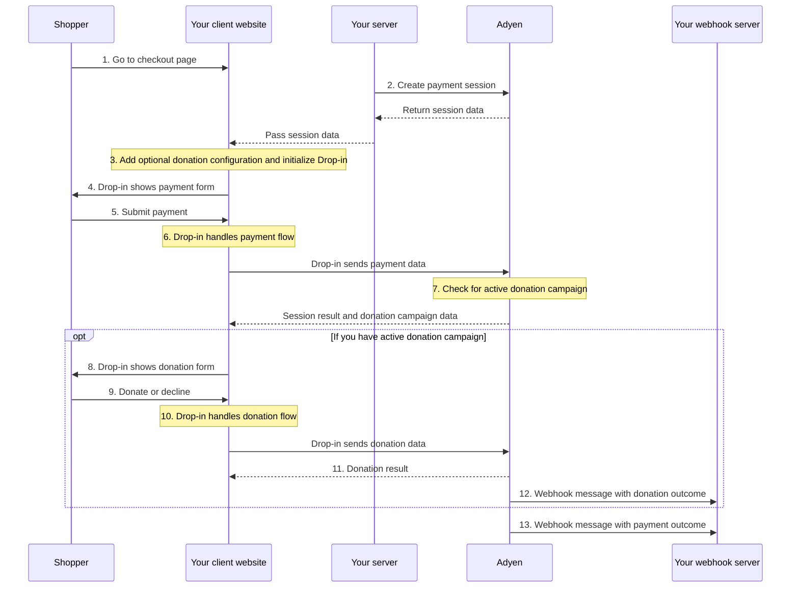

<!-- Source URL: https://docs.adyen.com/standard/integration/drop-in/donations.md -->
<!-- Fetched: 2026-09-15 -->
<!-- Discovery: llms.txt -->

---
title: "Donations"
description: "Accept donations with the Adyen Giving feature in your Drop-in integration."
url: "https://docs.adyen.com/standard/integration/drop-in/donations"
source_url: "https://docs.adyen.com/standard/integration/drop-in/donations.md"
canonical: "https://docs.adyen.com/standard/integration/drop-in/donations"
last_modified: "2026-09-15T14:06:04+02:00"
language: "en"
---

# Donations

Accept donations with the Adyen Giving feature in your Drop-in integration.

Adyen Giving is our donations feature. It lets your shoppers donate to a nonprofit as part of your payment flow. If the shopper chooses to make a donation, the donation amount is charged to the same payment method that was used for the original transaction. Drop-in handles the donation flow, including showing the donation campaign and processing the donation.

## Requirements

In addition to the [general Adyen Giving requirements](/online-payments/donations#requirements), take into account the following requirements.

| Requirement                                     | Description                                                                                                                                              |
| ----------------------------------------------- | -------------------------------------------------------------------------------------------------------------------------------------------------------- |
| **Integration type**                            | A standard payments integration with Drop-in.                                                                                                            |
| **[Customer Area roles](/account/user-roles)**  | Make sure that you have the **[Donation campaigns manager](/account/user-roles/#manage-donation-campaigns)** role.                                       |
| **[Webhooks](/development-resources/webhooks)** | Subscribe to the following webhooks:- Standard webhooks
- [Adyen Giving merchant webhook](/development-resources/webhooks/webhook-types/#other-webhooks) |
| **Setup steps**                                 | Before you begin:- Make sure you meet all the [requirements for Adyen Giving](/online-payments/donations#requirements).                                  |

## How it works

1. The shopper goes to the checkout page.
2. Your server [creates a payment session](/online-payments/build-your-integration/sessions-flow/?platform=Web\&integration=Drop-in#create-a-payment-session). You do not need to pass any donation-specific parameters in your request to create a payment session.
3. When you create a [global configuration object for `AdyenCheckout`](/online-payments/build-your-integration/sessions-flow/?platform=Web\&integration=Drop-in#configure), optionally [add a configuration object for donations](#add-giving-configuration).
4. Drop-in shows the payment form.
5. The shopper submits the payment on your checkout page.
6. Drop-in handles the payment flow.
7. If the payment is successful, Drop-in checks if you have an active donation campaign in your Adyen Customer Area.
8. If you have an active donation campaign, Drop-in shows the donation form.
9. The shopper chooses to donate or declines.
10. Drop-in handles the donation flow.
11. [Get the donation result](#get-the-donation-outcome) from the `donation.onDonationSuccess` callback.
12. Adyen sends a webhook message with the donation outcome.
13. Adyen sends a webhook message with the payment outcome.



## Add Giving configuration

When you create a [global configuration object for Drop-in](/standard/integration/drop-in/#configure), you add configuration for donations to enable the feature.

Event handlers:

| Property            | Required                                                                                                      | Description                                                                                                                          |
| ------------------- | ------------------------------------------------------------------------------------------------------------- | ------------------------------------------------------------------------------------------------------------------------------------ |
| `onDonationSuccess` |  | Called when the donation is completed or the shopper declines to donate. Receives an object with `didDonate`: **true** or **false**. |
| `onDonationFailure` |  | Called when an error occurs in the donation creation or when a donation fails.                                                       |

Configuration parameters:

| Property    | Required | Description                                                                                                                                                                              |
| ----------- | -------- | ---------------------------------------------------------------------------------------------------------------------------------------------------------------------------------------- |
| `autoMount` |          | Specifies if Drop-in automatically shows the donation form after a successful payment. Set to **false** to not show the donation form after the payment is completed. Default: **true**. |
| `delay`     |          | The delay in milliseconds after a successful payment before Drop-in shows the donation form.                                                                                             |

**Example global configuration with donation callbacks**

```js
const globalConfiguration = {
    session: {
        id: sessionId,
        sessionData: sessionData
    },
    // ...Other configuration.
    donation: {
        onDonationSuccess: (result) => {
            if (result.didDonate) {
                console.log("Shopper donated");
            } else {
                console.log("Shopper declined to donate");
            }
        },
        onDonationFailure: (error) => {
            console.error("Donation error:", error);
        }
    },
    onPaymentCompleted: (result, component) => {
        console.log("Payment completed:", result);
    }
};
```

After a successful payment, if you have an active donation campaign configured, Drop-in shows the donation form. By default, the donation form is mounted in the same container as Drop-in.

Drop-in handles the full donation flow, including:

* Showing the donation campaign details (nonprofit name, description, logo, and banner).
* Showing the donation amount options.
* Processing the donation.

## Get the donation outcome

After Drop-in finishes the payment flow, you can inform the shopper about the current payment status.

### Inform the shopper

Depending on whether the donation was successful, the `onDonationSuccess` or `onDonationFailure` event is triggered. From the relevant event, you can get the `result` object to inform the shopper.

### Get the webhook message

You also get the outcome of each donation in a webhook message.

For a successful donation, the event contains:

| Field               | Description                                                                       |
| ------------------- | --------------------------------------------------------------------------------- |
| `eventCode`         | **DONATION**                                                                      |
| `success`           | **true**                                                                          |
| `originalReference` | Use this value to associate the donation with the shopper's original transaction. |

**Example webhook message for a successful donation**

```json
{
  "live": "false",
  "notificationItems": [
    {
      "NotificationRequestItem": {
        "additionalData": {
          "originalMerchantAccountCode": "ADYEN_MERCHANT_ACCOUNT"
        },
        "amount": {
          "currency": "EUR",
          "value": 500
        },
        "originalReference": "V4HZ4RBFJGXXGN82",
        "eventCode": "DONATION",
        "eventDate": "2022-07-07T13:18:13+02:00",
        "merchantAccountCode": "CHARITY_DONATION_ACCOUNT",
        "merchantReference": "YOUR_DONATION_REFERENCE",
        "paymentMethod": "visa",
        "pspReference": "Z58FGTKBRCQ2WN27",
        "reason": "033899:1111:03/2030",
        "success": "true"
      }
    }
  ]
}
```

## Test and go live

Before you go live with donations, test your integration to make sure that your nonprofit receives the donations from your shoppers. We recommend to test your integration in the [test environment](#test-environment), and [live environment](#live-environment). In each environment, test the following:

1. Creating and activating a donation campaign.
2. Making a donation.
3. Getting the donation outcome in the [webhook message (Adyen Giving merchant webhook)](/development-resources/webhooks/webhook-types/#other-webhooks).

### Test environment

#### Create and activate a test donation campaign

1. In your [test Customer Area](https://ca-test.adyen.com/), go to **Giving** > **Campaigns**.

2. [Create a test campaign](/online-payments/donations/#donation-campaigns) using one of our demo nonprofits.

3. Select **Start campaign** for the campaign you configured to:

   * Activate the campaign.
   * Start receiving the `donationToken` in the [/payments](https://docs.adyen.com/api-explorer/Checkout/latest/post/payments) or [/payments/details](https://docs.adyen.com/api-explorer/Checkout/latest/post/payments/details) responses.

#### Make a test donation

To test donations using iDEAL, contact our [Support Team](https://ca-test.adyen.com/ca/ca/contactUs/support.shtml?form=other) for additional configuration.

After you have started a campaign, verify that the [/payments](https://docs.adyen.com/api-explorer/Checkout/latest/post/payments) or [/payments/details](https://docs.adyen.com/api-explorer/Checkout/latest/post/payments/details) response contains a `donationToken`.

When you make a [/donationCampaigns](https://docs.adyen.com/api-explorer/Checkout/latest/post/donationCampaigns) request, verify that the details returned in the response are correct.

Using your integration, make test donations using our [test cards](#test-cards).

#### Get the test donation outcome

For each test donation that you make, verify that you get a [webhook message](/development-resources/webhooks/webhook-types/#other-webhooks).

### Live environment

#### Create and activate a live donation campaign

1. In your Live [Customer Area](https://ca-live.adyen.com/), go to **Giving** > **Campaigns**.

   If you do not see **Giving** section in your Customer Area, reach out to your Adyen contact or our [Support Team](https://ca-test.adyen.com/ca/ca/contactUs/support.shtml?form=other).

2. [Create a campaign](/online-payments/donations/#donation-campaigns) for your nonprofit.

3. Select **Start campaign** for the campaign you configured to:

   * Activate the campaign.
   * Start receiving the `donationToken` in the [/payments](https://docs.adyen.com/api-explorer/Checkout/latest/post/payments) or [/payments/details](https://docs.adyen.com/api-explorer/Checkout/latest/post/payments/details) responses.

#### Enable the webhook for the live environment

In your live [Customer Area](https://ca-live.adyen.com/), enable the [Adyen Giving merchant webhook](/development-resources/webhooks/webhook-types/#other-webhooks).

#### Make donations for your live campaign

After you have started a campaign, verify that the [/payments](https://docs.adyen.com/api-explorer/Checkout/latest/post/payments) or [/payments/details](https://docs.adyen.com/api-explorer/Checkout/latest/post/payments/details) response contains a `donationToken`.

When you make a [/donationCampaigns](https://docs.adyen.com/api-explorer/Checkout/latest/post/donationCampaigns) request, verify that the details returned in the response are correct.

Using your integration, make a donation to your nonprofit.

#### Get the donation outcome

You can verify the outcome of the donation by either:

* Getting the webhook message for your donation.
* Finding the donation in a [Giving report or dashboard](/reporting/monitor-donations).

## Troubleshooting

If an issue occurs with your test donation requests, you can find more details in the [API logs](/development-resources/logs-resources/api-logs/).

## Test cards for donations

You can use the test card details below to make test donations.

| Card Number         | Card Type           | Issuing Country/region | Expiry Date | CVC  |
| ------------------- | ------------------- | ---------------------- | ----------- | ---- |
| 3700 0000 0000 002  | American Express    | NL                     | 03/2030     | 7373 |
| 3700 0000 0100 018  | American Express    | NL                     | 03/2030     | 7373 |
| 5555 3412 4444 1115 | Mastercard Consumer | NL                     | 03/2030     | 737  |
| 5201 2820 5004 2993 | Mastercard          | RU                     | 03/2030     | 737  |
| 5454 5464 9832 4682 | Mastercard          | PL                     | 03/2030     | 737  |
| 2223 5204 4356 0010 | Mastercard Debit    | NL                     | 03/2030     | 737  |
| 5103 2219 1119 9245 | Mastercard Prepaid  | BR                     | 03/2030     | 737  |
| 3569 9900 1009 5841 | JCB                 | US                     | 03/2030     | 737  |
| 6011 6011 6011 6611 | Discover            | US                     | 03/2030     | 737  |
| 6445 6445 6445 6445 | Discover            | GB                     | 03/2030     | 737  |
| 6445 6445 6445 6445 | Carte Bancaire      | FR                     | 03/2030     | 737  |
| 4871 0499 9999 9910 | Bancontact          | BE                     | 03/2030     | 737  |

The following test card doesn't require the CVC when entering the card details. You must use this card to test Visa payments.

| Card Number         | Card Type | Issuing Country/region | Expiry Date | CVC |
| ------------------- | --------- | ---------------------- | ----------- | --- |
| 4111 1111 4555 1142 | Visa      | NL                     | 03/2030     | 737 |

### Test 3D Secure 2 authentication with donations

The following test cards are enrolled in 3D Secure 2.

| Card Number         | Card Type        | Issuing Country/region | Expiry Date | CVC  |
| ------------------- | ---------------- | ---------------------- | ----------- | ---- |
| 3714 4963 5398 431  | American Express | US                     | 03/2030     | 7373 |
| 6011 1111 1111 1117 | Discover         | US                     | 03/2030     | 737  |
| 5111 1200 3000 8958 | Mastercard       | NL                     | 03/2030     | 737  |
