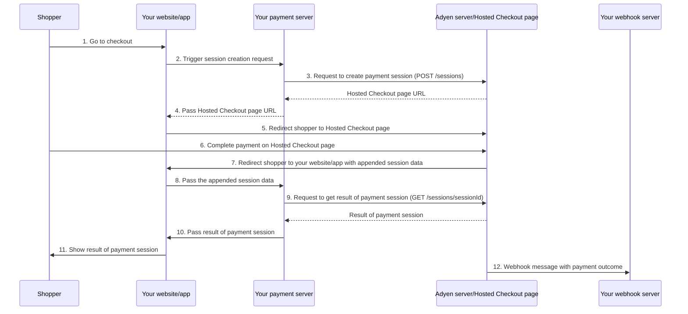

<!-- Source URL: https://docs.adyen.com/standard/integration/hosted-checkout.md -->
<!-- Fetched: 2026-09-15 -->
<!-- Discovery: llms.txt -->

---
title: "Hosted Checkout"
description: "Build your standard payments integration with Hosted Checkout."
url: "https://docs.adyen.com/standard/integration/hosted-checkout"
source_url: "https://docs.adyen.com/standard/integration/hosted-checkout.md"
canonical: "https://docs.adyen.com/standard/integration/hosted-checkout"
last_modified: "2026-09-15T14:06:04+02:00"
language: "en"
---

# Hosted Checkout

Build your standard payments integration with Hosted Checkout.

The Hosted Checkout integration redirects the shopper to an Adyen-hosted webpage that handles the complete payment flow for [supported payment methods](#supported-payment-methods).

## Requirements

| Requirement                    | Description                                                                                                                                                                                    |
| ------------------------------ | ---------------------------------------------------------------------------------------------------------------------------------------------------------------------------------------------- |
| **Integration type**           | Use this information to build an online payments integration.                                                                                                                                  |
| **Customer Area roles**        | Make sure that you have the following roles:- **Merchant admin role**
- **Manage API credentials**                                                                                             |
| **Adyen API credentials**      | Make sure that you have created the following:- [API credential](/development-resources/api-credentials/#new-credential)
- [API key](/development-resources/api-credentials/#generate-api-key) |
| **Adyen API credential roles** | Make sure that you have the roles for payments that are assigned by default.                                                                                                                   |
| **Webhooks**                   | Subscribe to the following webhooks:- Standard webhook with default event codes.                                                                                                               |
| **Setup steps**                | Make sure that you have done the following:- Set up your test account.
- Got an overview of what is required before you accept live payments.                                                  |

## How it works

For a Hosted Checkout integration, you must integrate the following parts:

* **Your payment server**: Sends the API request to create a Hosted Checkout payment session.

  * Use the [/sessions](https://docs.adyen.com/api-explorer/Checkout/latest/post/sessions) endpoint on Checkout API v72 or later.
  * Use a [server-side library](https://github.com/Adyen#server-side) released on March 30, 2026 or later.

* **Your webhook server**: Listens for webhook messages that include the outcome of each payment.

### Integration steps

To integrate Hosted Checkout:

1. [Install an API library](#install-api-library) on your server.
2. [Configure the theme](#configure-your-theme) for your Hosted Checkout page.
3. [Create a payment session](#create-a-payment-session).
4. [Redirect the shopper](#redirect-the-shopper-to-the-hosted-checkout-page) to the Hosted Checkout page.
5. Get the payment outcome.

### Shopper checkout experience

When the shopper goes to check out:

1. You redirect the shopper to an Adyen-hosted Hosted Checkout page.
2. The shopper completes the payment on the Hosted Checkout page.
3. The shopper gets redirected to your website where you show the result of the payment session.

### Payments integration flow

Your website/app, your server and the Hosted Checkout page work together to complete the payment flow:

1. The shopper chooses to go to check out on your website/app.
2. Your website/app triggers your server to create a payment session.
3. Your server makes a POST [/sessions](https://docs.adyen.com/api-explorer/Checkout/latest/post/sessions) request to Adyen, to create a payment session. Adyen returns the URL to the Hosted Checkout page.
4. Your server passes the URL to your website/app.
5. Your website/app redirects the shopper to the Hosted Checkout page.
6. The shopper completes the payment on the Hosted Checkout page.
7. The shopper gets redirected to your website/app with appended session data.
8. Your website/app passes appended session data to your server.
9. Your server makes a GET [/sessions/{sessionId}](https://docs.adyen.com/api-explorer/Checkout/latest/get/sessions/\(sessionId\)) request to Adyen. Adyen returns the result of the payment session.
10. Your server passes the result to your website/app.
11. Your website/app shows the result of the payment session to the shopper.
12. Your webhook server receives webhook message with the payment outcome.



## Install an API library

### Tab: Ruby

##### Try our example integration

  [Run it in Gitpod](https://github.com/adyen-examples/adyen-rails-online-payments#run-this-integration-in-seconds-using-gitpod).\
  [Clone the repository](https://github.com/adyen-examples/adyen-rails-online-payments).

#### Requirements

* Ruby 2.7 or later.

#### Installation

You can use [RubyGems](https://rubygems.org/):

**Install the API library**

```bash
gem install adyen-ruby-api-library
```

Alternatively, you can download the [release on GitHub](https://github.com/Adyen/adyen-ruby-api-library/releases).

Run `bundle install` to install dependencies.

### Tab: Java

##### Try our example integration

  [Run it in Gitpod](https://github.com/adyen-examples/adyen-java-spring-online-payments#checkout-example).\
  [Clone the repository](https://github.com/adyen-examples/adyen-java-spring-online-payments).

#### Requirements

* Java 11 or later.

#### Installation

You can use [Maven](https://maven.apache.org), adding this dependency to your project's POM.

**Add the API library**

```xml
<dependency>
  <groupId>com.adyen</groupId>
  <artifactId>adyen-java-api-library</artifactId>
  <version>LATEST_VERSION</version>
</dependency>
```

You can find the latest version on GitHub. Alternatively, you can download the [release on GitHub](https://github.com/Adyen/adyen-java-api-library/releases).

### Tab: PHP

##### Try our example integration

  [Run it in Gitpod](https://github.com/adyen-examples/adyen-php-online-payments#run-this-integration-in-seconds-using-gitpod).\
  [Clone the repository](https://github.com/adyen-examples/adyen-php-online-payments).

#### Requirements

* PHP 7.3 or later.
* cURL with SSL support.
* The JSON PHP extension.
* The list of dependencies from the composer require list.

#### Installation

You can use [Composer](https://getcomposer.org/). Follow the [installation instructions](https://getcomposer.org/doc/00-intro.md) if you do not already have composer installed.

**Install the API library**

```bash
composer require adyen/php-api-library
```

In your PHP script, make sure you include the autoloader:

**Include the autoloader**

```php
require __DIR__ . '/vendor/autoload.php';
```

Alternatively, you can download the [release on GitHub](https://github.com/Adyen/adyen-php-api-library/releases).

### Tab: Python

##### Try our example integration

  [Run it in Gitpod](https://github.com/adyen-examples/adyen-python-online-payments#run-this-integration-in-seconds-using-gitpod).\
  [Clone the repository](https://github.com/adyen-examples/adyen-python-online-payments).

#### Requirements

* Python 3.6 or later.
* (Optional) Packages: Requests or PycURL

#### Installation

You can use [pip](https://pip.pypa.io/en/stable/):

**Install the API library**

```py
pip install Adyen
```

Alternatively, you can download the [release on GitHub](https://github.com/Adyen/adyen-python-api-library).

### Tab: C\#

#### Requirements

* .NET standard 2.0 or later.

* For Terminal API certificate validation, set the application to either of the following:

  * .NET core 2.1 or later
  * .NET framework 4.6.1 or later

#### Installation

You can use [NuGet](https://www.nuget.org/packages/Adyen/):

**Install the API library**

```bash
PM> Install-Package Adyen -Version LATEST_VERSION
```

Alternatively, you can download the [release on GitHub](https://github.com/Adyen/adyen-dotnet-api-library).

### Tab: NodeJS

##### Try our example integration

  [Run it in Gitpod](https://github.com/adyen-examples/adyen-node-online-payments#checkout-example).\
  [Clone the repository](https://github.com/adyen-examples/adyen-node-online-payments).

#### Requirements

* Node.js version 18 or later.

#### Installation

You can use [npm](https://www.npmjs.com/):

**Install the API library**

```bash
npm install --save @adyen/api-library
npm update @adyen/api-library
```

Alternatively, you can download the [release on GitHub](https://github.com/Adyen/adyen-node-api-library/releases).

### Tab: Go

##### Try our example integration

  [Run it in Gitpod](https://github.com/adyen-examples/adyen-golang-online-payments#run-this-integration-in-seconds-using-gitpod).\
  [Clone the repository](https://github.com/adyen-examples/adyen-golang-online-payments).

#### Requirements

* Go 1.13 or later.

#### Installation

You can use [Go modules](https://github.com/golang/go/wiki/Modules):

**Install the API library**

```shell
go get github.com/adyen/adyen-go-api-library/v7
```

Alternatively, you can download the [release on GitHub](https://github.com/Adyen/adyen-go-api-library).

## Configure your theme

To create a theme, you must have one of the following [user roles](/account/user-roles#account):

* Merchant admin
* Hosted Checkout and Pay by Link Settings

To create a new theme:

1. Log in to your [Customer Area](https://ca-test.adyen.com/) and switch to your merchant account if necessary.
2. Go to **Pay by Link** > **Themes**.
3. Select **Create a new theme**.
4. Enter a **Theme name**. This name helps you to identify different themes.
5. Enter a **Display name**. This name is visible to the shopper on the Hosted Checkout page.
6. Upload a brand logo.
7. If you want this to be the default theme for all Hosted Checkout pages, select **Set as default**. Available only on the merchant account.
8. Select **Create**.

Get the theme ID:

1. Go to **Pay by Link** > **Themes**.
2. Select the options icon from the theme.
3. Select **Copy theme ID.**\
   This copies the theme ID to your system's clipboard.

## Create a payment session

When the shopper goes to checkout, for example by selecting a **Checkout** button, make a **POST** [/sessions](https://docs.adyen.com/api-explorer/Checkout/latest/post/sessions) request from your server, including:

| Parameter          | Required                                                                                                      | Description                                                                                                                                                                                                                                                                                                                                                                                                                                                                                                                             |
| ------------------ | ------------------------------------------------------------------------------------------------------------- | --------------------------------------------------------------------------------------------------------------------------------------------------------------------------------------------------------------------------------------------------------------------------------------------------------------------------------------------------------------------------------------------------------------------------------------------------------------------------------------------------------------------------------------- |
| `amount`           |  | The `currency` and `value` of the payment, in [minor units](/development-resources/currency-codes). This is used to filter the list of available payment methods to your shopper.                                                                                                                                                                                                                                                                                                                                                       |
| `merchantAccount`  |  | Your merchant account name.                                                                                                                                                                                                                                                                                                                                                                                                                                                                                                             |
| `returnUrl`        |  | URL where to redirect the shopper after they make the payment on the Hosted Checkout page. The URL can contain a maximum of 1024 characters and should include the protocol: `http://` or `https://`. You can also include your own additional query parameters, for example, shopper ID or order reference number. If the URL to return to includes non-ASCII characters, like spaces or special letters, URL encode the value. The URL must not include personally identifiable information (PII), for example name or email address. |
| `reference`        |  | Your unique reference for the payment. Minimum length: three characters.                                                                                                                                                                                                                                                                                                                                                                                                                                                                |
| `countryCode`      |  | The shopper's country/region. This is used to filter the list of available payment methods to your shopper. Format: the two-letter [ISO-3166-1 alpha-2](https://en.wikipedia.org/wiki/ISO_3166-1_alpha-2) country code. Exception: **QZ** (Kosovo).                                                                                                                                                                                                                                                                                     |
| `shopperEmail`     |  | The shopper's email address. Strongly recommended because this field is used in a number of [risk checks](/risk-management/configure-your-risk-profile/risk-field-reference), and for 3D Secure.                                                                                                                                                                                                                                                                                                                                        |
| `shopperReference` |  | Your unique reference for the shopper. Do not include personally identifiable information (PII), such as name or email address. **Format:**- Minimum length: 3 characters.
- Case-sensitive.This field is used for the following:- Risk checks.
- When storing the shopper's payment details: associating the token with the shopper.                                                                                                                                                                                                   |
| `mode`             |  | **hosted**                                                                                                                                                                                                                                                                                                                                                                                                                                                                                                                              |
| `themeId`          |  | The [theme ID](#theme-id) of the theme to use for the Hosted Checkout page.                                                                                                                                                                                                                                                                                                                                                                                                                                                             |

**Example request to create a session for Hosted Checkout**

#### curl

```bash
curl https://checkout-test.adyen.com/v72/sessions \
-H 'x-API-key: ADYEN_API_KEY' \
-H 'idempotency-key: YOUR_IDEMPOTENCY_KEY' \
-H 'content-type: application/json' \
-d '{
  "merchantAccount": "ADYEN_MERCHANT_ACCOUNT",
  "amount": {
      "value": 1000,
      "currency": "EUR"
  },
  "returnUrl": "https://your-company.example.com/checkout?shopperOrder=12xy..",
  "reference": "Your-payment-reference-123-abc",
  "countryCode": "NL",
  "shopperEmail": "s.hopper@example.com",
  "shopperReference": "Your-shopper-reference-890-xyz",
  "mode": "hosted",
  "themeId": "AZ1234567"
}'
```

#### Java

```java
// Adyen Java API Library v39.3.0
import com.adyen.Client;
import com.adyen.enums.Environment;
import com.adyen.model.checkout.*;
import java.util.*;
import com.adyen.model.RequestOptions;
import com.adyen.service.checkout.*;

// For the LIVE environment, also include your liveEndpointUrlPrefix.
Client client = new Client("ADYEN_API_KEY", Environment.TEST);

// Create the request object(s)
Amount amount = new Amount()
  .currency("EUR")
  .value(1000L);

CreateCheckoutSessionRequest createCheckoutSessionRequest = new CreateCheckoutSessionRequest()
  .reference("Your-payment-reference-123-abc")
  .mode(CreateCheckoutSessionRequest.ModeEnum.HOSTED)
  .amount(amount)
  .merchantAccount("ADYEN_MERCHANT_ACCOUNT")
  .countryCode("NL")
  .shopperEmail("s.hopper@example.com")
  .shopperReference("Your-shopper-reference-890-xyz")
  .themeId("AZ1234567")
  .returnUrl("https://your-company.example.com/checkout?shopperOrder=12xy..");

// Send the request
PaymentsApi service = new PaymentsApi(client);
CreateCheckoutSessionResponse response = service.sessions(createCheckoutSessionRequest, new RequestOptions().idempotencyKey("UUID"));
```

#### PHP

```php
<?php
// Adyen PHP API Library v28.2.0
use Adyen\Client;
use Adyen\Environment;
use Adyen\Model\Checkout\Amount;
use Adyen\Model\Checkout\CreateCheckoutSessionRequest;
use Adyen\Service\Checkout\PaymentsApi;

$client = new Client();
$client->setXApiKey("ADYEN_API_KEY");
// For the LIVE environment, also include your liveEndpointUrlPrefix.
$client->setEnvironment(Environment::TEST);


// Create the request object(s)
$amount = new Amount();
$amount
  ->setCurrency("EUR")
  ->setValue(1000);

$createCheckoutSessionRequest = new CreateCheckoutSessionRequest();
$createCheckoutSessionRequest
  ->setReference("Your-payment-reference-123-abc")
  ->setMode("hosted")
  ->setAmount($amount)
  ->setMerchantAccount("ADYEN_MERCHANT_ACCOUNT")
  ->setCountryCode("NL")
  ->setShopperEmail("s.hopper@example.com")
  ->setShopperReference("Your-shopper-reference-890-xyz")
  ->setThemeId("AZ1234567")
  ->setReturnUrl("https://your-company.example.com/checkout?shopperOrder=12xy..");

$requestOptions['idempotencyKey'] = 'UUID';

// Send the request
$service = new PaymentsApi($client);
$response = $service->sessions($createCheckoutSessionRequest, $requestOptions);
```

#### C\#

```cs
// Adyen .net API Library v32.1.1
using Adyen;
using Environment = Adyen.Model.Environment;
using Adyen.Model;
using Adyen.Model.Checkout;
using Adyen.Service.Checkout;

// For the LIVE environment, also include your liveEndpointUrlPrefix.
var config = new Config()
{
    XApiKey = "ADYEN_API_KEY",
    Environment = Environment.Test
};
var client = new Client(config);

// Create the request object(s)
Amount amount = new Amount
{
  Currency = "EUR",
  Value = 1000
};

CreateCheckoutSessionRequest createCheckoutSessionRequest = new CreateCheckoutSessionRequest
{
  Reference = "Your-payment-reference-123-abc",
  Mode = CreateCheckoutSessionRequest.ModeEnum.Hosted,
  Amount = amount,
  MerchantAccount = "ADYEN_MERCHANT_ACCOUNT",
  CountryCode = "NL",
  ShopperEmail = "s.hopper@example.com",
  ShopperReference = "Your-shopper-reference-890-xyz",
  ThemeId = "AZ1234567",
  ReturnUrl = "https://your-company.example.com/checkout?shopperOrder=12xy.."
};

// Send the request
var service = new PaymentsService(client);
var response = service.Sessions(createCheckoutSessionRequest, requestOptions: new RequestOptions { IdempotencyKey = "UUID"});
```

#### Go

```go
// Adyen Go API Library v21.0.0
import (
  "context"
  "github.com/adyen/adyen-go-api-library/v21/src/common"
  "github.com/adyen/adyen-go-api-library/v21/src/adyen"
  "github.com/adyen/adyen-go-api-library/v21/src/checkout"
)
// For the LIVE environment, also include your liveEndpointUrlPrefix.
client := adyen.NewClient(&common.Config{
  ApiKey:      "ADYEN_API_KEY",
  Environment: common.TestEnv,
})

// Create the request object(s)
amount := checkout.Amount{
  Currency: "EUR",
  Value: 1000,
}

createCheckoutSessionRequest := checkout.CreateCheckoutSessionRequest{
  Reference: "Your-payment-reference-123-abc",
  Mode: common.PtrString("hosted"),
  Amount: amount,
  MerchantAccount: "ADYEN_MERCHANT_ACCOUNT",
  CountryCode: common.PtrString("NL"),
  ShopperEmail: common.PtrString("s.hopper@example.com"),
  ShopperReference: common.PtrString("Your-shopper-reference-890-xyz"),
  ThemeId: common.PtrString("AZ1234567"),
  ReturnUrl: "https://your-company.example.com/checkout?shopperOrder=12xy..",
}

// Send the request
service := client.Checkout()
req := service.PaymentsApi.SessionsInput().IdempotencyKey("UUID").CreateCheckoutSessionRequest(createCheckoutSessionRequest)
res, httpRes, err := service.PaymentsApi.Sessions(context.Background(), req)
```

#### Python

```py
# Adyen Python API Library v13.6.0
import Adyen

adyen = Adyen.Adyen()
adyen.client.xapikey = "ADYEN_API_KEY"
# For the LIVE environment, also include your liveEndpointUrlPrefix.
adyen.client.platform = "test" # The environment to use library in.

# Create the request object(s)
json_request = {
  "merchantAccount": "ADYEN_MERCHANT_ACCOUNT",
  "amount": {
    "value": 1000,
    "currency": "EUR"
  },
  "returnUrl": "https://your-company.example.com/checkout?shopperOrder=12xy..",
  "reference": "Your-payment-reference-123-abc",
  "mode": "hosted",
  "themeId": "AZ1234567",
  "countryCode": "NL",
  "shopperEmail": "s.hopper@example.com",
  "shopperReference": "Your-shopper-reference-890-xyz"
}

# Send the request
result = adyen.checkout.payments_api.sessions(request=json_request, idempotency_key="UUID")
```

#### Ruby

```rb
# Adyen Ruby API Library v10.4.0
require "adyen-ruby-api-library"

adyen = Adyen::Client.new
adyen.api_key = 'ADYEN_API_KEY'
# For the LIVE environment, also include your liveEndpointUrlPrefix.
adyen.env = :test # Set to "live" for live environment

# Create the request object(s)
request_body = {
  :merchantAccount => 'ADYEN_MERCHANT_ACCOUNT',
  :amount => {
    :value => 1000,
    :currency => 'EUR'
  },
  :returnUrl => 'https://your-company.example.com/checkout?shopperOrder=12xy..',
  :reference => 'Your-payment-reference-123-abc',
  :mode => 'hosted',
  :themeId => 'AZ1234567',
  :countryCode => 'NL',
  :shopperEmail => 's.hopper@example.com',
  :shopperReference => 'Your-shopper-reference-890-xyz'
}

# Send the request
result = adyen.checkout.payments_api.sessions(request_body, headers: { 'Idempotency-Key' => 'UUID' })
```

#### NodeJS (TypeScript)

```ts
// Adyen Node API Library v29.0.0
import { Client, CheckoutAPI, Types } from "@adyen/api-library";

// For the LIVE environment, also include your liveEndpointUrlPrefix.
const config = new Config({
  apiKey: "ADYEN_API_KEY",
  environment: EnvironmentEnum.TEST
});

const client = new Client(config);

// Create the request object(s)
const amount: Types.checkout.Amount = {
  currency: "EUR",
  value: 1000
};

const createCheckoutSessionRequest: Types.checkout.CreateCheckoutSessionRequest = {
  reference: "Your-payment-reference-123-abc",
  mode: Types.checkout.CreateCheckoutSessionRequest.ModeEnum.Hosted,
  amount: amount,
  merchantAccount: "ADYEN_MERCHANT_ACCOUNT",
  countryCode: "NL",
  shopperEmail: "s.hopper@example.com",
  shopperReference: "Your-shopper-reference-890-xyz",
  themeId: "AZ1234567",
  returnUrl: "https://your-company.example.com/checkout?shopperOrder=12xy.."
};

// Send the request
const checkoutAPI = new CheckoutAPI(client);
const response = checkoutAPI.PaymentsApi.sessions(createCheckoutSessionRequest, { idempotencyKey: "UUID" });
```

The [/sessions](https://docs.adyen.com/api-explorer/Checkout/latest/post/sessions) response includes the URL (`url`) for the Hosted Checkout page.

**Example response with the URL for Hosted Checkout page**

```json
{
   "id": "WNKH9MC2XJMLNK82",
   "merchantAccount": "TestMerchant",
   "amount": {
      "currency": "EUR",
      "value": 100
   },
   "returnUrl": "https://test-merchant….",
   "reference": "Your-payment-reference-123-abc",
   "countryCode": "NL",
   "expiresAt": "2023-15-05T19:31:22+01:00",
   "url": "https://eu.adyen.link/WNKH9MC2XJMLNK82"
}
```

By default, the Hosted Checkout page expires (`expiresAt`) 1 hour after it was created.

## Redirect the shopper to the Hosted Checkout page

Redirect the shopper to the URL (`url`) from the [/sessions](https://docs.adyen.com/api-explorer/Checkout/latest/post/sessions) response. The shopper pays on the Hosted Checkout page.

When using Hosted Checkout for a mobile browser integration, use [SFSafariViewController](https://developer.apple.com/documentation/safariservices/sfsafariviewcontroller) for iOS or [Chrome Custom Tabs for Android](https://developer.chrome.com/docs/android/custom-tabs), instead of WebView objects. Some payment methods do not function correctly with WebView objects.

## Get the payment outcome

After Hosted Checkout finishes the payment flow, you can show the shopper the current payment status. Adyen sends a webhook with the outcome of the payment.

### Show the result of the payment session

1. After the shopper makes the payment, they are redirected back to your website.

2. Get the `sessionId` and `sessionResult` that is appended to the return URL from the Hosted Checkout page. Use it to get the outcome of the payment session.

   **Example return URL from Hosted Checkout page**

   ```bash
   https://your-company.example.com/checkout?sessionId=WNKH9MC2XJMLNK82&sessionResult=QXhlbFN0b2x0ZW5iZXJnCg
   ```

3. Make a **GET** `/sessions/{id}?sessionResult={sessionResult}` request including the `sessionId` and `sessionResult`.

   **Get outcome of payment session**

   #### curl

   ```bash
   curl -X GET https://checkout-test.adyen.com/v72/sessions/WNKH9MC2XJMLNK82?sessionResult=QXhlbFN0b2x0ZW5iZXJnCg
   ```

   #### Java

   ```java
   // Adyen Java API Library v39.3.0
   import com.adyen.Client;
   import com.adyen.enums.Environment;
   import com.adyen.model.checkout.*;
   import java.time.OffsetDateTime;
   import java.util.*;
   import com.adyen.service.checkout.*;

   // For the LIVE environment, also include your liveEndpointUrlPrefix.
   Client client = new Client("", Environment.TEST);
   // Send the request
   PaymentsApi service = new PaymentsApi(client);
   SessionResultResponse response = service.getResultOfPaymentSession("sessionId", "String", null);
   ```

   #### PHP

   ```php
   <?php
   // Adyen PHP API Library v28.2.0
   use Adyen\Client;
   use Adyen\Environment;
   use Adyen\Service\Checkout\PaymentsApi;

   $client = new Client();
   $client->setXApiKey("");
   // For the LIVE environment, also include your liveEndpointUrlPrefix.
   $client->setEnvironment(Environment::TEST);

   $requestOptions['queryParams'] = array('sessionResult' => 'string');

   // Send the request
   $service = new PaymentsApi($client);
   $response = $service->getResultOfPaymentSession('sessionId', $requestOptions);
   ```

   #### C\#

   ```cs
   // Adyen .net API Library v32.1.1
   using Adyen;
   using Environment = Adyen.Model.Environment;
   using Adyen.Model;
   using Adyen.Model.Checkout;
   using Adyen.Service.Checkout;

   // For the LIVE environment, also include your liveEndpointUrlPrefix.
   var config = new Config()
   {
       XApiKey = "",
       Environment = Environment.Test
   };
   var client = new Client(config);

   // Send the request
   var service = new PaymentsService(client);
   var response = service.GetResultOfPaymentSession("sessionId", sessionResult: "string");
   ```

   #### Go

   ```go
   // Adyen Go API Library v21.0.0
   import (
     "context"
     "github.com/adyen/adyen-go-api-library/v21/src/common"
     "github.com/adyen/adyen-go-api-library/v21/src/adyen"
     "github.com/adyen/adyen-go-api-library/v21/src/checkout"
   )
   // For the LIVE environment, also include your liveEndpointUrlPrefix.
   client := adyen.NewClient(&common.Config{
     ApiKey:      "",
     Environment: common.TestEnv,
   })

   // Send the request
   service := client.Checkout()
   req := service.PaymentsApi.GetResultOfPaymentSessionInput("sessionId")
   req = req.SessionResult("string")
   res, httpRes, err := service.PaymentsApi.GetResultOfPaymentSession(context.Background(), req)
   ```

   #### Python

   ```py
   # Adyen Python API Library v13.6.0
   import Adyen

   adyen = Adyen.Adyen()
   adyen.client.xapikey = ""
   # For the LIVE environment, also include your liveEndpointUrlPrefix.
   adyen.client.platform = "test" # The environment to use library in.

   query_parameters = {
     "sessionResult" : "string"
   }

   # Send the request
   result = adyen.checkout.payments_api.get_result_of_payment_session(sessionId="sessionId", query_parameters=query_parameters)
   ```

   #### Ruby

   ```rb
   # Adyen Ruby API Library v10.4.0
   require "adyen-ruby-api-library"

   adyen = Adyen::Client.new
   adyen.api_key = ''
   # For the LIVE environment, also include your liveEndpointUrlPrefix.
   adyen.env = :test # Set to "live" for live environment

   # Create the request object(s)
   query_params = {
     :sessionResult => 'string'
   }

   # Send the request
   result = adyen.checkout.payments_api.get_result_of_payment_session('sessionId', query_params: query_params)
   ```

   #### NodeJS (TypeScript)

   ```ts
   // Adyen Node API Library v29.0.0
   import { Client, CheckoutAPI, Types } from "@adyen/api-library";

   // For the LIVE environment, also include your liveEndpointUrlPrefix.
   const config = new Config({
     apiKey: "",
     environment: EnvironmentEnum.TEST
   });

   const client = new Client(config);

   // Send the request
   const checkoutAPI = new CheckoutAPI(client);
   const response = checkoutAPI.PaymentsApi.getResultOfPaymentSession("sessionId", "string");
   ```

   The response includes the current status (`status`) of the payment.

   **Example response for outcome of payment session**

   ```json
   {
     "additionalData": {
       ...
     },
     "id": "CSD9CAC34EBAE225DD",
     "payments": [{
       "amount": {
         "currency": "EUR",
         "value": 1000
       },
       "paymentMethod": {
         "brand": "visa",
         "type": "scheme"
       },
       "pspReference": "TG9SNBJJNXRKDM92",
       "resultCode": "Authorised"
     }],
     "reference": "Your-payment-reference-123-abc",
     "status": "completed"
   }
   ```

   The information included in [additionalData](https://docs.adyen.com/api-explorer/Checkout/latest/get/sessions/\(sessionId\)#responses-200-additionalData) depends on the type of payment made.

   Possible statuses:

   | `status`           | Description                                                                                                                           |
   | ------------------ | ------------------------------------------------------------------------------------------------------------------------------------- |
   | **completed**      | The shopper completed the payment.                                                                                                    |
   | **paymentPending** | The shopper is in the process of making the payment. Applies to payment methods with an asynchronous flow, such as a voucher payment. |
   | **expired**        | The session expired. The shopper can no longer use the Hosted Checkout page to make a payment.                                        |

   The `status` included in the response does not change. Do not make the request again to check for payment status updates. Instead, check webhooks or the **Transactions** list in your [Customer Area](https://ca-test.adyen.com/).

### Update your order management system

Update your order management system when you get the outcome in a webhook message with `eventCode`: **AUTHORISATION**. Use the `merchantReference` from the webhook to match it to your order reference.

For a successful payment, the event contains `success`: **true**.

**Example webhook for a successful payment**

```json
{
  "live": "false",
  "notificationItems":[
    {
      "NotificationRequestItem":{
        "eventCode":"AUTHORISATION",
        "merchantAccountCode":"ADYEN_MERCHANT_ACCOUNT",
        "reason":"033899:1111:03/2030",
        "amount":{
          "currency":"EUR",
          "value":2500
        },
        "operations":["CANCEL","CAPTURE","REFUND"],
        "success":"true",
        "paymentMethod":"mc",
        "additionalData":{
          "expiryDate":"03/2030",
          "authCode":"033899",
          "cardBin":"411111",
          "cardSummary":"1111",
          "checkoutSessionId":"CSF46729982237A879"
        },
        "merchantReference":"Your-payment-reference-123-abc",
        "pspReference":"NC6HT9CRT65ZGN82",
        "eventDate":"2021-09-13T14:10:22+02:00"
      }
    }
  ]
}
```

For an unsuccessful payment, you get `success`: **false**, and the `reason` field has details about why the payment was unsuccessful.

**Example webhook for an unsuccessful payment**

```json
{
  "live": "false",
  "notificationItems":[
    {
      "NotificationRequestItem":{
        "eventCode":"AUTHORISATION",
        "merchantAccountCode":"ADYEN_MERCHANT_ACCOUNT",
        "reason":"validation 101 Invalid card number",
        "amount":{
          "currency":"EUR",
          "value":2500
        },
        "success":"false",
        "paymentMethod":"unknowncard",
        "additionalData":{
          "expiryDate":"03/2030",
          "cardBin":"411111",
          "cardSummary":"1112",
          "checkoutSessionId":"861631540104159H"
        },
        "merchantReference":"Your-payment-reference-123-abc",
        "pspReference":"KHQC5N7G84BLNK43",
        "eventDate":"2021-09-13T14:14:05+02:00"
      }
    }
  ]
}
```

## Test and go live

Before going live, use our list of [test cards and other payment methods](/development-resources/test-cards-and-credentials/test-card-numbers) to test your integration. We recommend testing each payment method that you intend to offer to your shoppers.

You can check the test payments in your [Customer Area](https://ca-test.adyen.com/), under **Transactions** > **Payments**.

When you are ready to go live, you need to:

1. Apply for a live account.

2. Configure your live account. 

3. Submit a request to add payment methods in your [live Customer Area](https://ca-live.adyen.com/) .

4. Switch from test to our [live endpoints](/development-resources/live-endpoints#checkout-endpoints).

   Make sure that all API requests you make for the same payment session use the same live endpoint region. Using different regions for requests can result in errors.

## Troubleshooting

The following information can help your troubleshoot issues with your integration.

### Expiration

The Hosted Checkout page expires after:

* The `expiresAt` from the [/sessions](https://docs.adyen.com/api-explorer/Checkout/latest/post/sessions) response. The default is 1 hour after it was created.
* Our system determines that the shopper made too many payment attempts.

### Payment retries

For a payment that encounters an error or fails on a redirect payment method's page, the shopper gets redirected to the Hosted Checkout page to retry the payment.

### Payment errors

If the payment encounters an error, the shopper can retry the payment on the Hosted Checkout page. We send you a webhook message for each payment attempt. So, we can send you more than one webhook message that includes the same `sessionId`.

## Supported payment methods

* ACH Direct Debit
* Affirm
* Afterpay
* Alipay
* AlipayHK
* Apple Pay
* Atome
* BACS Direct Debit
* Bancontact Card
* Bancontact Mobile (Payconiq)
* Benefit
* BLIK
* Boleto Bancário
* Cards, including 3D Secure 1 and 3D Secure 2 authentication
* Clearpay
* Credit card installments
* Stored card details
* DANA
* Dragonpay
* EPS
* Fawry
* GCash
* Gift cards
* Google Pay
* GrabPay
* iDEAL
* Indonesian bank transfers and convenience stores
* Japanese convenience stores (Konbini)/\
  7-Eleven Japan
* KakaoPay
* Klarna
* KNET
* MB WAY
* MobilePay
* MOLPay
* MoMo
* Multibanco
* Oney 3x4x
* Online banking Finland
* Online banking India
* Online banking Japan
* Online banking Poland
* Napas card
* OXXO
* PayBright
* PayPal
* Paytm
* PayU
* Pix
* Ratepay
* SEPA Direct Debit
* Sofort
* Swish
* Trustly
* TWINT
* Vipps
* Wallets India
* WeChat Pay
* Zip

## Next steps

[Tokenization](/standard/integration/hosted-checkout/tokenization)

[Store and reuse your shopper's payment details for faster checkout.](/standard/integration/hosted-checkout/tokenization)
