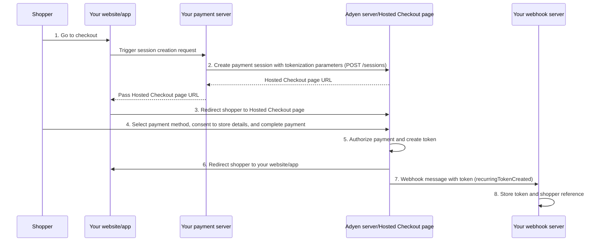
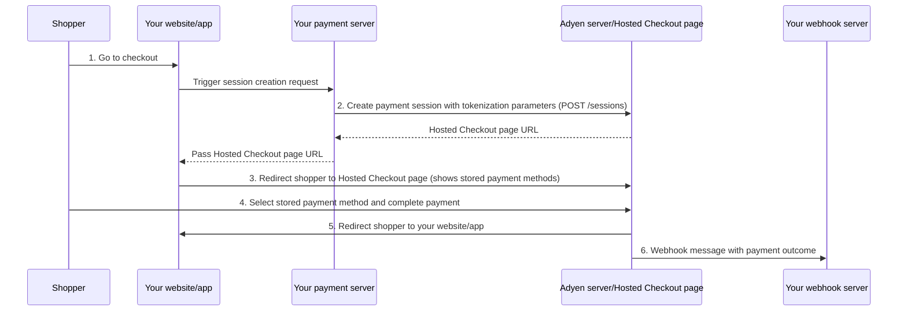

<!-- Source URL: https://docs.adyen.com/standard/integration/hosted-checkout/tokenization.md -->
<!-- Fetched: 2026-09-15 -->
<!-- Discovery: llms.txt -->

---
title: "Tokenization"
description: "Store and use stored payment details with our tokenization feature with Hosted Checkout."
url: "https://docs.adyen.com/standard/integration/hosted-checkout/tokenization"
source_url: "https://docs.adyen.com/standard/integration/hosted-checkout/tokenization.md"
canonical: "https://docs.adyen.com/standard/integration/hosted-checkout/tokenization"
last_modified: "2026-09-15T14:06:04+02:00"
language: "en"
---

# Tokenization

Store and use stored payment details with our tokenization feature with Hosted Checkout.

You can store your shoppers' payment details so that they can pay without entering their payment details again. Storing payment details creates an associated token that can be used for subsequent payments.

Because the Hosted Checkout page handles the complete payment flow on an Adyen-hosted page, you have minimal [PCI DSS](/development-resources/pci-dss-compliance-guide/) requirements. This qualifies you for the simplest form of PCI validation [(SAQ A)](/development-resources/pci-dss-compliance-guide/saq-a-eligibility/).

You can:

* [**Store payment details** ](#store-payment-details): Create a token when the shopper makes a payment, or with a [zero-value authorization](/get-started-with-adyen/adyen-glossary/#zero-value-auth) to verify payment details without collecting a payment.
* [**Make a one-click payment** ](#make-a-one-click-payment): Use the token for shopper-initiated payments where the returning shopper uses their stored payment details for a faster checkout.

## Requirements

Before you begin, take into account the following requirements, limitations, and preparations.

| Requirement              | Description                                                                                                                                                        |
| ------------------------ | ------------------------------------------------------------------------------------------------------------------------------------------------------------------ |
| **Integration type**     | A [standard integration](/standard/integration).                                                                                                                   |
| **API credential roles** | Make sure that you have the following roles:- **Checkout webservice role**
- **Merchant Recurring role**                                                           |
| **Webhooks**             | Subscribe to the [**Recurring tokens life cycle events** webhook type](/development-resources/webhooks/webhook-types/#other-webhooks).                             |
| **Setup steps**          | Before you begin:- [Add the payment methods](/payment-methods/add-payment-methods) that [support recurring payments](/payment-methods/?features%5B0%5D=recurring). |

## How it works

The following diagrams show the flow for storing payment details and making a one-click payment.

Storing payment details:

1. The shopper chooses to go to checkout on your website/app.
2. Your server creates a payment session with additional tokenization parameters. Adyen returns the URL to the Hosted Checkout page.
3. Your website/app redirects the shopper to the Hosted Checkout page.
4. The shopper selects their payment method, consents to store their payment details, and completes the payment on the Hosted Checkout page.
5. Adyen authorizes the payment and creates a token for the shopper's payment details.
6. The shopper gets redirected to your website/app.
7. Your webhook server receives a webhook message with the token associated with the shopper's stored payment details.
8. You store the token and the shopper reference in your database.



Making a one-click payment:

1. The shopper chooses to go to checkout on your website/app.
2. Your server creates a payment session with additional tokenization parameters. Adyen returns the URL to the Hosted Checkout page.
3. Your website/app redirects the shopper to the Hosted Checkout page. The Hosted Checkout page shows the shopper's stored payment details.
4. The shopper selects their stored payment method and completes the payment on the Hosted Checkout page.
5. The shopper gets redirected to your website/app.
6. Your webhook server receives a webhook message with the outcome of the payment.



## Store payment details

To store your shopper's payment details and get a token that you can use for future payments:

1. Before the shopper pays on your website, ask for their consent to store their payment details for future payments.
2. [Create a session with tokenization parameters](#create-a-session-with-tokenization-parameters).
3. [Get the token from the webhook](#get-the-token-from-the-webhook).

### Create a session with tokenization parameters

When the shopper proceeds to make a payment, [create a session](/standard/integration/hosted-checkout#create-a-payment-session) and include the following additional parameters for tokenization:

| Parameter                  | Required                                                                                                      | Description                                                                                                                                                                                                                                                                                                                                               |
| -------------------------- | ------------------------------------------------------------------------------------------------------------- | --------------------------------------------------------------------------------------------------------------------------------------------------------------------------------------------------------------------------------------------------------------------------------------------------------------------------------------------------------- |
| `shopperInteraction`       |  | Indicates the sales channel through which the shopper gives their card details. Set to **Ecommerce**.                                                                                                                                                                                                                                                     |
| `recurringProcessingModel` |  | The type of recurring payment the token is intended for. Set to **CardOnFile**.                                                                                                                                                                                                                                                                           |
| `storePaymentMethodMode`   |  | Indicates if the shopper's payment details will be stored. **Possible values:**- **askForConsent**: The payment form shows a checkbox that the shopper can select to store their payment details. We create an associated token.
- **enabled**: Store the payment details and create an associated token, without showing a checkbox in the payment form. |

To store the shopper's payment details without collecting a payment, you can use a zero-value authorization: set the `amount.value` to **0** to verify the payment details. If you want to store the payment details as part of an actual transaction, use the amount for the current transaction.

Some payment methods, like [iDEAL](/payment-methods/ideal/), require a minimum amount more than **0**.

**Example request for a session that creates a token**

```bash
curl https://checkout-test.adyen.com/v72/sessions \
-X POST \
-H 'x-api-key: ADYEN_API_KEY' \
-H 'idempotency-key: YOUR_IDEMPOTENCY_KEY' \
-H 'content-type: application/json' \
-d '{
  "merchantAccount": "ADYEN_MERCHANT_ACCOUNT",
  "amount": {
    "value": 1000,
    "currency": "EUR"
  },
  "returnUrl": "https://your-company.example.com/checkout?shopperOrder=12xy..",
  "reference": "Your-payment-reference-123-abc",
  "countryCode": "NL",
  "channel": "Web",
  "mode": "hosted",
  "themeId": "YOUR_THEME_ID",
  "shopperEmail": "s.hopper@example.com",
  "shopperReference": "YOUR_SHOPPER_REFERENCE",
  "shopperInteraction": "Ecommerce",
  "recurringProcessingModel": "CardOnFile",
  "storePaymentMethodMode": "enabled"
}'
```

The token is created after a successful payment authorization to ensure that the shopper's payment details are linked to an active account that can be charged.

### Get the token from the webhook

After the transaction is authorized, you receive a [recurring.token.created](https://docs.adyen.com/api-explorer/Tokenization-webhooks/latest/post/recurring.token.created) webhook with the token you can use for future payments. Store the `storedPaymentMethodId` together with the `shopperReference`, so that you associate the token with the shopper.

**Example token created webhook**

```json
{
    "createdAt": "2024-01-14T18:10:49+01:00",
    "environment": "test",
    "type": "recurring.token.created",
    "data": {
        "merchantAccount": "ADYEN_MERCHANT_ACCOUNT",
        "storedPaymentMethodId": "M5N7TQ4TG5PFWR50",
        "type": "visa",
        "operation": "created",
        "shopperReference": "YOUR_SHOPPER_REFERENCE"
    },
    "eventId": "QBQQ9DLNRHHKGK38"
}
```

To receive these updates, enable the [Recurring tokens life cycle events](/development-resources/webhooks/webhook-types/#other-webhooks) webhook. We recommend that you [set up the webhook](/development-resources/webhooks/#set-up-webhooks-in-your-customer-area) with all default events.

## Make a one-click payment

After you have stored a shopper's payment details, you can use the token for one-click payments where the returning shopper uses their stored payment details for a faster checkout.

1. From your server, make a POST [/sessions](https://docs.adyen.com/api-explorer/Checkout/latest/post/sessions) request including:

   | Parameter                  | Required                                                                                                      | Description                                                                                                                          |
   | -------------------------- | ------------------------------------------------------------------------------------------------------------- | ------------------------------------------------------------------------------------------------------------------------------------ |
   | `shopperReference`         |  | Your unique identifier for the shopper. We use it to check if you have stored payment details associated with this shopper.          |
   | `shopperInteraction`       |  | Indicates the sales channel through which the shopper uses the stored payment details. Set to **Ecommerce**.                         |
   | `recurringProcessingModel` |  | The type of recurring payment. Set to **CardOnFile**. If you set this to any other value, we internally change it to **CardOnFile**. |

   If you use 3D Secure for PSD2 SCA compliance, some issuing banks require SCA for **ContAuth** with **CardOnFile** transactions. See the [PSD2 SCA compliance guide](/online-payments/psd2-sca-compliance-and-implementation-guide#are-my-payments-affected) for more information.

   **Example request for a session with a one-click payment**

   ```bash
   curl https://checkout-test.adyen.com/v72/sessions \
   -X POST \
   -H 'x-api-key: ADYEN_API_KEY' \
   -H 'idempotency-key: YOUR_IDEMPOTENCY_KEY' \
   -H 'content-type: application/json' \
   -d '{
     "merchantAccount": "ADYEN_MERCHANT_ACCOUNT",
     "amount": {
       "value": 2000,
       "currency": "EUR"
     },
     "returnUrl": "https://your-company.example.com/checkout?shopperOrder=12xy..",
     "reference": "Your-payment-reference-123-abc",
     "countryCode": "NL",
     "channel": "Web",
     "mode": "hosted",
     "themeId": "YOUR_THEME_ID",
     "shopperReference": "YOUR_SHOPPER_REFERENCE",
     "shopperInteraction": "ContAuth",
     "recurringProcessingModel": "CardOnFile"
   }'
   ```

2. Redirect the shopper to the Hosted Checkout page. The page shows the shopper's stored payment details.

3. The shopper selects their stored payment method and completes the payment on the Hosted Checkout page.

4. Get the outcome of the payment in a webhook message.

## Test and go live

Follow our [testing guide for tokenization](/development-resources/testing/tokenization/) and make sure that you can successfully store payment details and make payments with a token.

When you are ready to go live:

* Enable the **Recurring tokens life cycle events** webhooks in your [live Customer Area](https://ca-live.adyen.com/).
* Follow the [Tokenization end-to-end testing checklist](/online-payments/go-live-checklist#tokenization).
