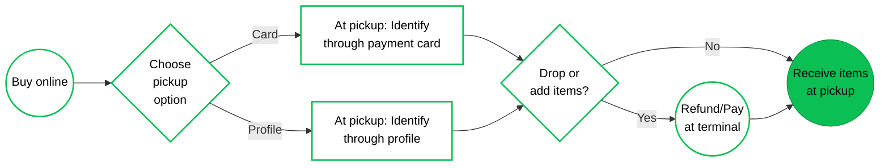
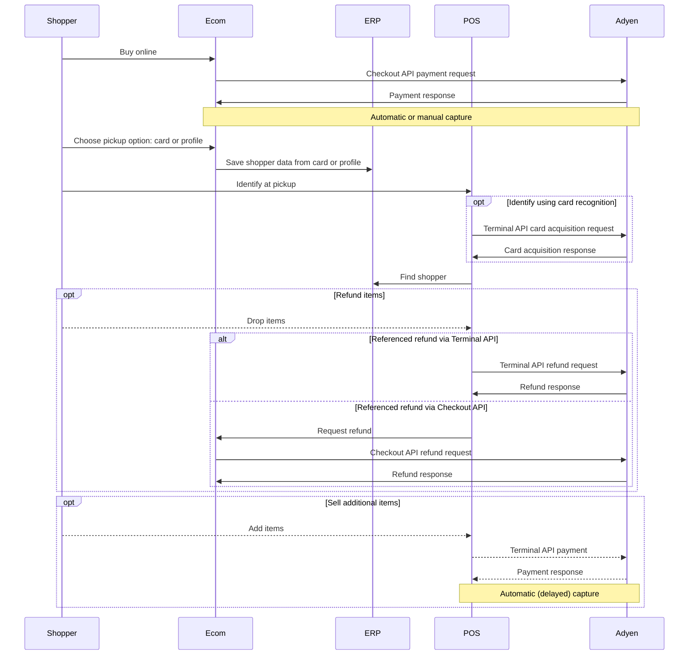

<!-- Source URL: https://docs.adyen.com/unified-commerce/retail-use-cases/click-and-collect/c-and-c-add-return.md -->
<!-- Fetched: 2026-09-15 -->
<!-- Discovery: llms.txt -->

---
title: "Buy online, pick up in store"
description: "Click and collect: Buy online and pick up in a store, and purchase less or more items."
url: "https://docs.adyen.com/unified-commerce/retail-use-cases/click-and-collect/c-and-c-add-return"
source_url: "https://docs.adyen.com/unified-commerce/retail-use-cases/click-and-collect/c-and-c-add-return.md"
canonical: "https://docs.adyen.com/unified-commerce/retail-use-cases/click-and-collect/c-and-c-add-return"
last_modified: "2026-09-15T14:06:03+02:00"
language: "en"
---

# Buy online, pick up in store

Click and collect: Buy online and pick up in a store, and purchase less or more items.

In this click-and-collect retail use case, items are paid online. When the items are picked up at a brick-and-mortar store, last minute changes can be made: purchased but unwanted items can be refunded, and additional items can be bought at pickup.

## Requirements

Before you begin, take into account the following information.

| Requirement          | Description                                                                                                                                                                                                                                                                                                                                                 |
| -------------------- | ----------------------------------------------------------------------------------------------------------------------------------------------------------------------------------------------------------------------------------------------------------------------------------------------------------------------------------------------------------- |
| **Integration type** | You must have both an ecommerce integration and a point-of-sale integration with Adyen.                                                                                                                                                                                                                                                                     |
| **Your systems**     | It is essential to have (or create) a consolidated order/inventory management or ERP system. Or alternatively, you must have an orchestration layer that communicates with your various sub-systems and can consume webhook messages. This is because your POS system needs to be able to update the online inventory in case of a pickup, sale, or return. |
| **Preparation**      | We recommend familiarizing yourself with specific concepts so that you can make informed decisions about integration choices. See [Considerations](#considerations) for details.                                                                                                                                                                            |

## Shopper journey

From the shopper's perspective, this click-and-collect use case is as follows.

On the ecommerce site, the shopper logs in to their profile (if they have one), selects some items, and pays. The shopper indicates they want to pick up the items in-person at a store location. The shopper selects a location, and indicates how they want to identify themselves when they pick up the items: using the same card that was used for the online payment, or using their customer profile. If necessary, the shopper enters the details to create a profile.

At the store, the shopper identifies themselves using the chosen method, either:

* At the terminal in the store, the shopper presents (taps) the same card that was used for the online payment.
* The shopper answers questions about identifying data that are included in the shopper's profile, such as name and telephone number.

Store staff retrieves the purchased items. The shopper can then decide they do not want one or more of the items and get a refund, or buy additional items from the store.

The following diagram illustrates this shopper journey.



## Considerations

Before you set up a flow for this use case, there are a couple of points that you must be aware of or make a decision on.

### Capture settings

You can capture the online payment immediately, or delay capture until the shopper picks up the items. We recommend capturing immediately. If you delay capture, the authorization can expire before pickup. Authorization validity periods vary per card scheme.

Reference:

[Capture](/online-payments/capture), [Authorization validity periods](/online-payments/adjust-authorisation#authorization-validity)

### Shopper attribution

You need to decide beforehand on how you will attribute the sale: If an item is purchased online and picked up in-store, is this an in-store sale or an ecommerce sale?

### Shopper identification

In general, to be able to identify the shopper at pickup based on data that you saved at the time of payment, you must consider data privacy. Always ask for explicit permission when you save the shopper's details for the first time.

Reference:

[Customer data and privacy](/point-of-sale/card-acquisition/identifiers#privacy)

In this use case, you identify shoppers using card recognition, or using customer profile details. Be aware that you need to implement both methods. The reason for this is that card recognition is only possible if a card or NFC wallet was used to make the ecommerce payment. Card recognition is not possible when the ecommerce payment is made with a QR code wallet (like PayPal), Buy Now Pay Later payment method (like Klarna), or other alternative payment method (like iDEAL/Wero).

We strongly recommend storing the card alias and the Payment Account Reference (PAR) in the shopper's profile. This lets you offer both recognition methods for the same shopper.

Reference:

[Card recognition](/point-of-sale/shopper-recognition)

To use card recognition as a way to identify the shopper at pickup, you must enable receiving shopper identifying data in API responses and webhook messages.

Reference:

[Receive identifiers in webhooks](/point-of-sale/card-acquisition/identifiers#receiving-identifiers-in-webhooks) and [Receive identifiers in Terminal API responses](/point-of-sale/card-acquisition/identifiers#receiving-identifiers-in-responses)

### Card acquisition

Card recognition is based on a "card acquisition" request: the shopper presents their card or other payment instrument to the payment terminal, and the response returns details that you can use to look up the shopper in your system. Make sure you are familiar with card acquisition and the shopper identifiers that this operation returns.

Reference:

[Card acquisition](/point-of-sale/card-acquisition)

### Refund type

If at pickup the shopper does not want an item, you need to issue a (partial) referenced refund. A referenced refund uses the PSP reference to link to the original authorization. You need to decide which API you prefer to use:

* **Terminal API**: You send a reversal request to the terminal. The terminal prints a receipt. You can refund from a different terminal or even a different merchant account.
* **Checkout API**: You send a refund request to the Checkout API. The terminal does not print a receipt.

Reference:

[Terminal API refund of an ecommerce payment](/point-of-sale/basic-tapi-integration/refund-payment/referenced#refund-ecommerce-payment) or [Checkout API refund](/online-payments/refund)

## API flow

There are several Adyen API requests involved in the described shopper journey, as shown in the following diagram.



The next section, "Instructions", provides more details about the API flow.

## Instructions

This section provides high-level instructions focusing on how to use the Adyen APIs and webhooks in the described shopper journey.

The code samples show the minimally required parameters. You can add more parameters.

#### Online purchase

If the shopper selected an option on your checkout to pick up their purchase at a (specific) physical location:

1. Make a Checkout API payment request and handle any additional action to complete the authorization.

   Reference:

   [Online payments > Build your integration](/online-payments/build-your-integration).

   ### Tab: Sessions flow payment request

   ```bash
   curl https://checkout-test.adyen.com/v72/sessions \
   -H 'x-api-key: ADYEN_API_KEY' \
   -H 'idempotency-key: YOUR_IDEMPOTENCY_KEY' \
   -H 'content-type: application/json' \
   -X POST \
   -d '{
     "merchantAccount": "ADYEN_MERCHANT_ACCOUNT",
     "amount": {
        "value": 12050,
        "currency": "USD"
     },
     "returnUrl": "https://your-company.example.com/checkout?shopperOrder=12xy..",
     "reference": "YOUR_PAYMENT_REFERENCE",
     "countryCode": "US"
   }'
   ```

   ### Tab: Advanced flow payment request

   ```json
   curl https://checkout-test.adyen.com/v72/payments \
   -H 'x-api-key: ADYEN_API_KEY' \
   -H 'content-type: application/json' \
   -d '{
     "amount": {
        "currency": "USD",
        "value": 12050
     },
     "reference": "YOUR_ORDER_NUMBER",
     "paymentMethod":{
        "type": "scheme",
        "encryptedCardNumber": "test_4111111111111111",
        "encryptedExpiryMonth": "test_03",
        "encryptedExpiryYear": "test_2030",
        "encryptedSecurityCode": "test_737"
     },
     "returnUrl": "https://your-company.example.com/checkout?shopperOrder=12xy..",
     "merchantAccount": "ADYEN_MERCHANT_ACCOUNT"
   }'
   ```

2. If the `resultCode` from the API response shows the payment is authorized, present an option on your checkout to let the shopper choose an identification method at the pickup location: through the card they used for the purchase, or through personal details.

3. If the shopper selected personal details as identification method, present a form to let the shopper enter identifying details such as name, phone number, and address. Securely save the entered details in your system.

4. If the shopper selected card as identification method, securely save the following details when you get the outcome of the payment in the [AUTHORISATION](https://docs.adyen.com/api-explorer/Webhooks/latest/post/AUTHORISATION) webhook message:

   * `additionalData.alias`: The card alias uniquely represents the shopper's card number (PAN). This enables you to recognize the card that a shopper is using. You cannot use the card alias for making payments. For NFC wallet transactions, the card alias is not available.
   * `additionalData.PaymentAccountReference`: The payment account reference (PAR) represents the payment account that the card and/or NFC wallet is linked to. It solves the issue with the PAN and alias not being available for NFC wallet transactions. Using the PAR, you can recognize the shopper.

5. Regardless of identification method, from the **AUTHORISATION** webhook message also save the following details. You will need these details to find the order in your system. You also need these details in case you want to make a referenced refund request when the shopper returns items at pickup.

   * `pspReference`: The Adyen-generated unique reference for the transaction.
   * `amount`: The `currency` and `value` of the transaction.

#### In-store pickup

When the shopper comes to the pickup location:

1. If you need to identify the shopper based on the card that was used to pay for the online purchase:

   1. Make a Terminal API [CardAcquisitionRequest](https://docs.adyen.com/api-explorer/terminal-api/latest/post/cardacquisition) with an empty `CardAcquisitionTransaction` object.

      Reference:

      [Card acquisition](/point-of-sale/card-acquisition)

      **Card acquisition to recognize the card**

      ```json
      {
          "SaleToPOIRequest": {
              "MessageHeader": {
                  "ProtocolVersion": "3.0",
                  "MessageClass": "Service",
                  "MessageCategory": "CardAcquisition",
                  "MessageType": "Request",
                  "ServiceID": "282",
                  "SaleID": "POSSystemID12345",
                  "POIID": "AMS1-324688179"
              },
              "CardAcquisitionRequest": {
                  "SaleData": {
                      "SaleTransactionID": {
                          "TransactionID": "869",
                          "TimeStamp": "2026-02-10T12:30:00.134Z"
                      }
                  },
                  "CardAcquisitionTransaction": {}
              }
          }
      }
      ```

   2. When you receive the [CardAcquisitionResponse](https://docs.adyen.com/api-explorer/terminal-api/latest/post/cardacquisition#responses-200-Response), get the following information from the `response.AdditionalResponse`:

      * `PaymentAccountReference`: the PAR, if present.
      * `alias`: the card alias

      The following example shows the `AdditionalResponse` as a string of key-value pairs concatenated with an ampersand (**&**). It is possible you receive a Base64-encoded string instead, which you need to Base64 decode first.

      **Card acquisition response**

      ```json
      {
          "SaleToPOIResponse": {
              "CardAcquisitionResponse": {
                  "POIData": {
                      "POIReconciliationID": "1000",
                      "POITransactionID": {
                          "TimeStamp": "2026-02-10T12:30:01.399Z",
                          "TransactionID": "BV0q001770726600000"
                      }
                  },
                  "PaymentInstrumentData": {
                      "CardData": {
                          "CardCountryCode": "840",
                          "MaskedPan": "510006 **** 0002",
                          "PaymentBrand": "mc",
                          "SensitiveCardData": {
                              "ExpiryDate": "1229"
                          }
                      },
                      "PaymentInstrumentType": "Card"
                  },
                  "Response": {
                      "AdditionalResponse": "PaymentAccountReference=nmHL7QIKrz2cae0gjLTByTxIk76OX&alias=P692729067643981&...message=CARD_ACQ_COMPLETED...",
                      "Result": "Success"
                  },
                  "SaleData": {
                      "SaleTransactionID": {
                          "TimeStamp": "2026-02-10T12:29:58.765Z",
                          "TransactionID": "869"
                      }
                  }
              },
              "MessageHeader": {
                  "MessageCategory": "CardAcquisition",
                  "MessageClass": "Service",
                  "MessageType": "Response",
                  "POIID": "AMS1-324688179",
                  "ProtocolVersion": "3.0",
                  "SaleID": "POSSystemID12345",
                  "ServiceID": "981"
              }
          }
      }
      ```

   3. Finish the card acquisition by making an [EnableServiceRequest](https://docs.adyen.com/api-explorer/terminal-api/latest/post/enableservice) to stop the flow.\
      Consider including a `DisplayOutput` object with an explanatory message for the shopper, as shown in the following example.

      Reference:

      [Finish with a cancellation](/point-of-sale/card-acquisition#cancel-completed)

      **Stop the card acquisition flow**

      ```json
      {
         "SaleToPOIRequest": {
            "MessageHeader": {
               "ProtocolVersion": "3.0",
               "MessageClass": "Service",
               "MessageCategory": "EnableService",
               "MessageType": "Request",
               "ServiceID":"3020711110",
               "SaleID":"POSSystemID12345",
               "POIID":"AMS1-324688179"
            },
            "EnableServiceRequest": {
               "TransactionAction": "AbortTransaction",
               "DisplayOutput": {
                  "Device": "CustomerDisplay",
                  "InfoQualify": "Display",
                  "OutputContent": {
                     "PredefinedContent": {
                        "ReferenceID": "AcceptedAnimated"
                     },
                     "OutputFormat": "Text",
                     "OutputText": [
                        {
                           "Text": "Thank you!"
                        },
                        {
                           "Text": "We will get your order."
                        }
                     ]
                  }
               }
            }
         }
      }
      ```

2. If you need to identify the shopper based on profile data, collect certain details like name and phone number. You can do this in the various ways, for example:

   * The shop assistant asks the shopper for the details.

   * You collect the shopper's details on a secondary screen, for instance a tablet.

   * You use [input requests](/point-of-sale/shopper-engagement/shopper-input/) to collect the shopper's details on the payment terminal.

3. Ensure your store staff is able to look up the shopper and the purchased items in your system using either the PAR or card alias from the card acquisition response, or the profile data that the shopper provided. Store staff then hands over the items to the shopper.

4. If the shopper does not want one or more of the purchased items, issue a referenced refund using the Terminal API or the Checkout API.

   ### Tab: Terminal API

   Send a Terminal API [ReversalRequest](https://docs.adyen.com/api-explorer/terminal-api/latest/post/reversal) specifying the following details. You can get these details from the [AUTHORISATION](https://docs.adyen.com/api-explorer/Webhooks/latest/post/AUTHORISATION) webhook message that you received for the ecommerce payment:

   | Parameter                                               | Required                                                                                                                                                | Description                                                                                                                                                                      |
   | ------------------------------------------------------- | ------------------------------------------------------------------------------------------------------------------------------------------------------- | -------------------------------------------------------------------------------------------------------------------------------------------------------------------------------- |
   | `OriginalPOITransaction.POITransactionID.TransactionID` |                                            | The PSP reference of the ecommerce payment, in the format `.pspReference`. Do not forget the leading dot (.). Without it, you will receive the error message `unreachable host`. |
   | `OriginalPOITransaction.POITransactionID.TimeStamp`     |                                            | The date and time in [UTC format](https://en.wikipedia.org/wiki/ISO_8601#Coordinated_Universal_Time_\(UTC\)) of the ecommerce payment.                                           |
   | `SaleData.SaleToAcquirerData`                           |                                                              | The currency of the refund, in the format `currency=ABC` where `ABC` is the three-letter [currency code](/development-resources/currency-codes) of the original payment.         |
   | `ReversedAmount`                                        |  | Required for partial refunds. Specify an amount, making sure to **not** use minor units. Without this parameter, the whole purchase is refunded.                                 |

   **Terminal API - Partial referenced refund of USD 12.50**

   ```json
   {
      "SaleToPOIRequest": {
         "MessageHeader": {
            "ProtocolVersion": "3.0",
            "MessageClass": "Service",
            "MessageCategory": "Reversal",
            "MessageType": "Request",
            "SaleID": "POSSystemID12345",
            "ServiceID": "207111108",
            "POIID": "AMS1-324688179"
         },
         "ReversalRequest": {
            "OriginalPOITransaction": {
               "POITransactionID": {
                  "TransactionID": ".VK9DRSLLRCQ2WN82",
                  "TimeStamp": "2026-02-06T15:58:00.004Z"
               }
            },
            "ReversalReason": "MerchantCancel",
            "ReversedAmount": 12.50,
            "SaleData": {
               "SaleToAcquirerData": "currency=USD",
               "SaleTransactionID": {
                  "TimeStamp": "2026-02-10T12:34:12.199Z",
                  "TransactionID": "rev-708"
               }
            }
         }
      }
   }
   ```

   Reference:

   [Refund an ecommerce payment](/point-of-sale/basic-tapi-integration/refund-payment/referenced#refund-ecommerce-payment)

   ### Tab: Checkout API

   Send a POST request to the [/payments/{paymentPspReference}/refunds](https://docs.adyen.com/api-explorer/Checkout/latest/post/payments/\(paymentPspReference\)/refunds) endpoint, specifying the PSP reference of the ecommerce payment in the path.

   | Parameter         | Required                                                                                                      | Description                                                                                                                                                          |
   | ----------------- | ------------------------------------------------------------------------------------------------------------- | -------------------------------------------------------------------------------------------------------------------------------------------------------------------- |
   | `merchantAccount` |  | The name of your merchant account that is used to process the payment.                                                                                               |
   | `amount`          |  | The amount that you want to refund. The `value` must be the same or less than the captured amount. The `currency` must match the currency used in the authorization. |
   | `reference`       |                                                                                                               | Your reference for the refund, for example to tag a partial refund for future reconciliation.                                                                        |

   **Checkout API - Partial referenced refund of USD 12.50**

   ```bash
   curl https://checkout-test.adyen.com/v72/payments/VK9DRSLLRCQ2WN82/refunds \
   -H 'x-api-key: ADYEN_API_KEY' \
   -H 'content-type: application/json' \
   -d '{
         "merchantAccount": "ADYEN_MERCHANT_ACCOUNT",
         "amount": {
            "currency": "USD",
            "value": 1250
         },
         "reference": "YOUR_UNIQUE_REFERENCE"
   }'
   ```

   Reference:

   [Refund a payment](/online-payments/refund)

5. If the shopper has added some items from the store to their basket, make a Terminal API [PaymentRequest](https://docs.adyen.com/api-explorer/terminal-api/latest/post/payment).

   Reference:

   [Make a payment](/point-of-sale/basic-tapi-integration/make-a-payment)

## See also

* [Features per industry: Retail omnichannel](/industries/feature-packs?industry=retail\&channel=omni\&target=_blank)
* [Other retail omnichannel use cases](/unified-commerce/retail-use-cases)
