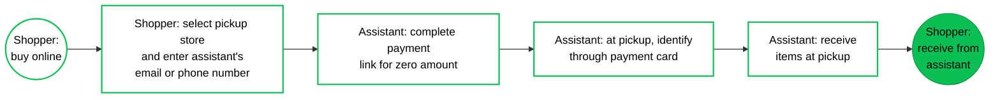
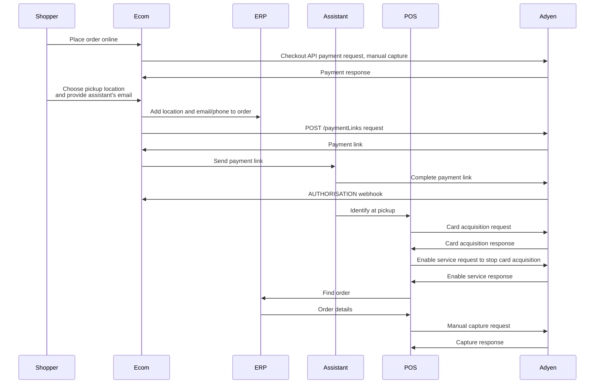

<!-- Source URL: https://docs.adyen.com/unified-commerce/retail-use-cases/click-and-collect/c-and-c-assistant-pickup.md -->
<!-- Fetched: 2026-09-15 -->
<!-- Discovery: llms.txt -->

---
title: "Buy online, pick up by assistant"
description: "Click and collect: Buy items online and let an assistant pick up the order in a store."
url: "https://docs.adyen.com/unified-commerce/retail-use-cases/click-and-collect/c-and-c-assistant-pickup"
source_url: "https://docs.adyen.com/unified-commerce/retail-use-cases/click-and-collect/c-and-c-assistant-pickup.md"
canonical: "https://docs.adyen.com/unified-commerce/retail-use-cases/click-and-collect/c-and-c-assistant-pickup"
last_modified: "2026-09-15T14:06:03+02:00"
language: "en"
---

# Buy online, pick up by assistant

Click and collect: Buy items online and let an assistant pick up the order in a store.

This click-and-collect retail use case involves two participants:

* The shopper who places the order online and authorizes the payment.
* Another person, who we will refer to as the assistant, who picks up the order in the store. For example, the assistant can be a professional personal assistant, or a member of the same household.

To make sure the right person is picking up the order, some identifying non-financial card details of the assistant are collected beforehand in a secure way. Then, at pickup, the assistant only needs to tap their card on the payment terminal. In this way, you do not need to deal with sensitive data such as photo IDs and you do not waste time checking screenshots or paper copies of the order.

The payment is captured at pickup, using the authorization from the shopper who placed the order.

## Requirements

Before you begin, take into account the following information.

| Requirement          | Description                                                                                                                                                                                                                                                                                                                                                 |
| -------------------- | ----------------------------------------------------------------------------------------------------------------------------------------------------------------------------------------------------------------------------------------------------------------------------------------------------------------------------------------------------------- |
| **Integration type** | You must have both an ecommerce integration and a point-of-sale integration with Adyen.                                                                                                                                                                                                                                                                     |
| **Your systems**     | It is essential to have (or create) a consolidated order/inventory management or ERP system. Or alternatively, you must have an orchestration layer that communicates with your various sub-systems and can consume webhook messages. This is because your POS system needs to be able to update the online inventory in case of a pickup, sale, or return. |
| **Preparation**      | We recommend familiarizing yourself with specific concepts so that you can make informed decisions about integration choices. See [Considerations](#considerations) for details.                                                                                                                                                                            |

## Shopper journey

From the perspective of the shopper and the assistant, this click-and-collect use case is as follows.

On the ecommerce site, the shopper logs in to their profile (if they have one), selects some items, and authorizes the payment. The shopper indicates they want another person, the "assistant", to pick up the items in-person at a store location. The shopper selects a location, and provides the email address or phone number of the assistant.

The assistant receives an email or text message with instructions and a payment link for a zero amount. On the Adyen-hosted payment page, the assistant completes the zero-amount transaction.

The assistant then goes to the store to pick up the order. The assistant identifies themselves at the terminal by presenting (tapping) the same card that was used for the payment link, and receives the order. The assistant then hands over the order to the shopper.

The following diagram illustrates this shopper journey.



## Considerations

Before you set up a flow for this use case, there are a couple of points that you must be aware of or make a decision on.

### Shopper attribution

You need to decide beforehand on how you will attribute the sale: if items are ordered online and the payment is captured at pick-up in the store, is this an in-store sale or an ecommerce sale?

### Capture settings

This use case requires manual capture. The payment is not captured at the time of ordering — capture only happens when the assistant picks up the order in-store.

Reference:

[Capture](/online-payments/capture)

### Identification of the assistant

To make sure the right person is picking up the order, this use case identifies the assistant through a combination of Pay by Link and card acquisition.

First a payment link for a zero amount is sent to the assistant. No payment is taken; only the assistant's card identifiers (card alias and/or Payment Account Reference (PAR)) are obtained and saved in the shopper's profile. This requires setting up Pay by Link in the Customer Area, and implementing payment links using API calls

Reference:

[Pay by Link - Add your terms and conditions](/unified-commerce/pay-by-link#add-your-terms-and-conditions), [Create payment links](/unified-commerce/pay-by-link/create-payment-links/api)

At pickup, the assistant is asked to present the same card to the terminal, to obtain the card identifiers through card acquisition. The identifiers are then checked against the assistant's card identifiers that are saved in the shopper's profile.

Reference:

[Card acquisition](/point-of-sale/card-acquisition)

To identify the assistant in the described way, you must enable receiving shopper identifying data in API responses and webhook messages.

Reference:

[Receive identifiers in webhooks](/point-of-sale/card-acquisition/identifiers#receiving-identifiers-in-webhooks) and [Receive identifiers in Terminal API responses](/point-of-sale/card-acquisition/identifiers#receiving-identifiers-in-responses)

## API flow

There are several Adyen API requests involved in the described shopper journey, as shown in the following diagram.



## Instructions

This section provides high-level instructions focusing on how to use the Adyen APIs and webhooks in the described shopper journey.

The code samples show the minimally required parameters. You can add more parameters.

#### Online purchase

If the shopper selected an option on your checkout to pick up their purchase at a (specific) physical location:

1. Make a Checkout API payment request, and handle any additional action to complete the authorization. Capture needs to be set to manual, either in the API request (like in the example below) or in your Customer Area for every payment.

   Reference:

   [Online payments > Build your integration](/online-payments/build-your-integration), [Enable manual capture](/online-payments/capture#enable-manual-capture).

   ### Tab: Sessions flow payment request with manual capture

   ```bash
   curl https://checkout-test.adyen.com/v72/sessions \
   -H 'x-api-key: ADYEN_API_KEY' \
   -H 'idempotency-key: YOUR_IDEMPOTENCY_KEY' \
   -H 'content-type: application/json' \
   -X POST \
   -d '{
     "merchantAccount": "ADYEN_MERCHANT_ACCOUNT",
     "amount": {
        "value": 12050,
        "currency": "USD"
     },
     "returnUrl": "https://your-company.example.com/checkout?shopperOrder=12xy..",
     "reference": "YOUR_PAYMENT_REFERENCE",
     "countryCode": "US",
     "additionalData": {
         "manualCapture": "true"
     }
   }'
   ```

   ### Tab: Advanced flow payment request with manual capture

   ```bash
   curl https://checkout-test.adyen.com/v72/payments \
   -H 'x-api-key: ADYEN_API_KEY' \
   -H 'content-type: application/json' \
   -X POST \
   -d '{
     "merchantAccount": "ADYEN_MERCHANT_ACCOUNT",
     "amount": {
        "currency": "USD",
        "value": 12050
     },
     "reference": "YOUR_ORDER_REFERENCE",
     "paymentMethod":{
        "type": "scheme",
        "encryptedCardNumber": "test_4111111111111111",
        "encryptedExpiryMonth": "test_03",
        "encryptedExpiryYear": "test_2030",
        "encryptedSecurityCode": "test_737"
     },
     "returnUrl": "https://your-company.example.com/checkout?shopperOrder=12xy..",
     "additionalData": {
         "manualCapture": "true"
     }
   }'
   ```

2. If the `resultCode` from the API response shows the payment is authorized, present an option on your checkout to let the shopper indicate another person is going to pick up the order.

3. If the shopper selected pickup by another person (the "assistant"), add a UI element to provide the assistant's name and email address or phone number. You will need these details later to send a payment link to the assistant. Securely save the assistant's details in the shopper's profile in your system.

   If the assistant's card details are at hand, you can alternatively add a UI element to collect the details directly. But in that case, you need to build an encryption solution to keep the card details secure.

4. Securely save the following details when you get the outcome of the payment in the [AUTHORISATION](https://docs.adyen.com/api-explorer/Webhooks/latest/post/AUTHORISATION) webhook message. You will need these details later to capture the payment.

   * `pspReference`: The Adyen-generated unique reference for the transaction.
   * `amount`: The `currency` and `value` of the transaction.

   In addition, you can securely save the following details, for future recognition of *the shopper*:

   * `additionalData.alias`: The card alias uniquely represents the shopper's card number (PAN). This enables you to recognize the card that a shopper is using. You cannot use the card alias for making payments. For NFC wallet transactions, the card alias is not available.
   * `additionalData.PaymentAccountReference`: The payment account reference (PAR) represents the payment account that the card and/or NFC wallet is linked to. It solves the issue with the PAN and alias not being available for NFC wallet transactions. Using the PAR, you can recognize the shopper.

#### Payment link to assistant

To obtain the card details of the assistant, for later identification at pickup:

1. Make sure that in your Customer Area, the general Pay by Link settings are configured, including a link to your terms and conditions.

   Reference:

   [Pay by Link terms and conditions](/unified-commerce/pay-by-link#add-your-terms-and-conditions), [Pay by Link settings](/unified-commerce/pay-by-link/settings).

2. Create a payment link for a zero amount.

   Reference:

   [Create payment links](/unified-commerce/pay-by-link/create-payment-links).

   Make a POST [/paymentLinks](https://docs.adyen.com/api-explorer/Checkout/latest/post/paymentLinks) request, specifying the following parameters:

   | Parameter                                                                                                                    | Required                                                                                    | Description                                                                                                                                                                                                                                                                         |
   | ---------------------------------------------------------------------------------------------------------------------------- | ------------------------------------------------------------------------------------------- | ----------------------------------------------------------------------------------------------------------------------------------------------------------------------------------------------------------------------------------------------------------------------------------- |
   | [reference](https://docs.adyen.com/api-explorer/Checkout/latest/post/paymentLinks#request-reference)                         |  | A string that enables you to associate the payment link with the order.                                                                                                                                                                                                             |
   | [amount](https://docs.adyen.com/api-explorer/Checkout/latest/post/paymentLinks#request-amount)                               |  | Set the `value` to **0** (zero).                                                                                                                                                                                                                                                    |
   | [description](https://docs.adyen.com/api-explorer/Checkout/latest/post/paymentLinks#request-description)                     |                                                                                             | A text of no more than 280 characters to explain what the payment link is for. It is important that the assistant understands that the card will not be charged, and that the same card must be available when picking up the order. This text will appear on the payment page.     |
   | [allowedPaymentMethods](https://docs.adyen.com/api-explorer/Checkout/latest/post/paymentLinks#request-allowedPaymentMethods) |                                                                                             | An array set to **scheme**, to restrict the available payment methods to card schemes. This is necessary because at pickup you will use a card acquisition request on the terminal to recognize the assistant's card, and card acquisition only works with cards (and NFC wallets). |

   **Zero amount payment link request**

   ```bash
   curl https://checkout-test.adyen.com/v72/paymentLinks \
   -H 'x-api-key: ADYEN_API_KEY' \
   -H 'content-type: application/json' \
   -X POST \
   -d '{
     "reference": "YOUR_ORDER_REFERENCE",
     "amount": {
       "value": 0,
       "currency": "USD"
     },
     "description": "Use the card that you will present when picking up order {orderID}. Your card will not be charged, not now and not at pickup.",
     "countryCode": "US",
     "merchantAccount": "ADYEN_MERCHANT_ACCOUNT",
     "shopperLocale": "en-US",
     "allowedPaymentMethods": [
       "scheme"
     ]
   }'
   ```

3. From the `/paymentLinks` response, save the [url](https://docs.adyen.com/api-explorer/Checkout/latest/post/paymentLinks#responses-201-url). This is the payment link that you need to send to the assistant.

4. Send the payment link to the assistant by email or text message. Consider adding an explanation about what the link is for and how the obtained information will be used.

5. When you receive the [AUTHORISATION](https://docs.adyen.com/api-explorer/Webhooks/latest/post/AUTHORISATION) webhook message for the payment link:

   1. Find the order in your system, using the `merchantReference`. This is the order reference that you used in the payment link request.
   2. Save the `additionalData.alias` and/or `additionalData.PaymentAccountReference` with the order, under the assistant's details. This is the alias (and/or PAR) for the card that the assistant used to complete the zero amount payment link.

#### In-store pickup

When the assistant arrives at the store to pick up the order:

1. To identify the assistant based on the card that was used to complete the payment link:

   1. Make a Terminal API [CardAcquisitionRequest](https://docs.adyen.com/api-explorer/terminal-api/latest/post/cardacquisition) with an empty `CardAcquisitionTransaction` object.

      Reference:

      [Card acquisition](/point-of-sale/card-acquisition)

      **Card acquisition to recognize the card**

      ```json
      {
          "SaleToPOIRequest": {
              "MessageHeader": {
                  "ProtocolVersion": "3.0",
                  "MessageClass": "Service",
                  "MessageCategory": "CardAcquisition",
                  "MessageType": "Request",
                  "ServiceID": "282",
                  "SaleID": "POSSystemID12345",
                  "POIID": "AMS1-324688179"
              },
              "CardAcquisitionRequest": {
                  "SaleData": {
                      "SaleTransactionID": {
                          "TransactionID": "869",
                          "TimeStamp": "2026-02-10T12:30:00.134Z"
                      }
                  },
                  "CardAcquisitionTransaction": {}
              }
          }
      }
      ```

   2. When you receive the [CardAcquisitionResponse](https://docs.adyen.com/api-explorer/terminal-api/latest/post/cardacquisition#responses-200-Response), find the assistant and the order in your ERP system using the following information from the `response.AdditionalResponse`:

      * `PaymentAccountReference`: the PAR, if present.
      * `alias`: the card alias

      The following example shows the `AdditionalResponse` as a string of key-value pairs concatenated with an ampersand (**&**). It is possible you receive a Base64-encoded string instead, which you need to Base64 decode first.

      **Card acquisition response**

      ```json
      {
          "SaleToPOIResponse": {
              "CardAcquisitionResponse": {
                  "POIData": {
                      "POIReconciliationID": "1000",
                      "POITransactionID": {
                          "TimeStamp": "2026-02-10T12:30:01.399Z",
                          "TransactionID": "BV0q001770726600000"
                      }
                  },
                  "PaymentInstrumentData": {
                      "CardData": {
                          "CardCountryCode": "840",
                          "MaskedPan": "510006 **** 0002",
                          "PaymentBrand": "mc",
                          "SensitiveCardData": {
                              "ExpiryDate": "1229"
                          }
                      },
                      "PaymentInstrumentType": "Card"
                  },
                  "Response": {
                      "AdditionalResponse": "PaymentAccountReference=nmHL7QIKrz2cae0gjLTByTxIk76OX&alias=P692729067643981&...message=CARD_ACQ_COMPLETED...",
                      "Result": "Success"
                  },
                  "SaleData": {
                      "SaleTransactionID": {
                          "TimeStamp": "2026-02-10T12:29:58.765Z",
                          "TransactionID": "869"
                      }
                  }
              },
              "MessageHeader": {
                  "MessageCategory": "CardAcquisition",
                  "MessageClass": "Service",
                  "MessageType": "Response",
                  "POIID": "AMS1-324688179",
                  "ProtocolVersion": "3.0",
                  "SaleID": "POSSystemID12345",
                  "ServiceID": "981"
              }
          }
      }
      ```

   3. When you have confirmed that the assistant's card details match the assistant's details in the profile of the shopper, finish the card acquisition by making an [EnableServiceRequest](https://docs.adyen.com/api-explorer/terminal-api/latest/post/enableservice) to stop the flow.\
      Consider including a `DisplayOutput` object with an explanatory message for the assistant, as shown in the following example.

      Reference:

      [Finish with a cancellation](/point-of-sale/card-acquisition#cancel-completed)

      **Stop the card acquisition flow**

      ```json
      {
         "SaleToPOIRequest": {
            "MessageHeader": {
               "ProtocolVersion": "3.0",
               "MessageClass": "Service",
               "MessageCategory": "EnableService",
               "MessageType": "Request",
               "ServiceID":"3020711110",
               "SaleID":"POSSystemID12345",
               "POIID":"AMS1-324688179"
            },
            "EnableServiceRequest": {
               "TransactionAction": "AbortTransaction",
               "DisplayOutput": {
                  "Device": "CustomerDisplay",
                  "InfoQualify": "Display",
                  "OutputContent": {
                     "PredefinedContent": {
                        "ReferenceID": "AcceptedAnimated"
                     },
                     "OutputFormat": "Text",
                     "OutputText": [
                        {
                           "Text": "Thank you!"
                        },
                        {
                           "Text": "We will get your order."
                        }
                     ]
                  }
               }
            }
         }
      }
      ```

2. Make a manual capture request for the amount due:\
   Send a POST request to the [/payments/{paymentPspReference}/captures](https://docs.adyen.com/api-explorer/Checkout/latest/post/payments/\(paymentPspReference\)/captures) endpoint, where `paymentPspReference` is the PSP reference from the AUTHORISATION webhook message that you received for the online purchase.

   Do not use the AUTHORISATION webhook message that you received for the payment link.

   **Checkout API - Manual capture**

   ```bash
   curl https://checkout-test.adyen.com/v72/payments/DXCD52AY3WUGXS93/captures \
   -H 'x-api-key: ADYEN_API_KEY' \
   -H 'content-type: application/json' \
   -X POST \
   -d '{
          "merchantAccount": "ADYEN_MERCHANT_ACCOUNT",
          "amount": {
             "currency": "USD",
             "value": 12050
          },
          "reference": "YOUR_ORDER_REFERENCE"
   }'
   ```

## See also

* [Features per industry: Retail omnichannel](/industries/feature-packs?industry=retail\&channel=omni\&target=_blank)
* [Other retail omnichannel use cases](/unified-commerce/retail-use-cases)
