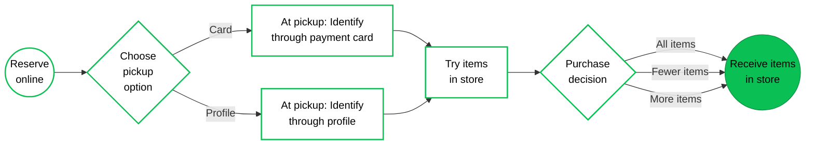
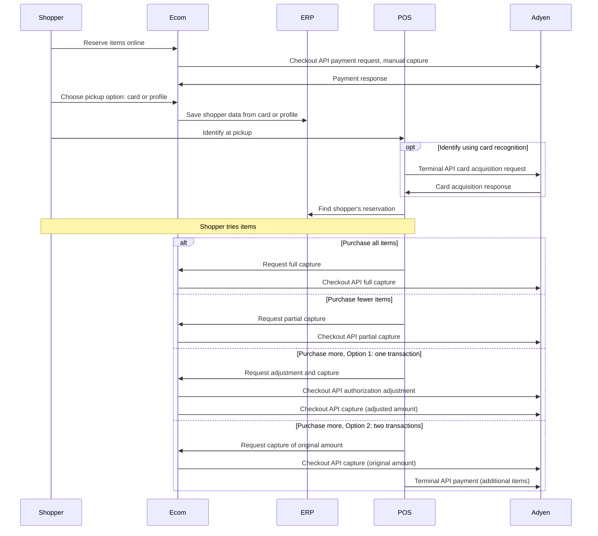

<!-- Source URL: https://docs.adyen.com/unified-commerce/retail-use-cases/click-and-collect/c-and-c-try-then-buy.md -->
<!-- Fetched: 2026-09-15 -->
<!-- Discovery: llms.txt -->

---
title: "Reserve online, try in store"
description: "Click and collect: Reserve online and try in a store before buying."
url: "https://docs.adyen.com/unified-commerce/retail-use-cases/click-and-collect/c-and-c-try-then-buy"
source_url: "https://docs.adyen.com/unified-commerce/retail-use-cases/click-and-collect/c-and-c-try-then-buy.md"
canonical: "https://docs.adyen.com/unified-commerce/retail-use-cases/click-and-collect/c-and-c-try-then-buy"
last_modified: "2026-09-15T14:06:03+02:00"
language: "en"
---

# Reserve online, try in store

Click and collect: Reserve online and try in a store before buying.

In this click-and-collect use case, shoppers reserve items online without paying upfront. They try the items in a store before deciding what to buy. This "try before you buy" model reduces returns and increases customer satisfaction.

## Requirements

Before you begin, take into account the following information.

| Requirement          | Description                                                                                                                                                                                                                                                                                                               |
| -------------------- | ------------------------------------------------------------------------------------------------------------------------------------------------------------------------------------------------------------------------------------------------------------------------------------------------------------------------- |
| **Integration type** | You must have both an ecommerce integration and a point-of-sale integration with Adyen.                                                                                                                                                                                                                                   |
| **Your systems**     | You need a consolidated order/inventory management or ERP system. Alternatively, you must have an orchestration layer that communicates with your various sub-systems and can consume webhook messages. This is because your POS system must be able to update the online inventory in case of a pickup, sale, or return. |
| **Preparation**      | We recommend familiarizing yourself with specific concepts so that you can make informed decisions about integration choices. See [Considerations](#considerations) for details.                                                                                                                                          |

## Shopper journey

From the shopper's perspective, this click-and-collect use case is as follows.

On the ecommerce site, the shopper logs in to their profile (if they have one), selects items to reserve, and chooses a pickup location. The shopper indicates how they want to identify themselves at pickup: using the same card used for the reservation, or using their customer profile. If necessary, the shopper enters the details to create a profile.

At the store, the shopper identifies themselves using the chosen method, either:

* At the terminal, the shopper presents (taps) the same card used for the online reservation.
* The shopper provides profile details such as name and telephone number.

Store staff retrieves the reserved items. The shopper tries the items and decides what to buy:

* **Purchase all items**: The full reservation amount is booked from the shopper's account.
* **Purchase fewer items**: Only part of the reservation amount is booked from the shopper's account.
* **Purchase more items**: The additional items are paid with a separate payment at the terminal, or a higher amount than the reservation is booked from the shopper's account.

The following diagram illustrates this shopper journey.



## Considerations

Before you set up a flow for this use case, there are a couple of points that you must be aware of or make a decision on.

### Capture settings

This use case requires manual capture. The payment is not captured at the time of reservation — capture only happens when the shopper decides which items to buy in-store.

You can use either:

* **Pre-authorization with manual capture**: Recommended if you want the option to increase the authorized amount later (when the shopper buys additional items). Pre-authorization signals to the issuer that the amount may change.
* **Regular authorization with manual capture**: Sufficient if you expect the amount to stay the same or decrease (partial capture for fewer items).

Not all card schemes support pre-authorization. Before you rely on pre-authorization, check which [payment methods and card schemes support authorization adjustment](/online-payments/adjust-authorisation#availability).

Reference:

[Authorization adjustment](/online-payments/adjust-authorisation), [Capture](/online-payments/capture)

### Shopper attribution

You need to decide beforehand how you want to attribute shoppers: if an item is reserved online and purchased in-store, which department can this sale be attributed to? Consider how you want to track and report on cross-channel transactions for accurate revenue attribution.

### Shopper identification

To identify the shopper at pickup, you must consider data privacy. Always ask for explicit permission when you save the shopper's details.

Reference:

[Customer data and privacy](/point-of-sale/card-acquisition/identifiers#privacy)

In this use case, you can identify shoppers using card recognition or customer profile details. Implement both methods because card recognition only works if a card or NFC wallet was used for the online reservation. Card recognition is not possible with QR code wallets (such as PayPal), Buy Now Pay Later payment methods (such as Klarna), or other alternative payment methods (such as iDEAL/Wero).

We strongly recommend storing the card alias and the Payment Account Reference (PAR) in the shopper's profile. This lets you offer both recognition methods for the same shopper.

Reference:

[Card recognition](/point-of-sale/shopper-recognition)

To use card recognition, you must enable receiving shopper identifying data in API responses and webhook messages.

Reference:

[Receive identifiers in webhooks](/point-of-sale/card-acquisition/identifiers#receiving-identifiers-in-webhooks) and [Receive identifiers in Terminal API responses](/point-of-sale/card-acquisition/identifiers#receiving-identifiers-in-responses).

### Card acquisition

Card recognition is based on a "card acquisition" request: the shopper presents their card or other payment instrument to the payment terminal, and the response returns details that you can use to look up the shopper in your system.

Reference:

[Card acquisition](/point-of-sale/card-acquisition)

### Mixed basket and account structure

If the shopper buys more items in-store than they reserved online, the purchase becomes a mixed basket of online and in-store items. We recommend discussing your Adyen account structure with your Adyen implementation engineer or account manager, since this affects how you reconcile and attribute the sale.

You have the following options for handling the additional items:

* **Option 1: One transaction**: increase the online authorization, then capture the total as a single payment. This works only if you used pre-authorization for the online reservation.
* **Option 2: Two transactions**: capture the original reservation, then charge the extra items as a separate in-person payment. This works with any authorization type.

Reference:

[Account structures for mixed baskets](/unified-commerce/retail-use-cases/mixed-baskets-accounts)

## API flow

There are several Adyen API requests involved in the described shopper journey, as shown in the following diagram.



The next section, "Instructions", provides more details about the API flow.

## Instructions

This section provides high-level instructions focusing on how to use the Adyen APIs and webhooks in the described shopper journey.

The code samples show the minimally required parameters. You can add more parameters.

### Online reservation

If the shopper selected items to reserve for in-store pickup:

1. Make a Checkout API payment request with manual capture enabled. Use pre-authorization if you want the option to increase the amount later (for additional items).

   Reference:

   [Adjust an authorization](/online-payments/adjust-authorisation/adjust-with-preauth), [Online payments > Build your integration](/online-payments/build-your-integration).

   ### Tab: Pre-authorization with manual capture (recommended)

   Use pre-authorization if you want the flexibility to increase the authorized amount when the shopper decides to buy additional items.

   **Pre-authorization request for reservation**

   ```bash
   curl https://checkout-test.adyen.com/v72/payments \
   -H 'x-api-key: ADYEN_API_KEY' \
   -H 'content-type: application/json' \
   -X POST \
   -d '{
      "amount": {
         "currency": "USD",
         "value": 15000
      },
      "reference": "YOUR_RESERVATION_REFERENCE",
      "paymentMethod":{
         "type": "scheme",
         "encryptedCardNumber": "test_4111111111111111",
         "encryptedExpiryMonth": "test_03",
         "encryptedExpiryYear": "test_2030",
         "encryptedSecurityCode": "test_737"
      },
      "returnUrl": "https://your-company.example.com/checkout?shopperOrder=12xy..",
      "merchantAccount": "ADYEN_MERCHANT_ACCOUNT",
      "additionalData": {
         "authorisationType": "PreAuth",
         "manualCapture": "true"
      }
   }'
   ```

   ### Tab: Regular authorization with manual capture

   Use regular authorization with manual capture if you only expect the shopper to purchase the same or fewer items (partial capture).

   **Authorization request with manual capture**

   ```bash
   curl https://checkout-test.adyen.com/v72/payments \
   -H 'x-api-key: ADYEN_API_KEY' \
   -H 'content-type: application/json' \
   -X POST \
   -d '{
      "amount": {
         "currency": "USD",
         "value": 15000
      },
      "reference": "YOUR_RESERVATION_REFERENCE",
      "paymentMethod":{
         "type": "scheme",
         "encryptedCardNumber": "test_4111111111111111",
         "encryptedExpiryMonth": "test_03",
         "encryptedExpiryYear": "test_2030",
         "encryptedSecurityCode": "test_737"
      },
      "returnUrl": "https://your-company.example.com/checkout?shopperOrder=12xy..",
      "merchantAccount": "ADYEN_MERCHANT_ACCOUNT",
      "additionalData": {
         "manualCapture": "true"
      }
   }'
   ```

2. If the `resultCode` from the API response shows the payment is authorized, present an option on your checkout to let the shopper choose an identification method at the pickup location: through the card they used for the reservation, or through personal details.

3. If the shopper selected personal details as identification method, present a form to let the shopper enter identifying details such as name, phone number, and address. Securely save the entered details in your system.

4. If the shopper selected card as identification method, securely save the following details when you get the outcome of the payment in the [AUTHORISATION](https://docs.adyen.com/api-explorer/Webhooks/latest/post/AUTHORISATION) webhook message:

   * `additionalData.alias`: The card alias uniquely represents the shopper's card number (PAN). This enables you to recognize the card that a shopper is using. You cannot use the card alias for making payments. For NFC wallet transactions, the card alias is not available.
   * `additionalData.PaymentAccountReference`: The payment account reference (PAR) represents the payment account that the card and/or NFC wallet is linked to. It solves the issue with the PAN and alias not being available for NFC wallet transactions. Using the PAR, you can recognize the shopper.

5. Regardless of identification method, from the **AUTHORISATION** webhook message also save the following details. You will need these details to find the reservation in your system and to capture the payment later.

   * `pspReference`: The Adyen-generated unique reference for the transaction.
   * `amount`: The `currency` and `value` of the transaction.

### In-store pickup and try-on

When the shopper comes to the pickup location:

1. If you need to identify the shopper based on the card that was used for the online reservation:

   1. Make a Terminal API [CardAcquisitionRequest](https://docs.adyen.com/api-explorer/terminal-api/latest/post/cardacquisition) with an empty `CardAcquisitionTransaction` object.

      Reference:

      [Card acquisition](/point-of-sale/card-acquisition)

      **Card acquisition to recognize the card**

      ```json
      {
          "SaleToPOIRequest": {
              "MessageHeader": {
                  "ProtocolVersion": "3.0",
                  "MessageClass": "Service",
                  "MessageCategory": "CardAcquisition",
                  "MessageType": "Request",
                  "ServiceID": "282",
                  "SaleID": "POSSystemID12345",
                  "POIID": "S1F2-000158212345"
              },
              "CardAcquisitionRequest": {
                  "SaleData": {
                      "SaleTransactionID": {
                          "TransactionID": "869",
                          "TimeStamp": "2026-02-10T12:30:00.134Z"
                      }
                  },
                  "CardAcquisitionTransaction": {}
              }
          }
      }
      ```

   2. When you receive the [CardAcquisitionResponse](https://docs.adyen.com/api-explorer/terminal-api/latest/post/cardacquisition#responses-200-Response), get the following information from the `response.AdditionalResponse`:

      * `PaymentAccountReference`: the PAR, if present.
      * `alias`: the card alias

   3. Finish the card acquisition by making an [EnableServiceRequest](https://docs.adyen.com/api-explorer/terminal-api/latest/post/enableservice) to stop the flow.

      Reference:

      [Finish with a cancellation](/point-of-sale/card-acquisition#cancel-completed)

2. If you need to identify the shopper based on profile data, collect certain details such as name and phone number. You can do this in various ways, for example:

   * Store staff asks the shopper for the details.
   * You collect the shopper's details on a secondary screen, for instance a tablet.
   * You use [input requests](/point-of-sale/shopper-engagement/shopper-input/) to collect the shopper's details on the payment terminal.

3. Ensure your store staff can look up the shopper's reserved items in your system using either the PAR or card alias from the card acquisition response, or the profile data that the shopper provided. Store staff then hands over the items to the shopper to try.

### Capture based on purchase decision

After the shopper has tried the items and decided what to buy:

### Tab: Purchase all items

If the shopper wants all the reserved items, make a Checkout API capture request for the full pre-authorized amount.

**Full capture**

```bash
curl https://checkout-test.adyen.com/v72/payments/KHQC5N7G84BLNK43/captures \
-H 'x-api-key: ADYEN_API_KEY' \
-H 'content-type: application/json' \
-X POST \
-d '{
    "merchantAccount": "ADYEN_MERCHANT_ACCOUNT",
    "amount": {
        "currency": "USD",
        "value": 15000
    }
}'
```

Reference:

[Capture](/online-payments/capture)

### Tab: Purchase fewer items

If the shopper only wants some of the reserved items, make a Checkout API partial capture request. The remaining amount is automatically released back to the shopper.

**Partial capture for USD 100.00 of a USD 150.00 reservation**

```bash
curl https://checkout-test.adyen.com/v72/payments/KHQC5N7G84BLNK43/captures \
-H 'x-api-key: ADYEN_API_KEY' \
-H 'content-type: application/json' \
-X POST \
-d '{
    "merchantAccount": "ADYEN_MERCHANT_ACCOUNT",
    "amount": {
        "currency": "USD",
        "value": 10000
    }
}'
```

Reference:

[Partial capture](/online-payments/capture#partial-capture)

### Tab: Purchase more items

When the shopper buys items in addition to what they reserved online, the order becomes a mixed basket consisting of online items plus in-store items. You can handle the extra items in one of two ways:

* **Option 1: Add to the online payment (one transaction)**: increase the online authorization, then capture the total as a single payment. This works only if you used pre-authorization for the online reservation (Online reservation, step 1).
* **Option 2: Charge the extra items separately (two transactions)**: capture the original reservation, then charge the extra items as a separate in-person payment. This works with any authorization type.

How you reconcile and attribute the online and in-store parts of a mixed basket depends on your Adyen account structure.

#### Option 1: Add to the online payment (one transaction)

First make an authorization adjustment to increase the authorized amount, then capture the adjusted amount.

1. Make an authorization adjustment to increase the authorized amount.

   **Authorization adjustment to increase amount to USD 200.00**

   ```bash
   curl https://checkout-test.adyen.com/v72/payments/KHQC5N7G84BLNK43/amountUpdates \
   -H 'x-api-key: ADYEN_API_KEY' \
   -H 'content-type: application/json' \
   -X POST \
   -d '{
       "merchantAccount": "ADYEN_MERCHANT_ACCOUNT",
       "amount": {
           "currency": "USD",
           "value": 20000
       }
   }'
   ```

2. Capture the adjusted amount.

   **Capture the adjusted amount**

   ```bash
   curl https://checkout-test.adyen.com/v72/payments/KHQC5N7G84BLNK43/captures \
   -H 'x-api-key: ADYEN_API_KEY' \
   -H 'content-type: application/json' \
   -X POST \
   -d '{
       "merchantAccount": "ADYEN_MERCHANT_ACCOUNT",
       "amount": {
           "currency": "USD",
           "value": 20000
       }
   }'
   ```

Reference:

[Adjust an authorization](/online-payments/adjust-authorisation/adjust-with-preauth)

#### Option 2: Charge the extra items separately (two transactions)

Capture the original pre-authorized amount, then make a separate Terminal API payment for the additional items.

1. Capture the original pre-authorized amount.

   **Capture the original reservation amount**

   ```bash
   curl https://checkout-test.adyen.com/v72/payments/KHQC5N7G84BLNK43/captures \
   -H 'x-api-key: ADYEN_API_KEY' \
   -H 'content-type: application/json' \
   -X POST \
   -d '{
       "merchantAccount": "ADYEN_MERCHANT_ACCOUNT",
       "amount": {
           "currency": "USD",
           "value": 15000
       }
   }'
   ```

2. Make a separate Terminal API payment for the additional items.

   **Terminal API payment for additional items**

   ```json
   {
       "SaleToPOIRequest":{
           "MessageHeader":{
               "ProtocolVersion":"3.0",
               "MessageClass":"Service",
               "MessageCategory":"Payment",
               "MessageType":"Request",
               "SaleID":"POSSystemID12345",
               "ServiceID":"175",
               "POIID":"S1F2-000158212345"
           },
           "PaymentRequest":{
               "SaleData":{
                   "SaleTransactionID":{
                       "TimeStamp":"2026-02-10T12:45:00.000Z",
                       "TransactionID":"YOUR_ADDITIONAL_ITEMS_REFERENCE"
                   }
               },
               "PaymentTransaction":{
                   "AmountsReq":{
                       "Currency":"USD",
                       "RequestedAmount":50.00
                   }
               }
           }
       }
   }
   ```

Reference:

[Make a payment](/point-of-sale/basic-tapi-integration/make-a-payment)

## See also

* [Account structures for mixed baskets](/unified-commerce/retail-use-cases/mixed-baskets-accounts)
* [Features per industry: Retail omnichannel](/industries/feature-packs?industry=retail\&channel=omni\&target=_blank)
* [Other retail omnichannel use cases](/unified-commerce/retail-use-cases)
