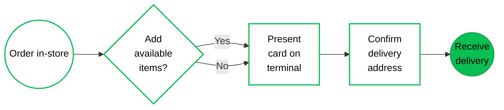
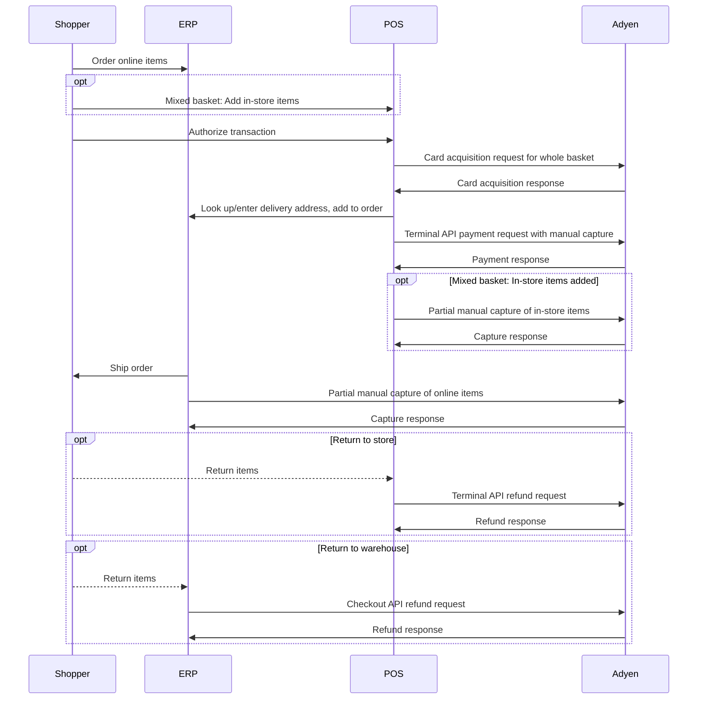
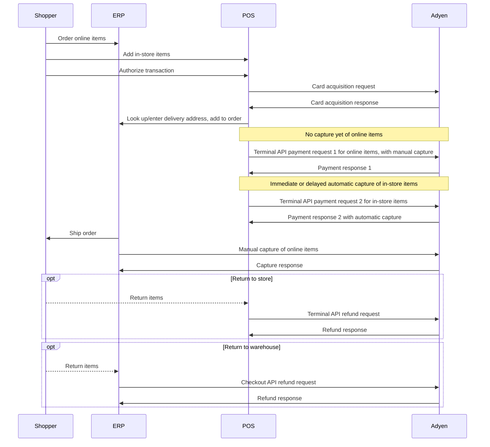

<!-- Source URL: https://docs.adyen.com/unified-commerce/retail-use-cases/endless-aisle/e-a-ship-home.md -->
<!-- Fetched: 2026-09-15 -->
<!-- Discovery: llms.txt -->

---
title: "Order in store, ship to home"
description: "Endless aisle: Order in store and ship to home."
url: "https://docs.adyen.com/unified-commerce/retail-use-cases/endless-aisle/e-a-ship-home"
source_url: "https://docs.adyen.com/unified-commerce/retail-use-cases/endless-aisle/e-a-ship-home.md"
canonical: "https://docs.adyen.com/unified-commerce/retail-use-cases/endless-aisle/e-a-ship-home"
last_modified: "2026-09-15T14:06:03+02:00"
language: "en"
---

# Order in store, ship to home

Endless aisle: Order in store and ship to home.

In this Endless Aisle retail use case, online items are ordered in a store or other physical location, and authorized using a payment terminal. The order is then shipped to the shopper's address, either in one go or in several partial shipments. The payment is captured when the order is shipped. In case of partial shipments, there will be corresponding partial captures.

This use case also covers a "mixed basket", where the shopper adds items that are available at the store to the ordered online items. The payment for the in-store items is captured on the spot. The payment for the ordered items is captured later, when the items are shipped.

## Requirements

Before you begin, take into account the following information.

| Requirement          | Description                                                                                                                                                                                                                                                                                                                                                                                     |
| -------------------- | ----------------------------------------------------------------------------------------------------------------------------------------------------------------------------------------------------------------------------------------------------------------------------------------------------------------------------------------------------------------------------------------------- |
| **Integration type** | You must have both an ecommerce integration and a point-of-sale integration with Adyen.                                                                                                                                                                                                                                                                                                         |
| **Your systems**     | It is essential to have (or create) a consolidated order/inventory management or ERP system. Or alternatively, you must have an orchestration layer that communicates with your various sub-systems and can consume webhook messages. This is because shoppers may return items to the store or to the warehouse, and both systems need to be able to update the inventory in case of a return. |
| **Preparation**      | We recommend familiarizing yourself with specific concepts so that you can make informed decisions about integration choices. See [Considerations](#considerations) for details.                                                                                                                                                                                                                |

## Shopper journey

From the shopper's perspective, this Endless Aisle retail use case is as follows.

In the store, it turns out that items that the shopper wants to purchase are not available at the location. Store staff helps the shopper to order the items online. If desired, the shopper can combine the order with purchasing items from the store that do not need to be ordered.

The shopper presents their card on the payment terminal, and confirms or provides the delivery address. When the order is shipped, the payment is captured and the shopper receives the ordered goods.

The following diagram illustrates this shopper journey.



## Considerations

Before you set up a flow for this use case, there are a couple of points that you must be aware of or make a decision on.

### Legal entity and location

In this use case, you use the payment terminal to authorize the online order.

If you want to process your Endless Aisle online transactions over a different merchant account than the regular in-person transactions, ask your Adyen Account Manager or Implementation Engineer about *Merchant Account Sharing*. With this, orders for both merchant accounts are processed on the same terminal, but kept separate. Enabling Merchant Account Sharing is subject to compliance approval. Terminals require a local legal entity.

If compliance approval is not given, you have other options to keep the transactions separate:

* You can use separate terminals for regular in-store transactions and Endless Aisle transactions.
* Or you can set up multiple stores under the same merchant account. This keeps the reporting simple.
* Alternatively, instead of authorizing Endless Aisle online orders on a payment terminal, you can use Pay by Link payment links.

Reference:

[Pay by Link](/unified-commerce/pay-by-link)

### Capture settings

This use case requires specific procedures to capture the payment. You must enable and use manual capture, and contact our [Support Team](https://ca-test.adyen.com/ca/ca/contactUs/support.shtml?form=other) to enable multiple partial captures.

For the ordered items, the amount is initially authorized, but not captured. When the items are shipped from the warehouse, you make a manual capture request. If all items are shipped together, you capture the full amount. If items are delivered in several partial shipments, you make a partial capture request for each shipment.

It depends on your other use cases whether it is best to enable manual capture for every payment, or in the API request for an individual payment.

Reference:

[Enable manual capture](/online-payments/capture#enable-manual-capture), [Partial manual capture](/online-payments/capture#partial-capture), [Capture a payment](/online-payments/capture#capture-a-payment)

### Mixed baskets

If you want to support mixed baskets, where the shopper combines an online order with items that are available in the store, we recommend discussing your Adyen account structure and capture strategy with your Adyen implementation engineer or account manager.

You have the following options for capturing the payment:

* One transaction with multiple partial captures: this option requires that online and in-store items are processed under the same merchant account.\
  You authorize the full amount of both the online order and the point-of-sale items, and make a partial capture request for the in-store items. Later, you make one or more partial captures as the ordered items are shipped.

* Two separate transactions: you authorize the online order and capture the amount later as ordered items are shipped. For the in-store items, you make a separate payment request and capture the amount immediately or with a capture delay.

Reference:

[Account structures for mixed baskets](/unified-commerce/retail-use-cases/mixed-baskets-accounts), [Delayed automatic capture](/point-of-sale/capturing-payments#delayed-automatic-capture). Also see the references under "Capture" above.

### Delivery address

To get the delivery address you use a "card acquisition" request: the shopper presents their card or other payment instrument to the payment terminal. You then use the card alias or PAR from the response to look up the delivery address in your CRM system and add the address to the order.

To use card acquisition in this way, you must enable receiving shopper identifying data in API responses, and you must store the card alias and/or PAR in the shopper's profile.

If the shopper wants the order to be delivered to a different address or does not have a record in your CRM system yet, the CRM must also support manual entry of shopper details and creation of a new CRM record.

Reference:

[Card acquisition](/point-of-sale/card-acquisition), [Receive card and shopper identifiers](/point-of-sale/card-acquisition/identifiers#receiving-identifiers-in-responses).

### Sale attribution

You need to decide beforehand on how you will attribute the sale: if items are ordered in-store and the payment is captured upon shipment, is this an in-store sale or an ecommerce sale?

### Refunds and discounts

If the shopper does not want a delivered item, the item may be returned to the store or to the warehouse. Both systems must be able to look up the PSP reference for the order and issue a (partial) referenced refund. You need to support both:

* **Terminal API** referenced refunds from the POS to the terminal for returns brought to the store.
* **Checkout API** referenced refunds for returns sent to the warehouse.

If discounts are offered over the phone or chat, customer service agents must be able to trigger partial referenced refunds as well.

Reference:

[Terminal API partial referenced refund](/point-of-sale/basic-tapi-integration/refund-payment/referenced), [Checkout API refund](/online-payments/refund)

## API flow

There are several Adyen API requests involved in the described shopper journey, as shown in the following diagrams for:

* The flow without mixed baskets and the flow with mixed baskets as a single transaction. These flows are very similar.
* The flow with a mixed basket as two separate transactions.

The next section, "Instructions", provides more details about the API flow.

### No mixed basket or mixed basket as one transaction



### Mixed basket as two transactions

We usually recommend delayed automatic capture for point-of-sale transactions. That is why the diagram shows automatic capture for the separate payment request related to the in-store items.



## Instructions

This section provides high-level instructions focusing on how to use the Adyen APIs and webhooks in the described shopper journey.

The code samples show the minimally required parameters. You can add more parameters.

#### Delivery address

After the shopper has ordered the online items:

1. Make a Terminal API [CardAcquisitionRequest](https://docs.adyen.com/api-explorer/terminal-api/latest/post/cardacquisition) where the `CardAcquisitionTransaction` object contains the `TotalAmount` field with the purchase amount for the ordered items and, if you support mixed baskets as a single transaction, any items from the store.

   Reference:

   [Card acquisition](/point-of-sale/card-acquisition)

   **Card acquisition**

   ```json
   {
       "SaleToPOIRequest": {
           "MessageHeader": {
               "ProtocolVersion": "3.0",
               "MessageClass": "Service",
               "MessageCategory": "CardAcquisition",
               "MessageType": "Request",
               "ServiceID": "282",
               "SaleID": "POSSystemID12345",
               "POIID": "AMS1-324688179"
           },
           "CardAcquisitionRequest": {
               "SaleData": {
                   "SaleTransactionID": {
                       "TransactionID": "869",
                       "TimeStamp": "2026-02-10T12:30:00.134Z"
                   }
               },
               "CardAcquisitionTransaction": {
                  "TotalAmount": 124.66
               }
           }
       }
   }
   ```

2. When you receive the [CardAcquisitionResponse](https://docs.adyen.com/api-explorer/terminal-api/latest/post/cardacquisition#responses-200-Response), save the following information:

   * `AdditionalResponse.PaymentAccountReference`: the PAR, if present.
   * `AdditionalResponse.alias`: the card alias.
   * The `TimeStamp` and `TransactionID` from the `POIData.POITransactionID` object. You need these values later, when you authorize the transaction.

   The following example shows the `AdditionalResponse` as a string of key-value pairs concatenated with an ampersand (**&**). It is possible you receive a Base64-encoded string instead, which you need to Base64 decode first.

   **Card acquisition response**

   ```json
   {
       "SaleToPOIResponse": {
           "CardAcquisitionResponse": {
               "POIData": {
                   "POIReconciliationID": "1000",
                   "POITransactionID": {
                       "TimeStamp": "2026-02-10T12:30:01.399Z",
                       "TransactionID": "BV0q001770726600000"
                   }
               },
               "PaymentInstrumentData": {
                   "CardData": {
                       "CardCountryCode": "840",
                       "MaskedPan": "510006 **** 0002",
                       "PaymentBrand": "mc",
                       "SensitiveCardData": {
                           "ExpiryDate": "1229"
                       }
                   },
                   "PaymentInstrumentType": "Card"
               },
               "Response": {
                   "AdditionalResponse": "PaymentAccountReference=nmHL7QIKrz2cae0gjLTByTxIk76OX&alias=P692729067643981&...message=CARD_ACQ_COMPLETED...",
                   "Result": "Success"
               },
               "SaleData": {
                   "SaleTransactionID": {
                       "TimeStamp": "2026-02-10T12:29:58.765Z",
                       "TransactionID": "869"
                   }
               }
           },
           "MessageHeader": {
               "MessageCategory": "CardAcquisition",
               "MessageClass": "Service",
               "MessageType": "Response",
               "POIID": "AMS1-324688179",
               "ProtocolVersion": "3.0",
               "SaleID": "POSSystemID12345",
               "ServiceID": "981"
           }
       }
   }
   ```

3. Use the card alias and/or PAR from the card acquisition response to look up the shopper's delivery address in your ERP system.

4. If the shopper is found in the ERP system, let the shop assistant verify the delivery address with the shopper.\
   Ensure the shop assistant can:

   * Update the delivery address if needed.
   * Enter an additional delivery address if the shopper wants the order shipped to a different address.

5. If the shopper is not found in the ERP system, add a record for the shopper to the ERP system with the card alias and/or PAR from the card acquisition response, and the other details that you need, specifically the delivery address and the name of the shopper. You can collect those other details in various ways, for example:

   * The shop assistant asks the shopper for the details.
   * You collect the shopper's details on a secondary screen, for instance a tablet.
   * You use [input requests](/point-of-sale/shopper-engagement/shopper-input/) to collect the shopper's details on the payment terminal.

6. Add the delivery address to the order.

#### Authorization

1. Make a Terminal API [PaymentRequest](https://docs.adyen.com/api-explorer/terminal-api/latest/post/payment) with:

   * `PaymentData.CardAcquisitionReference`: an object with the `TimeStamp` and `TransactionID` returned in the `POIData.POITransactionID` object of the card acquisition response.

   * `PaymentTransaction.AmountsReq`: an object with the `Currency` and the `RequestedAmount`.\
     If you support mixed baskets as a single transaction, use the total amount of the basket.\
     If you support mixed baskets as two separate transactions, use only the amount of the ordered online items.

   * `SaleToAcquirerData`: a parameter with **manualCapture** set to **true** in one of the following formats:

     * Option 1: A JSON object converted to a Base64-encoded string.
     * Option 2: A key-value pair.

     Reference:

     [Enable manual capture for a payment](/point-of-sale/capturing-payments?tab=manual-individual-pos_2)

   **Terminal API - Payment setting the capture method to manual**

   ```json
   {
      "SaleToPOIRequest":{
         "MessageHeader":{
            "ProtocolVersion": "3.0",
            "MessageClass": "Service",
            "MessageCategory": "Payment",
            "MessageType": "Request",
            "SaleID": "POSSystemID12345",
            "ServiceID":"0207111104",
            "POIID": "AMS1-324688179"
         },
         "PaymentRequest": {
            "SaleData": {
               "SaleTransactionID": {
                  "TransactionID": "27908",
                  "TimeStamp": "2026-02-10T12:30:03.122Z"
               },
               "SaleToAcquirerData": "manualCapture=true"
            },
            "PaymentTransaction": {
               "AmountsReq": {
                  "Currency": "USD",
                  "RequestedAmount": 124.66
               }
            },
            "PaymentData": {
               "CardAcquisitionReference": {
                  "TimeStamp": "2026-02-10T12:30:01.399Z",
                  "TransactionID": "BV0q001770726600000"
               }
            }
         }
      }
   }
   ```

2. When you receive the payment response, save the following details:

   * `POITransactionID.TransactionID`: The transaction ID in the format `tenderReference.pspReference`, which includes the PSP reference. For example, in the transaction ID **BV0q001765198054002.CWBC43ZX2VTFWR82**, the PSP reference is **CWBC43ZX2VTFWR82**. The PSP reference is also provided in the `AdditionalResponse`.

     * You need the PSP reference later for the capture request. You also need the PSP reference if the shopper returns items to the warehouse.
     * You need the full transaction ID if the shopper returns items in-store.

   * The payment date and time in the `POITransactionID.TimeStamp` field. You need the timestamp if the shopper returns items in-store.

   **Payment response**

   ```json
   {
    "SaleToPOIResponse": {
      "MessageHeader": {...},
      "PaymentResponse": {
        "POIData": {
          "POITransactionID": {
            "TimeStamp": "2026-02-10T12:30:05.314Z",
            "TransactionID":"BV0q001765198054002.CWBC43ZX2VTFWR82"
          }
        },
        "PaymentReceipt": [...],
        "PaymentResult": {...},
        "Response": {
          "AdditionalResponse": "...posAuthAmountCurrency=USD&posAuthAmountValue=12466&...pspReference=CWBC43ZX2VTFWR82...",
          "Result": "Success"
        },
        "SaleData": {...}
      }
    }
   }
   ```

3. If you support mixed baskets as two separate transactions, make another Terminal API payment request for the in-store items.\
   If your point-of-sale merchant account uses immediate or delayed capture by default (which we usually recommend), do not set manual capture in this payment request. Otherwise, see the next section, "Capture", and make a separate manual capture request for the in-store items.

#### Captures and refunds

1. If you support mixed baskets as a single transaction, make a partial manual capture request for the in-store items immediately after the payment request (see the next step for an example).

2. When the order is shipped from the warehouse, make a manual capture request for the amount due:

   Send a POST request to the [/payments/{paymentPspReference}/captures](https://docs.adyen.com/api-explorer/Checkout/latest/post/payments/\(paymentPspReference\)/captures) endpoint, where `paymentPspReference` is the PSP reference of the authorization you want to capture.

   In your request, include:

   | Parameter         | Required                                                                                                      | Description                                                                                                                                                                                                                                                                         |
   | ----------------- | ------------------------------------------------------------------------------------------------------------- | ----------------------------------------------------------------------------------------------------------------------------------------------------------------------------------------------------------------------------------------------------------------------------------- |
   | `merchantAccount` |  | The name of your merchant account that is used to process the payment. This depends on how you [attribute the sale](#sale-attribution).                                                                                                                                             |
   | `amount.value`    |  | The amount in [minor units](/development-resources/currency-codes) (without a decimal point) being captured. To capture the full amount, specify a `value` equal to the `requestedAmount` you authorized. For a partial capture, specify a `value` less than the `requestedAmount`. |

   **Checkout API - Partial manual capture**

   ```bash
   curl https://checkout-test.adyen.com/v72/payments/CWBC43ZX2VTFWR82/captures \
   -H 'x-api-key: ADYEN_API_KEY' \
   -H 'content-type: application/json' \
   -d '{
          "merchantAccount": "ADYEN_MERCHANT_ACCOUNT",
          "amount": {
             "currency": "USD",
             "value": 6509
          },
          "reference": "YOUR_UNIQUE_REFERENCE"
   }'
   ```

3. If the shopper returns one or more of the delivered items, issue a refund using the Terminal API if the items are returned in-store, or using the Checkout API if the items returned to the warehouse.

   ### Tab: Terminal API

   Send a Terminal API [ReversalRequest](https://docs.adyen.com/api-explorer/terminal-api/latest/post/reversal) specifying the following details from the Terminal API payment response:

   | Parameter                                 | Required                                                                                                                                                | Description                                                                                                                                                                                                                                                                                    |
   | ----------------------------------------- | ------------------------------------------------------------------------------------------------------------------------------------------------------- | ---------------------------------------------------------------------------------------------------------------------------------------------------------------------------------------------------------------------------------------------------------------------------------------------- |
   | `OriginalPOITransaction.POITransactionID` |                                            | An object with:- `TransactionID`: transaction identifier of the payment authorization in the format `tenderReference.pspReference`.
   - `TimeStamp`: date and time in [UTC format](https://en.wikipedia.org/wiki/ISO_8601#Coordinated_Universal_Time_\(UTC\)) of the payment authorization.      |
   | `ReversalReason`                          |                                            | Set to **MerchantCancel**.                                                                                                                                                                                                                                                                     |
   | `ReversedAmount`                          |  | Required for partial refunds. The amount (provided as a number, not a string) being returned to the shopper in the partial refund. Must be smaller than or equal to the authorized amount.                                                                                                     |
   | `SaleData.SaleToAcquirerData`             |  | Required for partial refunds. The currency of the refund, in the format `currency=ABC` where `ABC` is the three-letter [currency code](/development-resources/currency-codes) of the payment authorization.                                                                                    |
   | `SaleData.SaleTransactionID`              |                                                                                                                                                         | An object with:- `TransactionID`: your reference for the refund. In your Customer Area and Adyen reports, this will show as the **merchant reference**.
   - `TimeStamp`: date and time in [UTC format](https://en.wikipedia.org/wiki/ISO_8601#Coordinated_Universal_Time_\(UTC\)) of the refund. |

   **Terminal API - Partial referenced refund of USD 30.53**

   ```json
   {
      "SaleToPOIRequest": {
         "MessageHeader": {
            "ProtocolVersion": "3.0",
            "MessageClass": "Service",
            "MessageCategory": "Reversal",
            "MessageType": "Request",
            "SaleID": "POSSystemID12345",
            "ServiceID": "207111108",
            "POIID": "AMS1-324688179"
         },
         "ReversalRequest": {
            "OriginalPOITransaction": {
               "POITransactionID": {
                  "TransactionID": "BV0q001765198054002.CWBC43ZX2VTFWR82",
                  "TimeStamp": "2026-02-10T12:30:05.314Z"
               }
            },
            "ReversalReason": "MerchantCancel",
            "ReversedAmount": 30.53,
            "SaleData": {
               "SaleToAcquirerData": "currency=USD",
               "SaleTransactionID": {
                  "TimeStamp": "2026-02-12T11:04:12.159Z",
                  "TransactionID": "YOUR_UNIQUE_REFERENCE"
               }
            }
         }
      }
   }
   ```

   Reference:

   [Make a referenced refund](/point-of-sale/basic-tapi-integration/refund-payment/referenced#refund-ecommerce-payment)

   ### Tab: Checkout API

   Send a POST request to the [/payments/{paymentPspReference}/refunds](https://docs.adyen.com/api-explorer/Checkout/latest/post/payments/\(paymentPspReference\)/refunds) endpoint, specifying the PSP reference of the authorization in the path.

   | Parameter         | Required                                                                                                      | Description                                                                                                                                                          |
   | ----------------- | ------------------------------------------------------------------------------------------------------------- | -------------------------------------------------------------------------------------------------------------------------------------------------------------------- |
   | `merchantAccount` |  | The name of your merchant account that is used to process the payment. This depends on how you [attribute the sale](#sale-attribution).                              |
   | `amount`          |  | The amount that you want to refund. The `value` must be the same or less than the captured amount. The `currency` must match the currency used in the authorization. |
   | `reference`       |                                                                                                               | Your reference for the refund, for example to tag a partial refund for future reconciliation.                                                                        |

   **Checkout API - Partial referenced refund of USD 30.53**

   ```bash
   curl https://checkout-test.adyen.com/v72/payments/CWBC43ZX2VTFWR82/refunds \
   -H 'x-api-key: ADYEN_API_KEY' \
   -H 'content-type: application/json' \
   -d '{
         "merchantAccount": "ADYEN_MERCHANT_ACCOUNT",
         "amount": {
            "currency": "USD",
            "value": 3053
         },
         "reference": "YOUR_UNIQUE_REFERENCE"
   }'
   ```

   Reference:

   [Refund a payment](/online-payments/refund)

## See also

* [Features per industry: Retail omnichannel](/industries/feature-packs?industry=retail\&channel=omni\&target=_blank)
* [Other retail omnichannel use cases](/unified-commerce/retail-use-cases)
