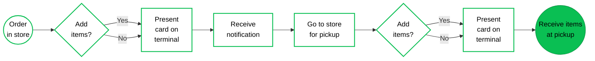
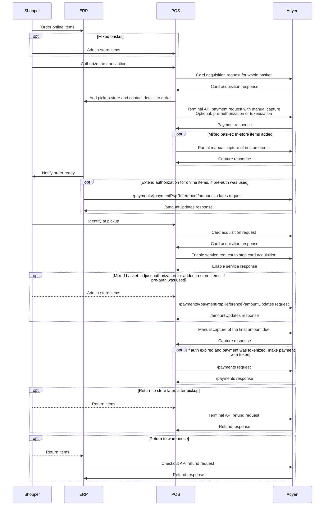
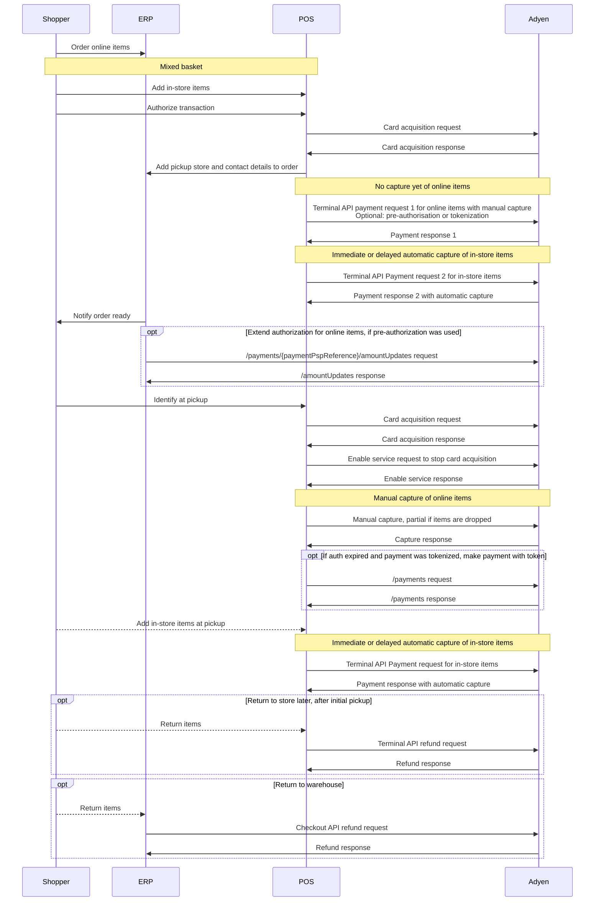

<!-- Source URL: https://docs.adyen.com/unified-commerce/retail-use-cases/endless-aisle/e-a-store-pickup.md -->
<!-- Fetched: 2026-09-15 -->
<!-- Discovery: llms.txt -->

---
title: "Order in store, pick up in store"
description: "Endless aisle: Order in store and pick up in store."
url: "https://docs.adyen.com/unified-commerce/retail-use-cases/endless-aisle/e-a-store-pickup"
source_url: "https://docs.adyen.com/unified-commerce/retail-use-cases/endless-aisle/e-a-store-pickup.md"
canonical: "https://docs.adyen.com/unified-commerce/retail-use-cases/endless-aisle/e-a-store-pickup"
last_modified: "2026-09-15T14:06:03+02:00"
language: "en"
---

# Order in store, pick up in store

Endless aisle: Order in store and pick up in store.

In this Endless Aisle retail use case, online items are ordered in a store, and authorized using a payment terminal. The order is then picked up at the shopper's preferred store. The payment is captured upon pickup. If not all ordered items become available for pickup at the same time, the shopper has to make several trips to the store and there will be corresponding partial captures.

This use case also covers a "mixed basket", where the shopper adds items that are available at the store to the ordered online items. This is possible both when ordering the online items, and when picking up the order. The payment for the in-store items is captured on the spot.

## Requirements

Before you begin, take into account the following information.

| Requirement          | Description                                                                                                                                                                                                                                                                                                                                                                                     |
| -------------------- | ----------------------------------------------------------------------------------------------------------------------------------------------------------------------------------------------------------------------------------------------------------------------------------------------------------------------------------------------------------------------------------------------- |
| **Integration type** | You must have both an ecommerce integration and a point-of-sale integration with Adyen.                                                                                                                                                                                                                                                                                                         |
| **Your systems**     | It is essential to have (or create) a consolidated order/inventory management or ERP system. Or alternatively, you must have an orchestration layer that communicates with your various sub-systems and can consume webhook messages. This is because shoppers may return items to the store or to the warehouse, and both systems need to be able to update the inventory in case of a return. |
| **Preparation**      | We recommend familiarizing yourself with specific concepts so that you can make informed decisions about integration choices. See [Considerations](#considerations) for details.                                                                                                                                                                                                                |

## Shopper journey

From the shopper's perspective, this Endless Aisle retail use case is as follows.

In the store, it turns out that items that the shopper wants to purchase are not available at the location. Store staff helps the shopper to order the items online, and select the store where they want to pick up the order. If desired, the shopper can combine the online order with purchasing items from the store that do not need to be ordered. The shopper presents their card on the payment terminal.

When the order arrives at the selected store, the shopper is notified. The shopper goes to the store for pickup, and identifies by presenting their card on the payment terminal. The shopper is then handed the ordered goods. If desired, the shopper can combine picking up the online order with purchasing items that are available in the store.

The following diagram illustrates this shopper journey.



## Considerations

Before you set up a flow for this use case, there are a couple of points that you must be aware of or make a decision on.

### Legal entity and location

In this use case, you use the payment terminal to authorize the online order.

If you want to process your Endless Aisle online transactions over a different merchant account than the regular in-person transactions, ask your Adyen Account Manager or Implementation Engineer about *Merchant Account Sharing*. With this, orders for both merchant accounts are processed on the same terminal, but kept separate. Enabling Merchant Account Sharing is subject to compliance approval. Terminals require a local legal entity.

If compliance approval is not given, you have other options to keep the transactions separate:

* You can use separate terminals for regular in-store transactions and Endless Aisle transactions.
* Or you can set up multiple stores under the same merchant account. This keeps the reporting simple.
* Alternatively, instead of authorizing Endless Aisle online orders on a payment terminal, you can use Pay by Link payment links.

Reference:

[Pay by Link](/unified-commerce/pay-by-link)

### Capture settings

This use case requires specific procedures to capture the payment. You must enable and use manual capture, and contact our [Support Team](https://ca-test.adyen.com/ca/ca/contactUs/support.shtml?form=other) to enable multiple partial captures.

For the ordered items, the amount is initially authorized, but not captured. When the shopper picks up the items in the store, you make a manual capture request. If all items are picked up at the same time, you capture the full amount. If items are picked up at different times, you make a partial capture request for each pickup. If the shopper drops online items when picking up the order, you make a partial capture request for the reduced amount.

It depends on your other use cases whether it is best to enable manual capture for every payment, or in the API request for an individual payment.

Reference:

[Enable manual capture](/online-payments/capture#enable-manual-capture), [Partial manual capture](/online-payments/capture#partial-capture), [Capture a payment](/online-payments/capture#capture-a-payment)

### Authorization expiry and late capture

After sending a notification that the order is ready for pickup and waiting for the shopper to collect the order, it is possible that the authorization has expired when you try to capture the payment. To deal with that, you have several options:

* Implement **authorization adjustments**.\
  You pre-authorize the order, and after a while send a `/payments/{paymentPspReference}/amountUpdates` request with the amount due, to renew the authorization. You can repeat this several times as needed, but each adjustment incurs costs.

  You need to choose between a synchronous flow or an asynchronous flow. In the synchronous flow you keep track of an `adjustAuthorisationData` blob that you pass from request to request. In the asynchronous flow you rely on webhooks to learn if the authorization adjustment succeeded.

  Authorization adjustment is also useful for:

  * Partial capture scenarios where only part of the order is picked up: after the partial capture you renew the authorization for a partial amount, to cover the items that will be picked up later.
  * Added in-store items at pickup, if you treat mixed baskets as one transaction: if the amount due increases substantially, you adjust the authorized amount upwards and then make a single capture request. Note that if the shopper drops online items when picking up the order you could adjust the amount down, but a partial capture request for a reduced amount is simpler and more cost-effective.

  Reference:

  [Pre-authorization and authorization adjustment](/point-of-sale/pre-authorisation), [Expiration of pre-authorizations](/point-of-sale/pre-authorisation#validity)

* Use the **Extend on capture** feature.\
  When you capture the payment, Adyen checks the status of the initial authorization. If the authorization has expired, we perform a new authorization request. This feature is supported for American Express, Mastercard, and Visa.

* Implement **tokenization**.\
  In your Terminal API payment request for the online items, you include tokenization parameters so that you receive a token and a shopper reference in the response. If at capture it turns out the initial authorization has expired, you make a new payment request to the Checkout API [/payments](https://docs.adyen.com/api-explorer/Checkout/latest/post/payments) endpoint. This request includes the token and shopper reference.

  Reference:

  [Tokenization](/point-of-sale/recurring-payments) at the point of sale, [Make an unscheduled card-on-file payment](/online-payments/tokenization/make-token-payments?tab=1#make-a-subscription-or-unscheduled-card-on-file-payment)

### Mixed baskets

If you want to support mixed baskets, where the shopper combines an online order with items that are available in the store, we recommend discussing your Adyen account structure and capture strategy with your Adyen implementation engineer or account manager.

You have the following options for capturing the payment:

* One transaction with multiple partial captures: this option requires that online and in-store items are processed under the same merchant account.

  * For a mixed basket when the shopper places the order, you authorize the full amount of both the online order and the point-of-sale items, and make a partial capture request for the in-store items. Later, you make one or more partial captures as the ordered items are picked up.
  * For a mixed basket when the shopper picks up the order, you adjust the authorized amount upwards for the added in-store items and then make a single capture request. This option requires that you used pre-authorization on the initial payment request.

* Two separate transactions: you authorize the online order and capture the amount later as ordered items are picked up. For the in-store items, you make a separate payment request and capture the amount automatically, immediately or with a capture delay. This approach applies for mixed baskets both when the shopper places the order, and when the shopper picks up the order.

Reference:

[Account structures for mixed baskets](/unified-commerce/retail-use-cases/mixed-baskets-accounts), [Delayed automatic capture](/point-of-sale/capturing-payments#delayed-automatic-capture). Also see the references under "Capture" above.

### Card recognition

At order pickup, you use a *card acquisition* request to find the shopper's order: the shopper presents their card or other payment instrument to the payment terminal. You then use the card alias or PAR from the response to look up the shopper and the order in your CRM system.

To use card acquisition in this way, you must enable receiving shopper identifying data in API responses, and you must store the card alias and/or the Payment Account Reference (PAR) in the shopper's profile.

If the shopper does not have a record in your CRM system yet at the time of ordering, the CRM must also support manual entry of shopper details and creation of a new CRM record.

Reference:

[Card acquisition](/point-of-sale/card-acquisition), [Receive card and shopper identifiers](/point-of-sale/card-acquisition/identifiers#receiving-identifiers-in-responses), [Card recognition](/point-of-sale/shopper-recognition).

### Sale attribution

You need to decide beforehand on how you will attribute the sale: if items are online items but ordered and paid for in-store, is this an in-store sale or an ecommerce sale?

### Refunds and discounts

If the shopper does not want an ordered item, the item may be returned to the store (during pickup or later), or to the warehouse. Both systems must be able to look up the PSP reference for the order and issue a (partial) referenced refund. You need to support both:

* **Terminal API** referenced refunds from the POS to the terminal for returns brought to the store.
* **Checkout API** referenced refunds for returns sent to the warehouse.

If discounts are offered over the phone or chat, customer service agents must be able to trigger partial referenced refunds as well.

Reference:

[Terminal API partial referenced refund](/point-of-sale/basic-tapi-integration/refund-payment/referenced), [Checkout API refund](/online-payments/refund)

## API flow

There are several Adyen API requests involved in the described shopper journey, as shown in the following diagrams for:

* The flow without mixed baskets and the flow with mixed baskets as a single transaction. These flows are very similar.
* The flow with mixed baskets as separate transactions.

The next section, "Instructions", provides more details about the API flow.

### No mixed basket or mixed basket as one transaction



### Mixed basket as two transactions

We usually recommend delayed automatic capture for point-of-sale transactions. That is why the diagram shows automatic capture for the separate payment request related to the in-store items.



## Instructions

This section provides high-level instructions focusing on how to use the Adyen APIs and webhooks in the described shopper journey.

The code samples show the minimally required parameters. You can add more parameters.

#### Contact details

After the shopper has ordered the online items and selected a pickup store:

1. Make a Terminal API [CardAcquisitionRequest](https://docs.adyen.com/api-explorer/terminal-api/latest/post/cardacquisition) where the `CardAcquisitionTransaction` object contains the `TotalAmount` field with the purchase amount for the ordered items.

   If you support mixed baskets as a single transaction, use the total amount of the basket: the purchase amount for the ordered online items and any items from the store.\
   If you support mixed baskets as two separate transactions, use only the amount of the ordered online items.

   Reference:

   [Card acquisition](/point-of-sale/card-acquisition)

   **Card acquisition**

   ```json
   {
       "SaleToPOIRequest": {
           "MessageHeader": {
               "ProtocolVersion": "3.0",
               "MessageClass": "Service",
               "MessageCategory": "CardAcquisition",
               "MessageType": "Request",
               "ServiceID": "282",
               "SaleID": "POSSystemID12345",
               "POIID": "AMS1-324688179"
           },
           "CardAcquisitionRequest": {
               "SaleData": {
                   "SaleTransactionID": {
                       "TransactionID": "869",
                       "TimeStamp": "2026-02-10T12:30:00.134Z"
                   }
               },
               "CardAcquisitionTransaction": {
                  "TotalAmount": 124.66
               }
           }
       }
   }
   ```

2. When you receive the [CardAcquisitionResponse](https://docs.adyen.com/api-explorer/terminal-api/latest/post/cardacquisition#responses-200-Response), save the following information:

   * `AdditionalResponse.PaymentAccountReference`: the PAR, if present.
   * `AdditionalResponse.alias`: the card alias.
   * The `TimeStamp` and `TransactionID` from the `POIData.POITransactionID` object. You need these values later, when you (pre-)authorize the transaction.

   The following example shows the `AdditionalResponse` as a string of key-value pairs concatenated with an ampersand (**&**). It is possible you receive a Base64-encoded string instead, which you need to Base64 decode first.

   **Card acquisition response**

   ```json
   {
       "SaleToPOIResponse": {
           "CardAcquisitionResponse": {
               "POIData": {
                   "POIReconciliationID": "1000",
                   "POITransactionID": {
                       "TimeStamp": "2026-02-10T12:30:01.399Z",
                       "TransactionID": "BV0q001770726600000"
                   }
               },
               "PaymentInstrumentData": {
                   "CardData": {
                       "CardCountryCode": "840",
                       "MaskedPan": "510006 **** 0002",
                       "PaymentBrand": "mc",
                       "SensitiveCardData": {
                           "ExpiryDate": "1229"
                       }
                   },
                   "PaymentInstrumentType": "Card"
               },
               "Response": {
                   "AdditionalResponse": "PaymentAccountReference=nmHL7QIKrz2cae0gjLTByTxIk76OX&alias=P692729067643981&...message=CARD_ACQ_COMPLETED...",
                   "Result": "Success"
               },
               "SaleData": {
                   "SaleTransactionID": {
                       "TimeStamp": "2026-02-10T12:29:58.765Z",
                       "TransactionID": "869"
                   }
               }
           },
           "MessageHeader": {
               "MessageCategory": "CardAcquisition",
               "MessageClass": "Service",
               "MessageType": "Response",
               "POIID": "AMS1-324688179",
               "ProtocolVersion": "3.0",
               "SaleID": "POSSystemID12345",
               "ServiceID": "981"
           }
       }
   }
   ```

3. Use the card alias and/or PAR from the card acquisition response to look up the shopper's contact details in your ERP system. You need the contact details later, to send a notification when the order is ready for pickup.

4. If the shopper is found in the ERP system, let the shop assistant verify the contact details with the shopper.\
   Ensure the shop assistant can update this information in the ERP system, if needed.

5. If the shopper is not found in the ERP system, add a record for the shopper to the ERP system with the card alias and/or PAR from the card acquisition response, and the other details that you need, specifically the contact details and the name of the shopper. You can collect those other details in various ways, for example:

   * The shop assistant asks the shopper for the details.
   * You collect the shopper's details on a secondary screen, for instance a tablet.
   * You use [input requests](/point-of-sale/shopper-engagement/shopper-input/) to collect the shopper's details on the payment terminal.

6. Make sure the pickup store location is included on the order.

#### (Pre-)authorization

1. Make a Terminal API [PaymentRequest](https://docs.adyen.com/api-explorer/terminal-api/latest/post/payment) with:

   * `PaymentData.CardAcquisitionReference`: an object with the `TimeStamp` and `TransactionID` returned in the `POIData.POITransactionID` object of the card acquisition response.

   * `PaymentTransaction.AmountsReq`: an object with the `Currency` and the `RequestedAmount`.\
     If you support mixed baskets as a single transaction, use the total amount of the basket.\
     If you support mixed baskets as two separate transactions, use only the amount of the ordered online items.

   * `SaleToAcquirerData`: a parameter with **manualCapture** set to **true**. Optionally you can add `SaleToAcquirerData` parameters to pre-authorize or tokenize the transactions, as a method to handle [authorization expiry and late captures](#auth-expiry-late-capture).

     Use one of the following formats to provide the `SaleToAcquirerData` value:

     * Option 1: A JSON object converted to a Base64-encoded string.
     * Option 2: Key-value pairs.

     Reference:

     [Enable manual capture for a payment](/point-of-sale/capturing-payments?tab=manual-individual-pos_2)

   ### Tab: Payment setting capture to manual

   The example shows setting manual capture using a key-value pair.

   **Terminal API payment with manual capture**

   ```json
   {
      "SaleToPOIRequest":{
         "MessageHeader":{
            "ProtocolVersion": "3.0",
            "MessageClass": "Service",
            "MessageCategory": "Payment",
            "MessageType": "Request",
            "SaleID": "POSSystemID12345",
            "ServiceID":"0207111104",
            "POIID": "AMS1-324688179"
         },
         "PaymentRequest": {
            "SaleData": {
               "SaleTransactionID": {
                  "TransactionID": "27908",
                  "TimeStamp": "2026-02-10T12:30:03.122Z"
               },
               "SaleToAcquirerData": "manualCapture=true"
            },
            "PaymentTransaction": {
               "AmountsReq": {
                  "Currency": "USD",
                  "RequestedAmount": 124.66
               }
            },
            "PaymentData": {
               "CardAcquisitionReference": {
                  "TimeStamp": "2026-02-10T12:30:01.399Z",
                  "TransactionID": "BV0q001770726600000"
               }
            }
         }
      }
   }
   ```

   ### Tab: Pre-authorization (optional)

   If you expect a need to extend or adjust the authorization later, in `SaleToAcquirerData` include **authorizationType** set to **PreAuth**. This is in addition to setting the capture method to manual.

   Reference:

   [Pre-authorize a payment](/point-of-sale/pre-authorisation#pre-authorize)

   **Terminal API payment with manual capture and pre-authorization**

   ```json
   {
      "SaleToPOIRequest":{
         "MessageHeader":{
            "ProtocolVersion": "3.0",
            "MessageClass": "Service",
            "MessageCategory": "Payment",
            "MessageType": "Request",
            "SaleID": "POSSystemID12345",
            "ServiceID":"0207111104",
            "POIID": "AMS1-324688179"
         },
         "PaymentRequest": {
            "SaleData": {
               "SaleTransactionID": {
                  "TransactionID": "27908",
                  "TimeStamp": "2026-02-10T12:30:03.122Z"
               },
               "SaleToAcquirerData": "manualCapture=true&authorisationType=PreAuth"
            },
            "PaymentTransaction": {
               "AmountsReq": {
                  "Currency": "USD",
                  "RequestedAmount": 124.66
               }
            },
            "PaymentData": {
               "CardAcquisitionReference": {
                  "TimeStamp": "2026-02-10T12:30:01.399Z",
                  "TransactionID": "BV0q001770726600000"
               }
            }
         }
      }
   }
   ```

   ### Tab: Tokenization (optional)

   If you plan to use tokenization to deal with expired authorizations, in `SaleToAcquirerData` include:

   * `shopperReference`: Your unique reference for this shopper.
   * `recurringProcessingModel`: Set this field to **UnscheduledCardOnFile**.

   This is in addition to setting the capture method to manual.

   **Terminal API payment with manual capture and tokenization**

   ```json
   {
      "SaleToPOIRequest":{
         "MessageHeader":{
            "ProtocolVersion": "3.0",
            "MessageClass": "Service",
            "MessageCategory": "Payment",
            "MessageType": "Request",
            "SaleID": "POSSystemID12345",
            "ServiceID":"0207111104",
            "POIID": "AMS1-324688179"
         },
         "PaymentRequest": {
            "SaleData": {
               "SaleTransactionID": {
                  "TransactionID": "27908",
                  "TimeStamp": "2026-02-10T12:30:03.122Z"
               },
               "SaleToAcquirerData": "manualCapture=true&recurringProcessingModel=UnscheduledCardOnFile&shopperReference=12345"
            },
            "PaymentTransaction": {
               "AmountsReq": {
                  "Currency": "USD",
                  "RequestedAmount": 124.66
               }
            },
            "PaymentData": {
               "CardAcquisitionReference": {
                  "TimeStamp": "2026-02-10T12:30:01.399Z",
                  "TransactionID": "BV0q001770726600000"
               }
            }
         }
      }
   }
   ```

   Reference:

   [Tokenize the initial payment](/point-of-sale/recurring-payments#make-initial-payment)

2. When you receive the payment response, save details from the following fields:

   * `POITransactionID.TransactionID`: save the transaction ID. This is provided in the format `tenderReference.pspReference`, for example, **CW1r112876209163113.DXCD52AY3WUGXS93**. The PSP reference is also provided in the `AdditionalResponse`.\
     You need the PSP reference later, to extend or adjust the authorization, and to capture the payment. You also need the PSP reference if the shopper returns items to the warehouse.\
     You need the full transaction ID if the shopper returns items to the store.

   * `AdditionalResponse`:

     * If you use synchronous authorization adjustment, save the `adjustAuthorisationData`. You need this data blob later, to extend or adjust the authorization.

     * If you use tokenization, save the token (`recurring.recurringDetailReference` or `tokenization.storedPaymentMethodId`) and the shopper reference (`recurring.shopperReference` or `tokenization.shopperReference`).

   * `POITransactionID.TimeStamp`: save the payment date and time. You need the timestamp if the shopper returns items to the store.

   **Payment response**

   ```json
   {
    "SaleToPOIResponse": {
      "MessageHeader": {...},
      "PaymentResponse": {
        "POIData": {
          "POITransactionID": {
            "TimeStamp": "2026-02-10T12:30:05.314Z",
            "TransactionID":"CW1r112876209163113.DXCD52AY3WUGXS93"
          }
        },
        "PaymentReceipt": [...],
        "PaymentResult": {...},
        "Response": {
          "AdditionalResponse": "...posAuthAmountCurrency=USD&posAuthAmountValue=12466&...pspReference=DXCD52AY3WUGXS93&...adjustAuthorisationData=BQABAQA+fbc==...",
          "Result": "Success"
        },
        "SaleData": {...}
      }
    }
   }
   ```

3. If you support mixed baskets as a single transaction, make a partial manual capture request for the in-store items. See the [example](#manual-capture) below, under "In-store pickup".

4. If you support mixed baskets as two separate transactions, make another Terminal API payment request for the in-store items.\
   If your point-of-sale merchant account uses immediate or delayed capture by default (which we usually recommend), do not set manual capture in this payment request. Otherwise, see the [example](#manual-capture)under "In-store pickup", and make a separate manual capture request for the in-store items.

#### Authorization extension (optional)

At one or more moments before or after you notify the shopper that the order is ready for pickup, you may need to extend the authorization. This ensures you can still capture the payment later, when the shopper arrives at the store to pick up the order.

Reference:

[Expiration of pre-authorizations](/point-of-sale/pre-authorisation#validity),\
[Authorization adjustment](/point-of-sale/pre-authorisation#adjust-authn)

### Tab: Asynchronous authorization extension

1. Make a POST [/payments/{paymentPspReference}/amountUpdates](https://docs.adyen.com/api-explorer/Checkout/latest/post/payments/\(paymentPspReference\)/amountUpdates) request, including the following:

   Path parameters:

   | Parameter             | Required                                                                                                      | Description                                            |
   | --------------------- | ------------------------------------------------------------------------------------------------------------- | ------------------------------------------------------ |
   | `paymentPspReference` |  | The PSP reference from the pre-authorization response. |

   Body parameters:

   | Parameter                                                                                                                                          | Required                                                                                                      | Description                                                                                                                               |
   | -------------------------------------------------------------------------------------------------------------------------------------------------- | ------------------------------------------------------------------------------------------------------------- | ----------------------------------------------------------------------------------------------------------------------------------------- |
   | [merchantAccount](https://docs.adyen.com/api-explorer/Checkout/latest/post/payments/\(paymentPspReference\)/amountUpdates#request-merchantAccount) |  | The name of the merchant account that is used to process the payment. This depends on how you [attribute the sale](#sale-attribution).    |
   | [amount](https://docs.adyen.com/api-explorer/Checkout/latest/post/payments/\(paymentPspReference\)/amountUpdates#request-amount)                   |  | The `currency` and `value` of the amount **in minor units** (without a decimal point) for which you want to extend the pre-authorization. |
   | [industryUsage](https://docs.adyen.com/api-explorer/Checkout/latest/post/payments/\(paymentPspReference\)/amountUpdates#request-industryUsage)     |                                                                                                               | Use the **delayedCharge** value.                                                                                                          |
   | [reference](https://docs.adyen.com/api-explorer/Checkout/latest/post/payments/\(paymentPspReference\)/amountUpdates#request-reference)             |                                                                                                               | Your reference to this payment modification, for use in your reconciliation process.                                                      |

   The following example shows how to extend the USD 124.66 authorization with PSP reference DXCD52AY3WUGXS93.

   **Asynchronous authorization extension**

   ```bash
   curl https://checkout-test.adyen.com/v72/payments/DXCD52AY3WUGXS93/amountUpdates \
   -H 'x-api-key: ADYEN_API_KEY' \
   -H 'content-type: application/json' \
   -d '{
     "merchantAccount": "ADYEN_MERCHANT_ACCOUNT",
     "amount": {
         "currency": "USD",
         "value": 12466
     },
     "industryUsage": "delayedCharge",
     "reference": "YOUR_UNIQUE_REFERENCE"
   }'
   ```

2. After you receive the [/amountUpdates](https://docs.adyen.com/api-explorer/Checkout/latest/post/payments/\(paymentPspReference\)/amountUpdates) response, wait for a webhook message with the `eventCode` [AUTHORISATION\_ADJUSTMENT](https://docs.adyen.com/api-explorer/Webhooks/latest/post/AUTHORISATION_ADJUSTMENT). This informs you whether the authorization extension succeeded.

### Tab: Synchronous authorization extension

[]()

1. Get the `adjustAuthorisationData` value from the pre-authorization response:

   * If you received the `AdditionalResponse` as key-value pairs separated by ampersands (**&**), URL-decode the value of the `adjustAuthorisationData` key.
   * If you received the `AdditionalResponse` as a Base64-encoded string, Base64-decode the string and copy the value of the `adjustAuthorisationData` field.

   This step is only needed for the first `/amountUpdates` request for a specific authorization.

2. Make a POST [/payments/{paymentPspReference}/amountUpdates](https://docs.adyen.com/api-explorer/Checkout/latest/post/payments/\(paymentPspReference\)/amountUpdates) request, including the following:

   Path parameters:

   | Parameter             | Required                                                                                                      | Description                                            |
   | --------------------- | ------------------------------------------------------------------------------------------------------------- | ------------------------------------------------------ |
   | `paymentPspReference` |  | The PSP reference from the pre-authorization response. |

   Body parameters:

   | Parameter                                                                                                                                          | Required                                                                                                      | Description                                                                                                                                                               |
   | -------------------------------------------------------------------------------------------------------------------------------------------------- | ------------------------------------------------------------------------------------------------------------- | ------------------------------------------------------------------------------------------------------------------------------------------------------------------------- |
   | [merchantAccount](https://docs.adyen.com/api-explorer/Checkout/latest/post/payments/\(paymentPspReference\)/amountUpdates#request-merchantAccount) |  | The name of the merchant account that is used to process the payment. This depends on how you [attribute the sale](#sale-attribution).                                    |
   | [amount](https://docs.adyen.com/api-explorer/Checkout/latest/post/payments/\(paymentPspReference\)/amountUpdates#request-amount)                   |  | The `currency` and `value` of the amount **in minor units** (without a decimal point) for which you want to extend the pre-authorization.                                 |
   | `adjustAuthorisationData`                                                                                                                          |  | The `adjustAuthorisationData` value from the pre-authorization response.If you later extend the authorization again, use the value from the preceding extension response. |
   | [reference](https://docs.adyen.com/api-explorer/Checkout/latest/post/payments/\(paymentPspReference\)/amountUpdates#request-reference)             |                                                                                                               | Your reference to this payment modification, for use in your reconciliation process.                                                                                      |

   The following example shows how to extend the USD 124.66 authorization with PSP reference DXCD52AY3WUGXS93.

   **Synchronous authorization extension**

   ```bash
   curl -X POST https://checkout-test.adyen.com/v72/payments/DXCD52AY3WUGXS93}/amountUpdates \
   -H 'x-api-key: ADYEN_API_KEY' \
   -H 'idempotency-key: YOUR_IDEMPOTENCY_KEY' \
   -H 'content-type: application/json' \
   -d '{
     "merchantAccount": "ADYEN_MERCHANT_ACCOUNT",
     "amount": {
         "currency": "USD",
         "value": 12466
     },
     "reference": "YOUR_UNIQUE_REFERENCE",
     "adjustAuthorisationData": "BQABAQA+fbc==..."
   }'
   ```

3. When you receive the [/amountUpdates](https://docs.adyen.com/api-explorer/Checkout/latest/post/payments/\(paymentPspReference\)/amountUpdates) response, save the `adjustAuthorisationData` blob. You will need this later if you extend the authorization again, or if you adjust the authorization amount at pickup.

#### In-store pickup

When the shopper arrives at the pickup location to collect the order:

1. To find the shopper's order based on the card that was used to authorize the order:

   1. Make a Terminal API [CardAcquisitionRequest](https://docs.adyen.com/api-explorer/terminal-api/latest/post/cardacquisition) with an empty `CardAcquisitionTransaction` object.

      Reference:

      [Card acquisition](/point-of-sale/card-acquisition)

      **Card acquisition to recognize the card**

      ```json
      {
          "SaleToPOIRequest": {
              "MessageHeader": {
                  "ProtocolVersion": "3.0",
                  "MessageClass": "Service",
                  "MessageCategory": "CardAcquisition",
                  "MessageType": "Request",
                  "ServiceID": "282",
                  "SaleID": "POSSystemID12345",
                  "POIID": "AMS1-324688179"
              },
              "CardAcquisitionRequest": {
                  "SaleData": {
                      "SaleTransactionID": {
                          "TransactionID": "869",
                          "TimeStamp": "2026-02-10T12:30:00.134Z"
                      }
                  },
                  "CardAcquisitionTransaction": {}
              }
          }
      }
      ```

   2. When you receive the [CardAcquisitionResponse](https://docs.adyen.com/api-explorer/terminal-api/latest/post/cardacquisition#responses-200-Response), find the shopper's order in your ERP system using the following information from the `response.AdditionalResponse`:

      * `PaymentAccountReference`: the PAR, if present.
      * `alias`: the card alias

      The following example shows the `AdditionalResponse` as a string of key-value pairs concatenated with an ampersand (**&**). It is possible you receive a Base64-encoded string instead, which you need to Base64 decode first.

      **Card acquisition response**

      ```json
      {
          "SaleToPOIResponse": {
              "CardAcquisitionResponse": {
                  "POIData": {
                      "POIReconciliationID": "1000",
                      "POITransactionID": {
                          "TimeStamp": "2026-02-10T12:30:01.399Z",
                          "TransactionID": "BV0q001770726600000"
                      }
                  },
                  "PaymentInstrumentData": {
                      "CardData": {
                          "CardCountryCode": "840",
                          "MaskedPan": "510006 **** 0002",
                          "PaymentBrand": "mc",
                          "SensitiveCardData": {
                              "ExpiryDate": "1229"
                          }
                      },
                      "PaymentInstrumentType": "Card"
                  },
                  "Response": {
                      "AdditionalResponse": "PaymentAccountReference=nmHL7QIKrz2cae0gjLTByTxIk76OX&alias=P692729067643981&...message=CARD_ACQ_COMPLETED...",
                      "Result": "Success"
                  },
                  "SaleData": {
                      "SaleTransactionID": {
                          "TimeStamp": "2026-02-10T12:29:58.765Z",
                          "TransactionID": "869"
                      }
                  }
              },
              "MessageHeader": {
                  "MessageCategory": "CardAcquisition",
                  "MessageClass": "Service",
                  "MessageType": "Response",
                  "POIID": "AMS1-324688179",
                  "ProtocolVersion": "3.0",
                  "SaleID": "POSSystemID12345",
                  "ServiceID": "981"
              }
          }
      }
      ```

   3. When you have found the order, finish the card acquisition by making an [EnableServiceRequest](https://docs.adyen.com/api-explorer/terminal-api/latest/post/enableservice) to stop the flow.\
      Consider including a `DisplayOutput` object with an explanatory message for the shopper, as shown in the following example.

      Reference:

      [Finish with a cancellation](/point-of-sale/card-acquisition#cancel-completed)

      **Stop the card acquisition flow**

      ```json
      {
         "SaleToPOIRequest": {
            "MessageHeader": {
               "ProtocolVersion": "3.0",
               "MessageClass": "Service",
               "MessageCategory": "EnableService",
               "MessageType": "Request",
               "ServiceID":"3020711110",
               "SaleID":"POSSystemID12345",
               "POIID":"AMS1-324688179"
            },
            "EnableServiceRequest": {
               "TransactionAction": "AbortTransaction",
               "DisplayOutput": {
                  "Device": "CustomerDisplay",
                  "InfoQualify": "Display",
                  "OutputContent": {
                     "PredefinedContent": {
                        "ReferenceID": "AcceptedAnimated"
                     },
                     "OutputFormat": "Text",
                     "OutputText": [
                        {
                           "Text": "Thank you!"
                        },
                        {
                           "Text": "We will get your order."
                        }
                     ]
                  }
               }
            }
         }
      }
      ```

2. Optional, if you used pre-authorization and you support mixed baskets as one transaction:

   If the shopper adds in-store items that significantly increase the amount due, make a POST [/payments/{paymentPspReference}/amountUpdates](https://docs.adyen.com/api-explorer/Checkout/latest/post/payments/\(paymentPspReference\)/amountUpdates) request to adjust the authorization amount.

   The following examples show how to adjust the amount for the authorization with PSP reference DXCD52AY3WUGXS93 up from USD 124.66 to USD 214.03 for added in-store items with a value of USD 89.37.

   ### Tab: Asynchronous amount update

   ```bash
   curl https://checkout-test.adyen.com/v72/payments/DXCD52AY3WUGXS93/amountUpdates \
   -H 'x-api-key: ADYEN_API_KEY' \
   -H 'content-type: application/json' \
   -d '{
    "merchantAccount": "ADYEN_MERCHANT_ACCOUNT",
    "amount": {
        "currency": "USD",
        "value": 21403
    },
    "industryUsage": "delayedCharge",
    "reference": "YOUR_UNIQUE_REFERENCE"
   }'
   ```

   ### Tab: Synchronous authorization adjustment

   Regarding the `adjustAuthorisationData` value in the request, note the following:

   * If you previously extended the authorization, use the `adjustAuthorisationData` value received in the response to the last `/amountUpdates` extension request that you made for this authorization.

   * If you did not previously extend the authorization, use the `adjustAuthorisationData` from the `AdditionalResponse` received in the pre-authorization response:

     * If you received key-value pairs separated by ampersands (**&**), URL-decode the value of the `adjustAuthorisationData` key.
     * If you received a Base64-encoded string, Base64-decode the string and copy the value of the `adjustAuthorisationData` field.

   **Synchronous amount update**

   ```bash
   curl -X POST https://checkout-test.adyen.com/v72/payments/DXCD52AY3WUGXS93}/amountUpdates \
   -H 'x-api-key: ADYEN_API_KEY' \
   -H 'idempotency-key: YOUR_IDEMPOTENCY_KEY' \
   -H 'content-type: application/json' \
   -d '{
     "merchantAccount": "ADYEN_MERCHANT_ACCOUNT",
     "amount": {
         "currency": "USD",
         "value": 21403
     },
     "reference": "YOUR_UNIQUE_REFERENCE",
     "adjustAuthorisationData": "CRBCBRN+gcd==..."
   }'
   ```

3. Make a manual capture request for the amount due:\
   []()\
   Send a POST request to the [/payments/{paymentPspReference}/captures](https://docs.adyen.com/api-explorer/Checkout/latest/post/payments/\(paymentPspReference\)/captures) endpoint, where `paymentPspReference` is the PSP reference from the (pre-)authorization response.

   In your request, include:

   | Parameter         | Required                                                                                                      | Description                                                                                                                                                                                                     |
   | ----------------- | ------------------------------------------------------------------------------------------------------------- | --------------------------------------------------------------------------------------------------------------------------------------------------------------------------------------------------------------- |
   | `merchantAccount` |  | The name of your merchant account that is used to process the payment. This depends on how you [attribute the sale](#sale-attribution).                                                                         |
   | `amount.value`    |  | The amount in [minor units](/development-resources/currency-codes) (without a decimal point) being captured. If you made any `/amountUpdates` requests, this is the amount from your last authorization update. |

   You need to make a partial capture for a smaller amount in these cases:

   * The whole order is available at pickup but the shopper does not want some of the ordered items.
   * Only part of the order is available and being picked. If you used pre-authorization: after the partial capture, you can adjust the authorization to a partial amount that covers the items that will be picked up at a later time.

4. The following example shows a capture request for the authorization with PSP reference DXCD52AY3WUGXS93 for USD 124.66.

   **Checkout API - Manual capture**

   ```bash
   curl https://checkout-test.adyen.com/v72/payments/DXCD52AY3WUGXS93/captures \
   -H 'x-api-key: ADYEN_API_KEY' \
   -H 'content-type: application/json' \
   -d '{
          "merchantAccount": "ADYEN_MERCHANT_ACCOUNT",
          "amount": {
             "currency": "USD",
             "value": 12466
          },
          "reference": "YOUR_ORDER_REFERENCE"
   }'
   ```

   Check the [CAPTURE](https://docs.adyen.com/api-explorer/Webhooks/latest/post/CAPTURE) webhook event message for any issue with the capture.

   A response with `success` **false** and `reason` **Transaction is expired** means the authorization expired. If you tokenized the original Terminal API payment request, you can make a Checkout API [/payments](https://docs.adyen.com/api-explorer/Checkout/latest/post/payments) request with the token.

   **If capture failed and the payment was tokenized**

   ```json
   curl https://checkout-test.adyen.com/v72/payments \
   -H 'x-api-key: ADYEN_API_KEY' \
   -H 'content-type: application/json' \
   -d '{
      "amount":{
         "value":12466,
         "currency":"USD"
      },
      "paymentMethod":{
         "type":"scheme",
         "{hint:The storedPaymentMethodId you received}storedPaymentMethodId{/hint}":"M5N7TQ4TG5PFWR50"
      },
      "reference":"YOUR_ORDER_REFERENCE",
      "shopperInteraction": "ContAuth",
      "recurringProcessingModel": "UnscheduledCardOnFile",
      "merchantAccount":"ADYEN_MERCHANT_ACCOUNT",
      "shopperReference":"YOUR_SHOPPER_REFERENCE"
   }'
   ```

5. If you treat mixed baskets as two separate transactions, make a separate Terminal API payment request for the in-store items that the shopper wants to purchase.

#### Later returns, after pickup

1. If the shopper returns one or more of the delivered items, issue a refund using the Terminal API if the items are returned in-store, or using the Checkout API if the items returned to the warehouse.

   ### Tab: Terminal API

   Send a Terminal API [ReversalRequest](https://docs.adyen.com/api-explorer/terminal-api/latest/post/reversal) specifying the following details from the Terminal API payment response:

   | Parameter                                 | Required                                                                                                                                                | Description                                                                                                                                                                                                                                                                                    |
   | ----------------------------------------- | ------------------------------------------------------------------------------------------------------------------------------------------------------- | ---------------------------------------------------------------------------------------------------------------------------------------------------------------------------------------------------------------------------------------------------------------------------------------------- |
   | `OriginalPOITransaction.POITransactionID` |                                            | An object with:- `TransactionID`: transaction identifier of the payment authorization in the format `tenderReference.pspReference`.
   - `TimeStamp`: date and time in [UTC format](https://en.wikipedia.org/wiki/ISO_8601#Coordinated_Universal_Time_\(UTC\)) of the payment authorization.      |
   | `ReversalReason`                          |                                            | Set to **MerchantCancel**.                                                                                                                                                                                                                                                                     |
   | `ReversedAmount`                          |  | Required for partial refunds. The amount (provided as a number, not a string) being returned to the shopper in the partial refund. Must be smaller than or equal to the authorized amount.                                                                                                     |
   | `SaleData.SaleToAcquirerData`             |  | Required for partial refunds. The currency of the refund, in the format `currency=ABC` where `ABC` is the three-letter [currency code](/development-resources/currency-codes) of the payment authorization.                                                                                    |
   | `SaleData.SaleTransactionID`              |                                                                                                                                                         | An object with:- `TransactionID`: your reference for the refund. In your Customer Area and Adyen reports, this will show as the **merchant reference**.
   - `TimeStamp`: date and time in [UTC format](https://en.wikipedia.org/wiki/ISO_8601#Coordinated_Universal_Time_\(UTC\)) of the refund. |

   **Terminal API - Partial referenced refund of USD 30.53**

   ```json
   {
      "SaleToPOIRequest": {
         "MessageHeader": {
            "ProtocolVersion": "3.0",
            "MessageClass": "Service",
            "MessageCategory": "Reversal",
            "MessageType": "Request",
            "SaleID": "POSSystemID12345",
            "ServiceID": "207111108",
            "POIID": "AMS1-324688179"
         },
         "ReversalRequest": {
            "OriginalPOITransaction": {
               "POITransactionID": {
                  "TransactionID": "CW1r112876209163113.DXCD52AY3WUGXS93",
                  "TimeStamp": "2026-02-10T12:30:05.314Z"
               }
            },
            "ReversalReason": "MerchantCancel",
            "ReversedAmount": 30.53,
            "SaleData": {
               "SaleToAcquirerData": "currency=USD",
               "SaleTransactionID": {
                  "TimeStamp": "2026-02-12T11:04:12.159Z",
                  "TransactionID": "YOUR_UNIQUE_REFERENCE"
               }
            }
         }
      }
   }
   ```

   Reference:

   [Make a referenced refund](/point-of-sale/basic-tapi-integration/refund-payment/referenced#refund-ecommerce-payment)

   ### Tab: Checkout API

   Send a POST request to the [/payments/{paymentPspReference}/refunds](https://docs.adyen.com/api-explorer/Checkout/latest/post/payments/\(paymentPspReference\)/refunds) endpoint, specifying the PSP reference of the authorization in the path.

   | Parameter         | Required                                                                                                      | Description                                                                                                                                                          |
   | ----------------- | ------------------------------------------------------------------------------------------------------------- | -------------------------------------------------------------------------------------------------------------------------------------------------------------------- |
   | `merchantAccount` |  | The name of your merchant account that is used to process the payment. This depends on how you [attribute the sale](#sale-attribution).                              |
   | `amount`          |  | The amount that you want to refund. The `value` must be the same or less than the captured amount. The `currency` must match the currency used in the authorization. |
   | `reference`       |                                                                                                               | Your reference for the refund, for example to tag a partial refund for future reconciliation.                                                                        |

   **Checkout API - Partial referenced refund of USD 30.53**

   ```bash
   curl https://checkout-test.adyen.com/v72/payments/DXCD52AY3WUGXS93/refunds \
   -H 'x-api-key: ADYEN_API_KEY' \
   -H 'content-type: application/json' \
   -d '{
         "merchantAccount": "ADYEN_MERCHANT_ACCOUNT",
         "amount": {
            "currency": "USD",
            "value": 3053
         },
         "reference": "YOUR_UNIQUE_REFERENCE"
   }'
   ```

   Reference:

   [Refund a payment](/online-payments/refund)

## See also

* [Features per industry: Retail omnichannel](/industries/feature-packs?industry=retail\&channel=omni\&target=_blank)
* [Other retail omnichannel use cases](/unified-commerce/retail-use-cases)
