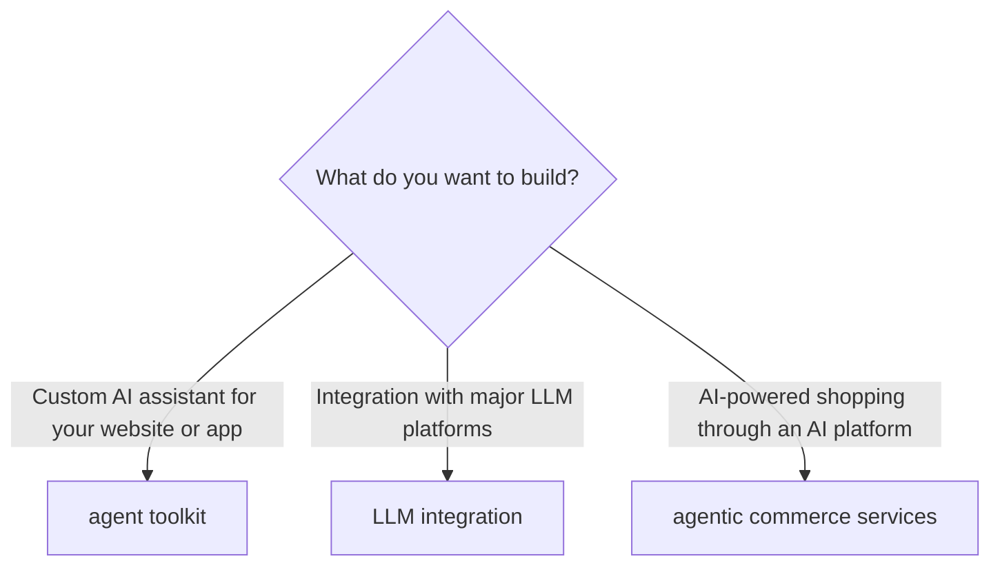

<!-- Source URL: https://docs.paypal.ai/developer/tools/ai/ai-intro -->
<!-- Fetched: 2026-04-19 -->

> ## Documentation Index
>
> Fetch the complete documentation index at: https://docs.paypal.ai/llms.txt
> Use this file to discover all available pages before exploring further.

# PayPal's AI resources for developers

Using AI is a powerful way to enhance your applications and services. Everyday examples include:

- **E-commerce stores** that automate order processing, handle returns, and provide 24/7 customer support.
- **Marketplaces** that enable AI-powered product discovery and streamline seller onboarding.
- **SaaS platforms** that automate billing, subscription management, and payment reconciliation.
- **Service businesses** that generate and send invoices, process payments, and manage appointments.

When you combine AI with PayPal's powerful payment and commerce services, you can change how you build and deploy commerce automation solutions, and you can help customers use AI to shop.

Our suite of AI-powered tools enable you to leverage AI in these ways:

- **Build custom agents:** Create AI agents that handle payment workflows and customer interactions using the [agent toolkit quickstart guide](/developer/tools/ai/agent-toolkit-quickstart/).
- **Connect with LLMs:** Enable ChatGPT, Claude, and other AI assistants to interact with your services using the [LLM integration guide](/developer/tools/ai/llm-integration/).
- **Join PayPal's agentic commerce network:** Make your products discoverable through AI shopping surfaces with PayPal's [agentic commerce services](/growth/agentic-commerce/overview/).

## Key features of PayPal AI tools and resources

PayPal AI tools enable agents to perform commerce-related tasks using PayPal's APIs and services. Agents can process payments, manage subscriptions, handle disputes, automate invoicing, and provide customer support while maintaining the highest standards of security and compliance that PayPal is known for.

Key features of PayPal's AI tools and resources include:

- **Seamless integration:** Built on PayPal's infrastructure, our AI agents provide direct access to payment processing, financial data, and commerce APIs.
- **Intelligent automation:** Leverage advanced AI capabilities to automate repetitive tasks, make data-driven decisions, and provide personalized customer experiences at scale.
- **Developer-friendly tools:** Our agent toolkit includes everything you need, from quickstart guides to advanced MCP (Model Context Protocol) servers, to build, test, and deploy agents quickly.
- **Enterprise-grade security:** All agents operate within PayPal's secure environment, ensuring PCI compliance and protecting sensitive financial data throughout every transaction.
- **Scalable architecture:** Whether you're building a simple payment bot or a complex multi-agent commerce system, our platform scales to meet your needs.

## Getting started

These pages help you start using PayPal's AI tools and resources:

- **<a href="/growth/agentic-commerce/overview/" target="_blank" rel="noopener noreferrer">Agentic commerce services</a>**
- **<a href="/developer/tools/ai/agent-toolkit-quickstart/" target="_blank" rel="noopener noreferrer">Agent toolkit quickstart guide</a>**
- **<a href="/developer/tools/ai/mcp-quickstart/" target="_blank" rel="noopener noreferrer">MCP server quickstart guide</a>**
- **<a href="/developer/tools/ai/llm-integration/" target="_blank" rel="noopener noreferrer">LLM integration quickstart guide</a>**
- **<a href="/developer/tools/ai/agent-tools-ref/" target="_blank" rel="noopener noreferrer">Agent tools reference</a>**
- **<a href="/developer/tools/ai/prompt-best-practices/" target="_blank" rel="noopener noreferrer">Best practices for prompts</a>**
