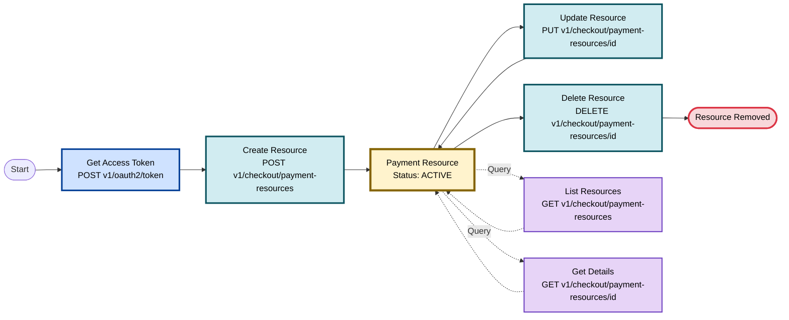

<!-- Source URL: https://docs.paypal.ai/payments/pay-links-buttons-api -->
<!-- Fetched: 2026-04-16 -->

> ## Documentation Index
>
> Fetch the complete documentation index at: https://docs.paypal.ai/llms.txt
> Use this file to discover all available pages before exploring further.

# Use API to create payment links

Create and manage reusable Payment Links through a REST API so your systems can generate, update, and delete payment links programmatically. Payment links collect payments by sharing a URL with customers. You can send a payment link directly through text or email and embed it on your website. The Payment Links and Buttons API currently supports payment links only and does not return button code.

This API is available in all countries where PayPal operates. See [Countries and Currencies](https://docs.paypal.ai/reference/codes/country-codes) for a list of supported currencies.

## Prerequisites

- Set up a [PayPal Business Account](https://www.paypal.com/business/open-business-account?_ga=2.49411041.673139926.1760916697-1259758161.1760473483).
- Navigate to the **Apps and Credentials** section on the [PayPal Developer Dashboard](https://www.paypal.com/signin?returnUri=https%3A%2F%2Fdeveloper.paypal.com%2Fdashboard%2F&intent=developer&ctxId=ul1761161497704) and select **Create App** or select an existing one.
- Confirm **Payment Links & Buttons** is enabled for the selected credentials.
- Implement OAuth 2.0 to obtain an access token for each API call.
- Use `https://api-m.sandbox.paypal.com` for sandbox or `https://api.paypal.com` for production. Payloads and steps are the same for both environments.

## Quick start

Follow these steps to create your first payment link using the sandbox environment.

### 1. Get an access token

Send a `POST` request to get an OAuth 2.0 bearer token.

```bash theme={null}
curl -v -X POST 'https://api-m.sandbox.paypal.com/v1/oauth2/token' \
  -u '<CLIENT_ID>:<CLIENT_SECRET>' \
  -H 'Content-Type: application/x-www-form-urlencoded' \
  -d 'grant_type=client_credentials'
```

The response includes an `access_token` that you pass in the `Authorization` header for subsequent calls.

### 2. Create a payment link

Send a `POST` request with the minimal required product details.

```bash [expandable] theme={null}
curl -v -X POST 'https://api-m.sandbox.paypal.com/v1/checkout/payment-resources' \
  -H 'Authorization: Bearer ACCESS-TOKEN' \
  -H 'Accept: application/json' \
  -H 'Content-Type: application/json' \
  -H 'PayPal-Request-Id: PAYPAL_REQUEST_ID' \
  -d '{
    "integration_mode": "LINK",
    "type": "BUY_NOW",
    "reusable": "MULTIPLE",
    "return_url": "https://merchant.example.com/thank-you",
    "line_items": [
      {
        "name": "Wireless Mouse",
        "unit_amount": {
          "currency_code": "USD",
          "value": "39.99"
        }
      }
    ]
  }'
```

### 3. Use the `payment_link` URL

The API returns HTTP status `201 Created`, the payment resource `id`, and a `payment_link` URL. Share this URL with customers or embed it behind a button on your site.

### 4. Verify the link

Open the `payment_link` URL in a browser, confirm the product name and price, and complete a test checkout using a sandbox buyer account. Use the `payment_link` value from the `links` array in the response.

```bash [expandable] theme={null}
{
    "id": "PLB-A87RKBMWWFHM",
    "integration_mode": "LINK",
    "type": "BUY_NOW",
    "reusable": "MULTIPLE",
    "return_url": "https://merchant.example.com/thank-you",
    "line_items": [
        {
            "name": "Wireless Mouse",
            "description": "LIGHTSPEED wireless technology: Delivers a 1-millisecond response time for performance that matches wired gaming mice.\nExtended battery life: Offers up to 250 hours of gameplay on a single AA battery, supporting prolonged usage.",
            "unit_amount": {
                "currency_code": "USD",
                "value": "39.99"
            },
            "collect_shipping_address": true
        }
    ],
    "status": "ACTIVE",
    "create_time": "2026-04-02T21:36:12Z",
    "update_time": "2026-04-02T21:36:12Z",
    "links": [
        {
            "href": "https://api-m.sandbox.paypal.com/v1/checkout/payment-resources/PLB-A87RKBMWWFHM",
            "rel": "self",
            "method": "GET"
        },
        {
            "href": "https://api-m.sandbox.paypal.com/v1/checkout/payment-resources/PLB-A87RKBMWWFHM",
            "rel": "replace",
            "method": "PUT"
        },
        {
            "href": "https://api-m.sandbox.paypal.com/v1/checkout/payment-resources/PLB-A87RKBMWWFHM",
            "rel": "delete",
            "method": "DELETE"
        },
        {
            "href": "https://www.sandbox.paypal.com/ncp/payment/PLB-A87RKBMWWFHM",
            "rel": "payment_link",
            "method": "GET"
        }
    ]
}
```

## How it works

The Payment Links and Buttons API exposes a simple lifecycle for Payment Links:

1. Get an OAuth access token for your PayPal Business account.
2. Create a payment resource by calling `POST /v1/checkout/payment-resources`.
3. Share the returned `payment_link` URL with customers.
4. Optionally list, retrieve, update, or delete existing payment resources as your catalog changes.



## Endpoints

This section summarizes each endpoint. See the full [API reference](https://docs.paypal.ai/reference/api/rest/payment-resources/list-payment-resources) for the complete schema and additional examples.

| Use case                 | Endpoint                                                                                                                              | Request                                                                                                                                                  | Response                                                                                            |
| ------------------------ | ------------------------------------------------------------------------------------------------------------------------------------- | -------------------------------------------------------------------------------------------------------------------------------------------------------- | --------------------------------------------------------------------------------------------------- |
| Create payment links     | [`POST /v1/checkout/payment-resources`](https://docs.paypal.ai/reference/api/rest/payment-resources/list-payment-resources)           | Include product details in the request body, such as name, price, description, variants, taxes, shipping information, and the return URL.                | Returns `201 Created` with the payment link ID, shareable link URL, status, and creation timestamp. |
| List all payment links   | [`GET /v1/checkout/payment-resources`](https://docs.paypal.ai/reference/api/rest/payment-resources/list-payment-resources)            | This endpoint does not require a payload. Use optional query parameters such as `page_size` to control results per page and `page_token` for pagination. | Returns `200 OK` with an array of payment links and pagination metadata.                            |
| Get payment link details | [`GET /v1/checkout/payment-resources/{id}`](https://docs.paypal.ai/reference/api/rest/payment-resources/retrieve-a-payment-resource)  | Use the payment link ID in the URL path to retrieve details.                                                                                             | Returns `200 OK` with complete details for the specified payment link.                              |
| Update payment link      | [`PUT /v1/checkout/payment-resources/{id}`](https://docs.paypal.ai/reference/api/rest/payment-resources/replace-a-payment-resource)   | Use the payment link ID in the URL path. Include the complete, updated product information in the request body.                                          | Returns `200 OK` with the updated payment link details.                                             |
| Delete payment link      | [`DELETE /v1/checkout/payment-resources/{id}`](https://docs.paypal.ai/reference/api/rest/payment-resources/delete-a-payment-resource) | Use the payment link ID in the URL path to delete it permanently.                                                                                        | Returns `204 No Content` to confirm successful deletion.                                            |

## Use cases

See how to create payment links that address common scenarios and requirements.

### Create a payment link (`POST /v1/checkout/payment-resources`)

Create a payment link that points to a PayPal‑hosted checkout experience. Use this endpoint to generate shareable payment URLs for your products.

#### Request

```json [expandable] theme={null}
{
  "integration_mode": "LINK",
  "type": "BUY_NOW",
  "reusable": "MULTIPLE",
  "return_url": "https://example-merchant.com/payment/return-success",
  "line_items": [
    {
      "name": "Premium Wireless Headphones with Noise Cancellation",
      "product_id": "PROD-WH-NC-2024-12345",
      "description": "Experience crystal-clear sound with our premium wireless headphones featuring active noise cancellation, 30-hour battery life",
      "taxes": [
        {
          "name": "State Sales Tax",
          "type": "PERCENTAGE",
          "value": "8.25"
        }
      ],
      "shipping": [
        {
          "type": "FLAT",
          "value": "12.50",
          "additional_unit_value": "3.00"
        }
      ],
      "collect_shipping_address": true,
      "customer_notes": [
        {
          "label": "Gift Message (Optional)",
          "required": false
        }
      ],
      "variants": {
        "dimensions": [
          {
            "name": "Color",
            "primary": true,
            "options": [
              {
                "label": "Midnight Black",
                "unit_amount": {
                  "currency_code": "USD",
                  "value": "149.99"
                }
              },
              {
                "label": "Silver Gray",
                "unit_amount": {
                  "currency_code": "USD",
                  "value": "149.99"
                }
              },
              {
                "label": "Rose Gold",
                "unit_amount": {
                  "currency_code": "USD",
                  "value": "169.99"
                }
              },
              {
                "label": "Navy Blue",
                "unit_amount": {
                  "currency_code": "USD",
                  "value": "159.99"
                }
              }
            ]
          },
          {
            "name": "Warranty",
            "primary": false,
            "options": [
              { "label": "Standard 1-Year" },
              { "label": "Extended 2-Year" },
              { "label": "Premium 3-Year" }
            ]
          },
          {
            "name": "Package Type",
            "primary": false,
            "options": [
              { "label": "Standard Box" },
              { "label": "Gift Wrapped" }
            ]
          }
        ]
      },
      "adjustable_quantity": {
        "maximum": 10
      }
    }
  ]
}
```

#### Response

The response includes the payment resource ID, shareable payment link, product details, and configuration. The API returns HTTP status 201 Created with content type `application/json`.

```json [expandable] theme={null}
{
  "id": "PLB-HL9U6YXUMCGB",
  "integration_mode": "LINK",
  "type": "BUY_NOW",
  "reusable": "MULTIPLE",
  "return_url": "https://example-merchant.com/payment/return-success",
  "line_items": [
    {
      "name": "Premium Wireless Headphones with Noise Cancellation",
      "product_id": "PROD-WH-NC-2024-12345",
      "description": "Experience crystal-clear sound with our premium wireless headphones featuring active noise cancellation, 30-hour battery life",
      "taxes": [
        {
          "name": "State Sales Tax",
          "type": "PERCENTAGE",
          "value": "8.25"
        }
      ],
      "shipping": [
        {
          "type": "FLAT",
          "value": "12.50",
          "additional_unit_value": "3.00"
        }
      ],
      "collect_shipping_address": true,
      "customer_notes": [
        {
          "required": false,
          "label": "Gift Message (Optional)"
        }
      ],
      "variants": {
        "dimensions": [
          {
            "name": "Color",
            "primary": true,
            "options": [
              {
                "label": "Midnight Black",
                "unit_amount": {
                  "currency_code": "USD",
                  "value": "149.99"
                }
              },
              {
                "label": "Silver Gray",
                "unit_amount": {
                  "currency_code": "USD",
                  "value": "149.99"
                }
              },
              {
                "label": "Rose Gold",
                "unit_amount": {
                  "currency_code": "USD",
                  "value": "169.99"
                }
              },
              {
                "label": "Navy Blue",
                "unit_amount": {
                  "currency_code": "USD",
                  "value": "159.99"
                }
              }
            ]
          },
          {
            "name": "Warranty",
            "primary": false,
            "options": [
              {
                "label": "Standard 1-Year"
              },
              {
                "label": "Extended 2-Year"
              },
              {
                "label": "Premium 3-Year"
              }
            ]
          },
          {
            "name": "Package Type",
            "primary": false,
            "options": [
              {
                "label": "Standard Box"
              },
              {
                "label": "Gift Wrapped"
              }
            ]
          }
        ]
      },
      "adjustable_quantity": {
        "maximum": 10
      }
    }
  ],
  "status": "ACTIVE",
  "create_time": "2026-04-02T21:42:42Z",
  "update_time": "2026-04-02T21:42:42Z",
  "links": [
    {
      "href": "https://api-m.sandbox.paypal.com/v1/checkout/payment-resources/PLB-HL9U6YXUMCGB",
      "rel": "self",
      "method": "GET"
    },
    {
      "href": "https://api-m.sandbox.paypal.com/v1/checkout/payment-resources/PLB-HL9U6YXUMCGB",
      "rel": "replace",
      "method": "PUT"
    },
    {
      "href": "https://api-m.sandbox.paypal.com/v1/checkout/payment-resources/PLB-HL9U6YXUMCGB",
      "rel": "delete",
      "method": "DELETE"
    },
    {
      "href": "https://www.sandbox.paypal.com/ncp/payment/PLB-HL9U6YXUMCGB",
      "rel": "payment_link",
      "method": "GET"
    }
  ]
}
```

### List payment resources (`GET /v1/checkout/payment-resources`)

Retrieve a paginated list of all payment resources created by the merchant. This endpoint supports filtering through query parameters, such as `status`.

#### Request

```bash theme={null}
curl -v -k -X GET 'https://api-m.sandbox.paypal.com/v1/checkout/payment-resources?page_size=2' \
  -H 'Authorization: Bearer ACCESS-TOKEN' \
  -H 'Accept: application/json' \
  -H 'Content-Type: application/json'
```

#### Response

The response contains an array of payment resources and pagination links. The API returns HTTP status `200 OK` with content type `application/json`.

```json [expandable] theme={null}
{
  "resources": [
    {
      "id": "PLB-X7MNK9P2QR8T",
      "integration_mode": "LINK",
      "create_time": "2025-11-29T13:13:25.832592Z",
      "status": "ACTIVE",
      "payment_link": "https://www.paypal.com/ncp/payment/PLB-X7MNK9P2QR8T",
      "type": "BUY_NOW",
      "reusable": "MULTIPLE",
      "line_items": [
        {
          "name": "Wireless Mouse",
          "unit_amount": {
            "currency_code": "USD",
            "value": "29.99"
          }
        }
      ],
      "links": [
        {
          "href": "https://api.paypal.com/v1/checkout/payment-resources/PLB-X7MNK9P2QR8T",
          "rel": "self",
          "method": "GET"
        },
        {
          "href": "https://api.paypal.com/v1/checkout/payment-resources/PLB-X7MNK9P2QR8T",
          "rel": "replace",
          "method": "PUT"
        },
        {
          "href": "https://api.paypal.com/v1/checkout/payment-resources/PLB-X7MNK9P2QR8T",
          "rel": "delete",
          "method": "DELETE"
        },
        {
          "href": "https://www.paypal.com/ncp/payment/PLB-X7MNK9P2QR8T",
          "rel": "payment_link",
          "method": "GET"
        }
      ]
    },
    {
      "id": "PLB-P2QR8TX7MNK9",
      "integration_mode": "LINK",
      "create_time": "2025-11-29T13:13:25.832592Z",
      "status": "ACTIVE",
      "payment_link": "https://www.paypal.com/ncp/payment/PLB-P2QR8TX7MNK9",
      "type": "BUY_NOW",
      "reusable": "MULTIPLE",
      "line_items": [
        {
          "name": "Wireless Keyboard",
          "unit_amount": {
            "currency_code": "USD",
            "value": "99.99"
          }
        }
      ],
      "links": [
        {
          "href": "https://api.paypal.com/v1/checkout/payment-resources/PLB-P2QR8TX7MNK9",
          "rel": "self",
          "method": "GET"
        },
        {
          "href": "https://api.paypal.com/v1/checkout/payment-resources/PLB-P2QR8TX7MNK9",
          "rel": "replace",
          "method": "PUT"
        },
        {
          "href": "https://api.paypal.com/v1/checkout/payment-resources/PLB-P2QR8TX7MNK9",
          "rel": "delete",
          "method": "DELETE"
        },
        {
          "href": "https://www.paypal.com/ncp/payment/PLB-P2QR8TX7MNK9",
          "rel": "payment_link",
          "method": "GET"
        }
      ]
    }
  ],
  "links": [
    {
      "href": "https://api.paypal.com/v1/checkout/payment-resources?page_size=2",
      "rel": "self"
    },
    {
      "href": "https://api.paypal.com/v1/checkout/payment-resources?page_token=eyJleGNsdXNpdmVfc3RhcnRfa2V5Ijp7ImlkIjoiUExCLVAyUVI4VFg3TU5LOSJ9LCJwYWdlX3NpemUiOjJ9",
      "rel": "next"
    }
  ]
}
```

### Get payment resource details (`GET /v1/checkout/payment-resources/{id}`)

Get the details of a specific payment resource by its unique ID. This endpoint returns all metadata, including payment status, link URL, reusable type, and line item details.

#### Request

```bash theme={null}
curl -v -k -X GET 'https://api-m.sandbox.paypal.com/v1/checkout/payment-resources/PLB-X7MNK9P2QR8T' \
 -H 'Authorization: Bearer ACCESS-TOKEN' \
 -H 'Accept: application/json' \
 -H 'Content-Type: application/json'
```

#### Response

```json [expandable] theme={null}
{
  "id": "PLB-X7MNK9P2QR8T",
  "integration_mode": "LINK",
  "create_time": "2025-11-29T13:13:25.832592Z",
  "status": "ACTIVE",
  "payment_link": "https://www.paypal.com/ncp/payment/PLB-X7MNK9P2QR8T",
  "type": "BUY_NOW",
  "reusable": "MULTIPLE",
  "return_url": "https://merchant.example.com/thank-you",
  "line_items": [
    {
      "name": "Wireless Mouse",
      "unit_amount": {
        "currency_code": "USD",
        "value": "29.99"
      }
    }
  ],
  "links": [
    {
      "href": "https://api.paypal.com/v1/checkout/payment-resources/PLB-X7MNK9P2QR8T",
      "rel": "self",
      "method": "GET"
    },
    {
      "href": "https://api.paypal.com/v1/checkout/payment-resources/PLB-X7MNK9P2QR8T",
      "rel": "replace",
      "method": "PUT"
    },
    {
      "href": "https://api.paypal.com/v1/checkout/payment-resources/PLB-X7MNK9P2QR8T",
      "rel": "delete",
      "method": "DELETE"
    },
    {
      "href": "https://www.paypal.com/ncp/payment/PLB-X7MNK9P2QR8T",
      "rel": "payment_link",
      "method": "GET"
    }
  ]
}
```

### Update payment resource (`PUT /v1/checkout/payment-resources/{id}`)

Replace the configuration of a specific payment resource with new product and checkout details.

#### Request

```bash [expandable] theme={null}
curl -v -k -X PUT 'https://api-m.sandbox.paypal.com/v1/checkout/payment-resources/PLB-X7MNK9P2QR8T' \
 -H 'Authorization: Bearer ACCESS-TOKEN' \
 -H 'Accept: application/json' \
 -H 'Content-Type: application/json' \
 -d '{
    "type": "BUY_NOW",
    "integration_mode": "LINK",
    "reusable": "MULTIPLE",
    "return_url": "https://merchant.example.com/thank-you",
    "line_items": [
        {
            "name": "Wireless Mouse",
            "unit_amount": {
                "currency_code": "USD",
                "value": "29.99"
            }
        }
    ]
}'
```

#### Response

The API typically returns HTTP status `204 No Content`. In some cases, it may also return a confirmation body:

```json [expandable] theme={null}
{
  "id": "PLB-X7MNK9P2QR8T",
  "integration_mode": "LINK",
  "create_time": "2025-11-29T13:13:25.832592Z",
  "status": "ACTIVE",
  "payment_link": "https://www.paypal.com/ncp/payment/PLB-X7MNK9P2QR8T",
  "type": "BUY_NOW",
  "reusable": "MULTIPLE",
  "return_url": "https://merchant.example.com/thank-you",
  "line_items": [
    {
      "name": "Wireless Mouse",
      "unit_amount": {
        "currency_code": "USD",
        "value": "29.99"
      }
    }
  ],
  "links": [
    {
      "href": "https://api.paypal.com/v1/checkout/payment-resources/PLB-X7MNK9P2QR8T",
      "rel": "self",
      "method": "GET"
    },
    {
      "href": "https://api.paypal.com/v1/checkout/payment-resources/PLB-X7MNK9P2QR8T",
      "rel": "replace",
      "method": "PUT"
    },
    {
      "href": "https://api.paypal.com/v1/checkout/payment-resources/PLB-X7MNK9P2QR8T",
      "rel": "delete",
      "method": "DELETE"
    },
    {
      "href": "https://www.paypal.com/ncp/payment/PLB-X7MNK9P2QR8T",
      "rel": "payment_link",
      "method": "GET"
    }
  ]
}
```

### Delete payment resources (`DELETE /v1/checkout/payment-resources/{id}`)

Permanently delete a payment resource by its unique ID.

#### Request

```bash theme={null}
curl -v -k -X DELETE 'https://api-m.sandbox.paypal.com/v1/checkout/payment-resources/PLB-X7MNK9P2QR8T' \
 -H 'Authorization: Bearer ACCESS-TOKEN' \
 -H 'Accept: application/json' \
 -H 'Content-Type: application/json'
```

#### Response

The API returns HTTP status `204 No Content` with no response body.

## Error handling

| HTTP code | Error name              | Error message                                                                                          | Common cause                                                                                                                                  |
| --------- | ----------------------- | ------------------------------------------------------------------------------------------------------ | --------------------------------------------------------------------------------------------------------------------------------------------- |
| `400`     | `INVALID_REQUEST`       | Request is not well-formed, syntactically incorrect, or violates the schema.                           | Missing required payment resource fields such as item name, amount, and return URL in the body.                                               |
| `403`     | `NOT_AUTHORIZED`        | Authorization failed due to insufficient permissions.                                                  | The access token is expired or lacks the correct OAuth scopes, and the merchant account doesn't have permission for payment buttons.          |
| `404`     | `RESOURCE_NOT_FOUND`    | The specified resource does not exist.                                                                 | The payment resource ID is wrong, expired, or deleted. You may have tried to fetch, update, or delete a link or button that no longer exists. |
| `422`     | `UNPROCESSABLE_ENTITY`  | The requested action could not be performed, is semantically incorrect, or failed business validation. | Invalid payment amount, unsupported currency, or business rule violation, such as a duplicate payment link.                                   |
| `500`     | `INTERNAL_SERVER_ERROR` | An internal server error has occurred.                                                                 | Temporary disruption during payment link or button processing. Retry the request or contact support if the issue persists.                    |

For more information, see [Common errors](https://docs.paypal.ai/developer/how-to/api/troubleshooting/common-errors/overview).

## Test

- Create a sandbox account through the PayPal Developer Portal.
- Use your sandbox environment for all development and testing. All endpoints are duplicated for the sandbox (`api-m.sandbox.paypal.com`) and live environments. See [Card testing](https://developer.paypal.com/tools/sandbox/card-testing/) to simulate transactions in the sandbox.
- To test live behavior, create a low‑value payment link, complete a test purchase, and verify the transaction in the **Activity** section of your PayPal account. Refund the test transaction after verification.
