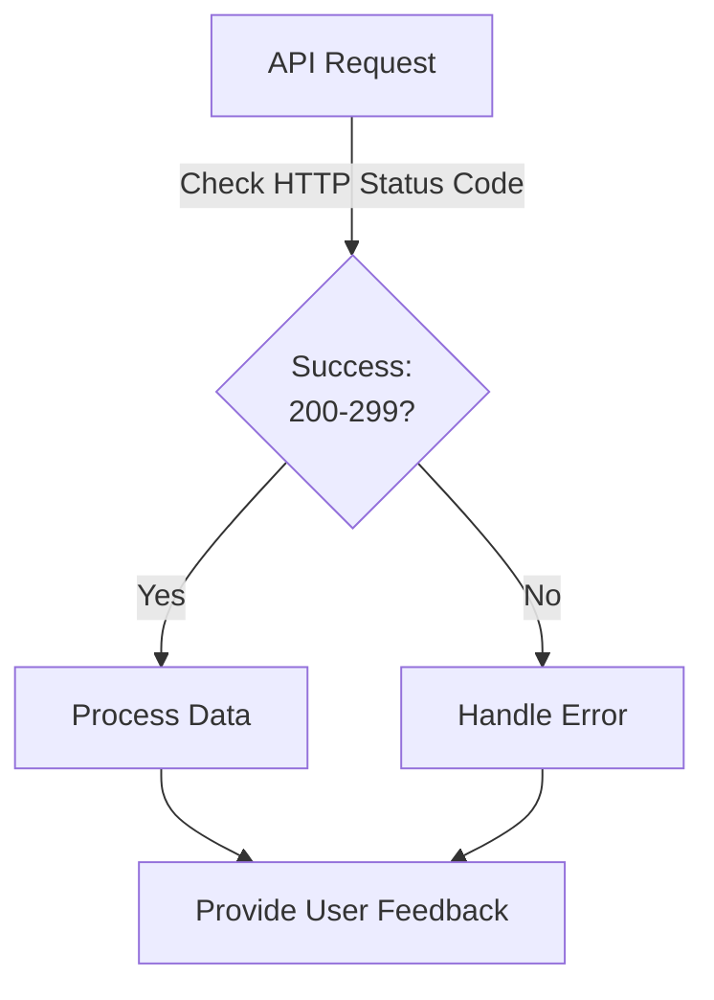

<!-- Source URL: https://docs.paypal.ai/developer/how-to/api/handling-api-responses -->
<!-- Fetched: 2026-04-19 -->

> ## Documentation Index
>
> Fetch the complete documentation index at: https://docs.paypal.ai/llms.txt
> Use this file to discover all available pages before exploring further.

# Handling API responses when integrating with PayPal APIs

Correctly processing API responses ensures that your application can gracefully manage successful payments, declines, errors, and edge cases. This improves user experience, reduces failed transactions, and helps maintain compliance with PCI DSS, the security standards for handling credit card data.

This guide provides software developers with best practices, tools, and integration details for handling PayPal API responses. It includes tips for both back-end and front-end environments.

When integrating with PayPal, keep these principles in mind:

- Always check and handle API responses and errors to ensure a secure and reliable integration.
- Use PayPal's official SDKs and follow documented response handling patterns for server-side and client-side environments.
- Implement strong error handling, logging, and user feedback for all payment flows. Use PayPal's sandbox tools to test error scenarios.

## Requirements and guidelines

- Check the HTTP status code and response body for every API call.
- Handle all possible error codes and messages.
- Log errors and unexpected responses for troubleshooting.
- Avoid exposing sensitive error details to users.
- Use PayPal's sandbox tools to simulate errors.
- Provide clear feedback to users for payment declines or failures.
- Follow PayPal's [API Response Guidelines](https://developer.paypal.com/api/rest/responses/).

## Response handling flow

This image shows the basic flow for handling API responses:



## Understanding response types

PayPal API responses generally fall into two categories:

### Successful responses

A successful response has a status code between 200 and 299 and includes the requested data:

```json theme={null}
{
  "id": "PAY-1234567890ABCDEF",
  "status": "COMPLETED",
  "amount": {
    "currency": "USD",
    "value": "15.00"
  }
}
```

### Error responses

Error responses have status codes outside the 200-299 range and include error details:

```json theme={null}
{
  "name": "VALIDATION_ERROR",
  "message": "Invalid request - see details",
  "debug_id": "9adb23571c146",
  "details": [
    {
      "field": "amount",
      "issue": "cannot be negative"
    }
  ]
}
```

## HTTP status codes and error handling

The following table shows common HTTP status codes from PayPal APIs and what they mean:

| HTTP status code            | Error name               | What it means                      | What to do                 |
| --------------------------- | ------------------------ | ---------------------------------- | -------------------------- |
| `400 Bad Request`           | `INVALID_REQUEST`        | Formatting errors in your request. | Check your JSON structure. |
| `401 Unauthorized`          | `AUTHENTICATION_FAILURE` | Missing or expired access token.   | Get a new access token.    |
| `403 Forbidden`             | `NOT_AUTHORIZED`         | No permission for this action.     | Check account permissions. |
| `404 Not Found`             | `RESOURCE_NOT_FOUND`     | Resource doesn't exist.            | Verify the ID or URL.      |
| `422 Unprocessable Entity`  | `UNPROCESSABLE_ENTITY`   | Business rule errors.              | Check error details.       |
| `500 Internal Server Error` | `INTERNAL_SERVER_ERROR`  | PayPal server issue.               | Try again later.           |

For more details, see the [Common errors](/developer/how-to/api/troubleshooting/common-errors) page.

## Tools, integrations, and features

| Name                                      | Purpose                                        | Integration location             |
| ----------------------------------------- | ---------------------------------------------- | -------------------------------- |
| Rest API response handling                | Get formatted answers for payments and orders. | Back-end and front-end           |
| Error handling and codes                  | Find and fix errors and warnings.              | Back-end and front-end           |
| Negative testing tools                    | Create test errors and declined payments.      | Sandbox (back-end and front-end) |
| Card decline and funding failure handling | Help users when cards are declined.            | Back-end and front-end           |

### How REST API responses work

PayPal APIs send back structured JSON answers when you make requests about payments, orders, and accounts. These answers include status codes, results, and error details. Always check the status code and read the full response to handle both successes and errors well. Learn more in the [REST API responses guide](https://developer.paypal.com/api/rest/responses/).

### Error handling

PayPal gives you specific error codes and messages to help you fix issues. By checking these codes and showing helpful messages to users, your app can guide people through problems and make payments easier.

## Common PayPal API error codes

Here are the most common error codes you'll see and how to fix them:

| Error                    | What it means                                         | What to do                                                                                                                      |
| ------------------------ | ----------------------------------------------------- | ------------------------------------------------------------------------------------------------------------------------------- |
| `VALIDATION_ERROR`       | Required fields are missing or have incorrect values. | Check the [validation error page](/developer/how-to/api/troubleshooting/common-errors/validation-error) for field requirements. |
| `DUPLICATE_INVOICE_ID`   | You used the same invoice ID more than once.          | Use a unique invoice ID for each transaction.                                                                                   |
| `CARD_EXPIRED`           | Customer's card is expired.                           | Ask them to use a different card.                                                                                               |
| `ORDER_ALREADY_CAPTURED` | The payment was already processed.                    | Check your records for the original payment.                                                                                    |
| `PAYER_ACTION_REQUIRED`  | The customer needs to do something.                   | Send them to the link in the response.                                                                                          |

These guides have more details about handling errors:

- [Common errors](/developer/how-to/api/troubleshooting/common-errors)
- [Rest API errors](https://developer.paypal.com/api/rest/responses/)
- [Payflow transaction responses](https://developer.paypal.com/api/nvp-soap/payflow/integration-guide/transaction-responses/)

### Testing your error handling

PayPal offers tools to test how your app handles errors. These tools let you create test errors and declined payments without real problems. Use special headers and settings to test your error handling.

You can create specific test errors by adding a header to your test API requests:

```bash theme={null}
PayPal-Mock-Response: {"mock_application_codes":"INSTRUMENT_DECLINED"}
```

This lets you test error handling without causing real errors.

Learn more about testing from these guides:

- [Negative testing with request headers](https://developer.paypal.com/tools/sandbox/negative-testing/request-headers/)
- [Sandbox error conditions](https://developer.paypal.com/tools/sandbox/error-conditions/)

### Handling card declines

When a card is declined or payment fails, your app needs to handle it smoothly. Your system should spot these issues and give users clear feedback and options to try again. This helps them understand what went wrong and how to fix it.

Learn more about handling payment problems:

- [Card decline errors](https://developer.paypal.com/docs/checkout/advanced/card-decline-errors/)
- [Handle funding failures](https://developer.paypal.com/docs/checkout/standard/customize/handle-funding-failures/)

## Integration

This section explains how to handle PayPal API responses and errors in both back-end and front-end environments.

### Back-end

The back end handles secure tasks like creating payments, checking transactions, and storing API keys. It talks directly to PayPal's APIs, processes responses, handles errors, and keeps sensitive data safe.

Code examples in various programming languages show how to get access tokens and handle API responses securely. These examples show the right patterns to follow in your back-end code.

<Tabs>
  <Tab title="cURL">
    ```bash theme={null}
    curl -X POST https://api-m.sandbox.paypal.com/v1/payments/payment \
      -H "Content-Type: application/json" \
      -H "Authorization: Bearer ACCESS_TOKEN" \
      -d '{...}'
    ```
  </Tab>

  <Tab title="Java">
    ```java theme={null}
    import java.net.*;
    import java.io.*;

    public class PayPalApiExample {
        public static void main(String[] args) throws Exception {
            URL url = new URL("https://api-m.sandbox.paypal.com/v1/payments/payment");
            HttpURLConnection conn = (HttpURLConnection) url.openConnection();
            conn.setRequestMethod("POST");
            conn.setRequestProperty("Content-Type", "application/json");
            conn.setRequestProperty("Authorization", "Bearer ACCESS_TOKEN");
            conn.setDoOutput(true);

            String jsonInputString = "{...}";
            try(OutputStream os = conn.getOutputStream()) {
                byte[] input = jsonInputString.getBytes("utf-8");
                os.write(input, 0, input.length);
            }

            int code = conn.getResponseCode();
            BufferedReader br = new BufferedReader(new InputStreamReader(
                code == 201 ? conn.getInputStream() : conn.getErrorStream(), "utf-8"));
            StringBuilder response = new StringBuilder();
            String responseLine;
            while ((responseLine = br.readLine()) != null) {
                response.append(responseLine.trim());
            }
            System.out.println("Status: " + code + ", Response: " + response.toString());
        }
    }
    ```

  </Tab>

  <Tab title="JavaScript (Node.js)">
    ```javascript theme={null}
    const fetch = require('node-fetch');

    fetch('https://api-m.sandbox.paypal.com/v1/payments/payment', {
      method: 'POST',
      headers: {
        'Content-Type': 'application/json',
        'Authorization': 'Bearer ACCESS_TOKEN'
      },
      body: JSON.stringify({...})
    })
      .then(res => res.json().then(data => ({ status: res.status, body: data })))
      .then(({ status, body }) => {
        if (status === 201) {
          console.log('Payment created:', body);
        } else {
          console.error('Error:', status, body);
        }
      });
    ```

  </Tab>

  <Tab title=".NET (C#)">
    ```dotnet theme={null}
    using System;
    using System.Net.Http;
    using System.Text;
    using System.Threading.Tasks;

    class Program {
        static async Task Main() {
            var client = new HttpClient();
            client.DefaultRequestHeaders.Add("Authorization", "Bearer ACCESS_TOKEN");
            var content = new StringContent("{...}", Encoding.UTF8, "application/json");
            var response = await client.PostAsync("https://api-m.sandbox.paypal.com/v1/payments/payment", content);
            var result = await response.Content.ReadAsStringAsync();
            if (response.IsSuccessStatusCode) {
                Console.WriteLine("Payment created: " + result);
            } else {
                Console.WriteLine("Error: " + response.StatusCode + " " + result);
            }
        }
    }
    ```

  </Tab>

  <Tab title="PHP">
    ```php theme={null}
    <?php
    $ch = curl_init();
    curl_setopt($ch, CURLOPT_URL, "https://api-m.sandbox.paypal.com/v1/payments/payment");
    curl_setopt($ch, CURLOPT_RETURNTRANSFER, 1);
    curl_setopt($ch, CURLOPT_POST, 1);
    curl_setopt($ch, CURLOPT_POSTFIELDS, json_encode([...]));
    curl_setopt($ch, CURLOPT_HTTPHEADER, [
        "Content-Type: application/json",
        "Authorization: Bearer ACCESS_TOKEN"
    ]);
    $result = curl_exec($ch);
    $httpcode = curl_getinfo($ch, CURLINFO_HTTP_CODE);
    curl_close($ch);

    if ($httpcode == 201) {
        echo "Payment created: $result";
    } else {
        echo "Error: $httpcode $result";
    }
    ?>
    ```

  </Tab>

  <Tab title="Python">
    ```python theme={null}
    import requests

    url = "https://api-m.sandbox.paypal.com/v1/payments/payment"
    headers = {
        "Content-Type": "application/json",
        "Authorization": "Bearer ACCESS_TOKEN"
    }
    data = {...}

    response = requests.post(url, json=data, headers=headers)
    if response.status_code == 201:
        print("Payment created:", response.json())
    else:
        print("Error:", response.status_code, response.json())
    ```

  </Tab>

  <Tab title="Ruby">
    ```ruby theme={null}
    require 'net/http'
    require 'uri'
    require 'json'

    uri = URI('https://api-m.sandbox.paypal.com/v1/payments/payment')
    http = Net::HTTP.new(uri.host, uri.port)
    http.use_ssl = true
    request = Net::HTTP::Post.new(uri.path, {
      'Content-Type' => 'application/json',
      'Authorization' => 'Bearer ACCESS_TOKEN'
    })
    request.body = {...}.to_json

    response = http.request(request)
    if response.code == "201"
      puts "Payment created: #{response.body}"
    else
      puts "Error: #{response.code} #{response.body}"
    end
    ```

  </Tab>

  <Tab title="TypeScript">
    ```typescript theme={null}
    import fetch from 'node-fetch';

    async function createPayment() {
      const response = await fetch('https://api-m.sandbox.paypal.com/v1/payments/payment', {
        method: 'POST',
        headers: {
          'Content-Type': 'application/json',
          'Authorization': 'Bearer ACCESS_TOKEN'
        },
        body: JSON.stringify({...})
      });
      const data = await response.json();
      if (response.status === 201) {
        console.log('Payment created:', data);
      } else {
        console.error('Error:', response.status, data);
      }
    }
    ```

  </Tab>
</Tabs>

### Front-end

The front end interacts with users, starts payments, and shows feedback based on API responses. Good response handling ensures users know the payment status, can retry if needed, and get clear guidance when something goes wrong.

> **Important:** Never send your API keys or tokens from front-end code. The front-end should talk to your secure back end, which then talks to PayPal.

Code examples show how to handle responses and errors in various front-end frameworks. These examples help you create user-friendly payment flows.

<Tabs>
  <Tab title="ECMAScript (ES Modules)">
    ```javascript theme={null}
    // paypal.js
    export async function createPayment() {
      const response = await fetch('https://api-m.sandbox.paypal.com/v1/payments/payment', {
        method: 'POST',
        headers: {
          'Content-Type': 'application/json',
          'Authorization': 'Bearer ACCESS_TOKEN'
        },
        body: JSON.stringify({...})
      });
      const data = await response.json();
      if (response.status === 201) {
        alert('Payment created!');
      } else {
        alert('Error: ' + response.status);
      }
    }

    // index.html
    <script type="module">
      import { createPayment } from './paypal.js';
      document.getElementById('pay-btn').addEventListener('click', createPayment);
    </script>
    <button id="pay-btn">Pay with PayPal</button>
    ```

  </Tab>

  <Tab title="JavaScript (React)">
    ```javascript theme={null}
    import React from 'react';

    function createPayment() {
      fetch('https://api-m.sandbox.paypal.com/v1/payments/payment', {
        method: 'POST',
        headers: {
          'Content-Type': 'application/json',
          'Authorization': 'Bearer ACCESS_TOKEN'
        },
        body: JSON.stringify({...})
      })
        .then(res => res.json().then(data => ({ status: res.status, body: data })))
        .then(({ status, body }) => {
          if (status === 201) {
            alert('Payment created!');
          } else {
            alert('Error: ' + status);
          }
        });
    }

    export default function PayPalButton() {
      return <button onClick={createPayment}>Pay with PayPal</button>;
    }
    ```

  </Tab>

  <Tab title="JavaScript (Vanilla)">
    ```javascript theme={null}
    <script>
    fetch('https://api-m.sandbox.paypal.com/v1/payments/payment', {
      method: 'POST',
      headers: {
        'Content-Type': 'application/json',
        'Authorization': 'Bearer ACCESS_TOKEN'
      },
      body: JSON.stringify({...})
    })
      .then(res => res.json().then(data => ({ status: res.status, body: data })))
      .then(({ status, body }) => {
        if (status === 201) {
          alert('Payment created!');
        } else {
          alert('Error: ' + status);
        }
      });
    </script>
    ```
  </Tab>

  <Tab title="TypeScript (React)">
    ```typescript theme={null}
    import React from 'react';

    const createPayment = async () => {
      const response = await fetch('https://api-m.sandbox.paypal.com/v1/payments/payment', {
        method: 'POST',
        headers: {
          'Content-Type': 'application/json',
          'Authorization': 'Bearer ACCESS_TOKEN'
        },
        body: JSON.stringify({...})
      });
      const data = await response.json();
      if (response.status === 201) {
        alert('Payment created!');
      } else {
        alert('Error: ' + response.status);
      }
    };

    const PayPalButton: React.FC = () => (
      <button onClick={createPayment}>Pay with PayPal</button>
    );

    export default PayPalButton;
    ```

  </Tab>
</Tabs>

## Security testing tips

Testing your security setup is vital to protect against threats. Consider these key tests:

### Auth testing

- Test with expired tokens to make sure your refresh system works.
- Try operations with limited permissions to test your access controls.
- Check that webhook security properly rejects unsigned events.

### Data protection testing

- Make sure sensitive data isn't saved in your logs.
- Check that error messages don't show sensitive details to users.
- Test that front-end code never sees or handles secure data.

### Integration security testing

- Use [PayPal's testing tools](https://developer.paypal.com/tools/sandbox/negative-testing/request-headers/) to create security-related errors.
- Test with poor network conditions, like timeouts and drops.
- Check that your security settings meet PayPal's requirements.

For complete testing info, see the [Testing your response handling guide](/developer/how-to/api/handling-api-responses#testing-your-response-handling).

## Testing your response handling

Follow these steps to test how your app handles PayPal responses:

1. Set up test accounts:
   - Create test merchant and buyer accounts.
   - Save the test login details.
2. Test successful payments:
   - Complete a test payment.
   - Check that your code handles success correctly.
3. Test error scenarios:
   - Use PayPal's tools to create test errors.
   - Add special headers to trigger specific errors.
   - Example: `PayPal-Mock-Response: {"mock_application_codes":"INSTRUMENT_DECLINED"}`.
4. Test recovery flows:
   - Make sure users can recover from errors.
   - Check that error messages are clear.
   - Test that retry options work correctly.

## Common problems and solutions

You might face these common issues:

| Problem                        | Solution                                                      |
| ------------------------------ | ------------------------------------------------------------- |
| Getting `401` errors regularly | Set up token refresh before tokens expire.                    |
| Webhooks not working           | Make sure your webhook URL is public and events are verified. |
| Can't process refunds          | Use the correct transaction ID from the original payment.     |
| Test payments always fail      | Check if your test buyer account has enough funds.            |

## Mobile app tips

When building mobile apps with PayPal:

- Use native SDKs when possible for better user experience.
- Add extra error handling for spotty mobile connections.
- Plan for offline scenarios when the app loses connection.
- Add clear visual feedback during payment processing.

## References

- [Rest API responses](https://developer.paypal.com/api/rest/responses/)
- [Rest API overview](https://developer.paypal.com/api/rest/)
- [Rest API requests](https://developer.paypal.com/api/rest/requests/)
- [Payflow transaction responses](https://developer.paypal.com/api/nvp-soap/payflow/integration-guide/transaction-responses/)
- [Negative testing with request headers](https://developer.paypal.com/tools/sandbox/negative-testing/request-headers/)
- [Sandbox error conditions](https://developer.paypal.com/tools/sandbox/error-conditions/)
- [Card decline errors](https://developer.paypal.com/docs/checkout/advanced/card-decline-errors/)
- [Handle funding failures](https://developer.paypal.com/docs/checkout/standard/customize/handle-funding-failures/)
