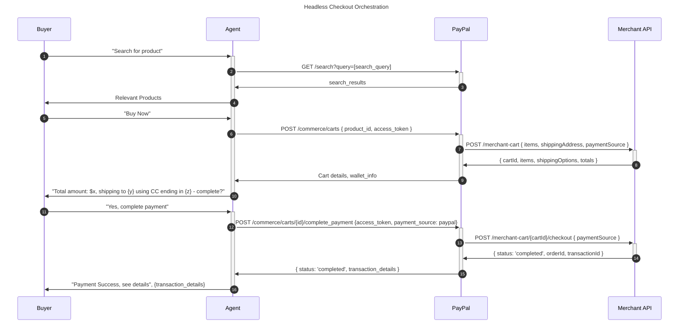

<!-- Source URL: https://docs.paypal.ai/growth/agentic-commerce/store-sync/your-api/api-overview -->
<!-- Fetched: 2026-04-18 -->

> ## Documentation Index
>
> Fetch the complete documentation index at: https://docs.paypal.ai/llms.txt
> Use this file to discover all available pages before exploring further.

# Agentic shopping API overview

After you set up your [product catalog and product feed ingestion](/growth/agentic-commerce/store-sync/product-catalog/create-a-product-catalog/), the next step is to implement the API that PayPal will call to create and manage shopping carts. This API enables AI agents to interact with your store, which allows customers to discover products, add them to a cart, and complete purchases through an agent's conversational interface.

> **Important:** To access and use Store Sync, complete [this form](https://www.paypal.com/us/business/ai#form) to contact the AI team at PayPal and request access.

## Agentic shopping flow

Before you set up your API, it helps to understand the different roles and steps in the agentic shopping flow. This flow involves 3 main parties: the customer, the AI agent, and your merchant API. The AI agent acts as an intermediary that understands the customer's intent and interacts with PayPal's Cart API for you.

## Next steps

Now that you understand the agentic shopping flow, choose your payment integration to implement your API:

- [**Orders API v2 integration**](/growth/agentic-commerce/store-sync/your-api/set-up-your-api/orders-v2-integration/): Integrate with PayPal's Orders API v2.
- [**Braintree integration**](/growth/agentic-commerce/store-sync/your-api/set-up-your-api/braintree-integration/): Integrate with Braintree's payment processing.
